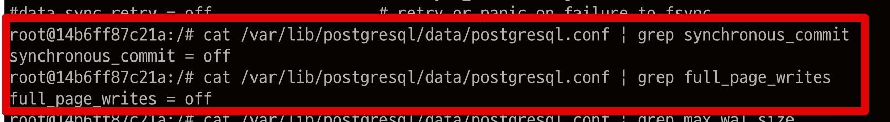

# 데이터베이스 통합 테스트 성능 개선하기 (Docker & PostgreSQL)

보통 통합 테스트는 SQLite, H2와 같은 InMemory 데이터베이스를 사용한다.  
메모리상에만 존재하기 때문에 실제 ORM (SQL) 을 검증이 가능하면서도 **병렬로 테스트를 수행**할 수 있고, **고속의 쿼리 수행**이 가능하기 때문이다.  

대부분의 데이터베이스 쿼리는 InMemory DB 에 대해 실행할 수 있지만 많은 엔터프라이즈 시스템은 실제 프로덕션과 같은 관계형 데이터베이스에 대해서만 테스트할 수 있는 복잡한 기본 쿼리를 사용한다.  
  
그래서 운영 환경에서 사용하는 데이터베이스(MySQL, PostgreSQL 등) 에서 지원하는 여러 기능들을 적극적으로 사용하는 환경에서는 InMemory DB로 검증하는데 한계가 있다.  
  
이를 위해 보통은 로컬 PC에서는 Docker를 통해 데이터베이스 통합 테스트 환경을 구축해서 사용한다.  

물론, 외부에 의존적인 통합 테스트 보다 단위 테스트의 비중이 많은 것이 좋다.  


* 출처: [TestPyramid](https://martinfowler.com/bliki/TestPyramid.html)

다만, 레거시 시스템을 리팩토링해야하거나 기존 시스템이 데이터베이스에 많이 의존하고 있는 경우 프로젝트 전체적인 구조를 개편하기 전까지는 통합 테스트에 많이 의존할 수 밖에 없다.  
  
당장 프로젝트 구조를 개선해서 단위 테스트의 비중을 늘릴 수 있다면 좋겠지만, 그러기 쉽지 않다면, 아래의 내용을 참고해 **데이터베이스를 사용하는 통합테스트의 전체 성능을 개선**하는 것을 시도해보자.
## 해결

## 1. tmpfs

### data

데이터베이스는 이미 가능한 한 디스크 작업을 피하는 방식으로 작성되었으며 일단 모든 내구성 설정을 끄면 (메모리에 맞는 데이터 세트의 경우) 거의 디스크 읽기/쓰기를 중지합니다

### /run, /var/cache

[/run](https://unix.stackexchange.com/questions/13972/what-is-this-new-run-filesystem)

## 2. Non Durability

내구성 (Durability) 은 서버가 충돌하거나 전원이 꺼지더라도 데이터 저장을 보장하는 기능이다.  
보편적인 RDBMS에서는 필수 기능이나, E2E 테스트에서는 중요한 기능이 아니다.    
E2E 테스트가 가능한 운영 (Production) 환경에 최대한 비슷한 형태로 테스트 해야한다는 의견이 있지만 (이 역시도 논쟁거리이긴하지만) 내구성 (Durability)에 한해서는 충분히 절충 가능한 사안이다.  
특히 테스트 성능에 영향을 끼친다면 더욱 그렇다.  
  
PostgreSQL에서는 내구성 (Durability) 를 다음의 방식으로 `off` 시킬 수 있다.

* https://www.postgresql.org/docs/13/non-durability.html

만약 설치된 DB라면 `/var/lib/postgresql/data/postgresql.conf` 에 다음 옵션을 변경하면 된다.

```bash
fsync = off
synchronous_commit = off
full_page_writes = off
```

하지만 현재 테스트 환경에서는 Docker를 통해 PostgreSQL을 사용하니 `Dockerfile`을 사용한다.

**docker-compose.yml**

```bash
FROM postgres:13-alpine3.17

# Update config with non-durable settings (fsync, synchronous_commit, full_page_writes, max_wal_size)
# See: https://www.postgresql.org/docs/13/non-durability.html
RUN sed -ri "s!^#?(fsync|synchronous_commit|full_page_writes)\s*=\s*\S+.*!\1 = off!" /usr/local/share/postgresql/postgresql.conf.sample
```


```bash
services:
  db:
    build:
      context: ./pg-docker
      dockerfile: Dockerfile
    ports:
      - '5434:5432'
    container_name: inflearn-db
    environment:
      - POSTGRES_DB=test
      - POSTGRES_USER=test
      - POSTGRES_PASSWORD=test
      - POSTGRES_INITDB_ARGS=--encoding=UTF-8
    tmpfs:
      - /var/lib/postgresql/data
      - /run
      - /var/cache
```

다음의 설정이 잘 되는지는 로컬에서 docker-compose로 DB를 꼭 실행해보고 


### max_wal_size & checkpoint_timeout

https://www.crunchydata.com/blog/tuning-your-postgres-database-for-high-write-loads

## 3. unlogged table

내구성 (Durability) 과 마찬가지로 테이블의 로그를 관리하는 정보 역시 E2E 테스트 안에서는 성능을 위해 절충할 수 있는 기능이다.  
  

https://www.compose.com/articles/faster-performance-with-unlogged-tables-in-postgresql/

```ts
import { DatabaseTable } from '@mikro-orm/better-sqlite';
import { MikroORM } from '@mikro-orm/core';

export async function generateTestSchema(orm: MikroORM) {
  const schemaGenerator = orm.getSchemaGenerator();
  await schemaGenerator.refreshDatabase();
  // @ts-ignore
  const tables: DatabaseTable[] = schemaGenerator.getTargetSchema().getTables();

  await Promise.all(
    tables.map(async (table) =>
      schemaGenerator.execute(`ALTER TABLE "${table.name}" SET UNLOGGED`),
    ),
  );
}
```

> 물론 이 코드는 MikroORM을 사용했지만, TypeORM에서도 충분히 활용가능하다.
 
```ts

```

## 마무리

