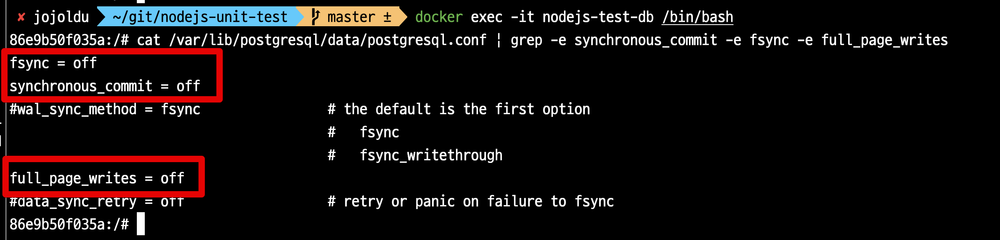

# 데이터베이스 통합 테스트 성능 개선하기 (Docker & PostgreSQL)

보통 통합 테스트는 SQLite, H2와 같은 InMemory 데이터베이스를 사용한다.  
메모리상에만 존재하기 때문에 실제 ORM (SQL) 을 검증이 가능하면서도 **병렬로 테스트를 수행**할 수 있고, **고속의 쿼리 수행**이 가능하기 때문이다.  

대부분의 데이터베이스 쿼리는 InMemory 데이터베이스에 대해 실행할 수 있지만 많은 엔터프라이즈 시스템은 실제 **Production과 같은 데이터베이스에 대해서만 테스트할 수 있는 복잡한 쿼리**를 사용한다.  
  
그래서 운영 환경에서 사용하는 데이터베이스(MySQL, PostgreSQL 등) 에서 지원하는 여러 기능(Windows함수, 프로시저, 트리거 등) 들을 적극적으로 사용하는 환경에서는 InMemory DB로 검증하는데 한계가 있다.  
  
이를 위해 보통은 로컬 PC에서는 Docker를 통해 데이터베이스 통합 테스트 환경을 구축해서 사용한다.  

물론, 외부에 의존적인 통합 테스트 보다 단위 테스트의 비중이 많은 것이 좋다.  


* 출처: [TestPyramid](https://martinfowler.com/bliki/TestPyramid.html)

다만, 레거시 시스템을 리팩토링 해야하거나 기존 시스템이 데이터베이스에 많이 의존하고 있는 경우 프로젝트 전체적인 구조를 개편하기 전까지는 통합 테스트에 많이 의존할 수 밖에 없다.  
  
당장 프로젝트 구조를 개선해서 단위 테스트의 비중을 늘릴 수 있다면 좋겠지만, 그러기 쉽지 않다면, 아래의 내용을 참고해 **데이터베이스를 사용하는 통합테스트의 전체 성능을 개선**하는 것을 시도해보자.

## 문제

Docker PostgreSQL를 사용하는 통합 테스트 환경이 있다고 가정해보자.  
Docker 설정은 다음과 같다.  
  
**docker-compose.yml**

```yaml
services:
  db:
    image: postgres:13-alpine3.17
    ports:
      - '5432:5432'
    container_name: nodejs-test-db
    environment:
      - POSTGRES_DB=test
      - POSTGRES_USER=test
      - POSTGRES_PASSWORD=test
      - POSTGRES_INITDB_ARGS=--encoding=UTF-8
```

테스트 환경은 다음과 같다.

* 2021 M1 Macbook Pro 16GB
* Node 18.12.1
* Docker PostgreSQL 13

그리고 이 테스트 데이터베이스를 사용하는 테스트 코드들은 다음과 같다.

> 모든 코드는 [Github](https://github.com/jojoldu/nodejs-unit-test) 에 존재한다

```ts
// bulkInsertPoints.ts
// 수백개의 통합 테스트와 비슷한 상황을 가장하기 위해 모두 sync로 요청한다.
export async function bulkInsertPoints(count: number, pointRepository: Repository<Point>) {
  for (let key = 0; key < count; key++) {
    await pointRepository.save(Point.of(key * 1_000));
  }
}

// test1.ts
describe('PointEntity, 10_000번', () => {
  ...
  it('Point를 10_000번 쌓는다', async () => {
    // given
    const count = 10_000;

    // when
    await bulkInsertPoints(count, pointRepository);
  });
});

// test2.ts
describe('PointEntity2, 20_000번', () => {
  ...

  it('Point를 10_000번 쌓는다 (1)', async () => {
    // given
    const count = 10_000;

    // when
    await bulkInsertPoints(count, pointRepository);
  });

  it('Point를 10_000번 쌓는다 (2)', async () => {
    // given
    const count = 10_000;

    // when
    await bulkInsertPoints(count, pointRepository);
  });
});

// test3.ts
describe('PointEntity3, 30_000번', () => {
  ...

  it('Point를 10_000번 쌓는다 (1)', async () => {
    // given
    const count = 10_000;

    // when
    await bulkInsertPoints(count, pointRepository);
  });

  it('Point를 10_000번 쌓는다 (2)', async () => {
    // given
    const count = 10_000;

    // when
    await bulkInsertPoints(count, pointRepository);
  });

  it('Point를 10_000번 쌓는다 (3)', async () => {
    // given
    const count = 10_000;

    // when
    await bulkInsertPoints(count, pointRepository);
  });
});

// test4.ts
describe('PointEntity4, async', () => {
  ...

  it('Point를 async 10_000번 쌓는다', async () => {
    // given
    const count = 10_000;

    // when
    await bulkAsyncInsertPoints(count, pointRepository);

    const actual = await pointRepository.count();
    expect(actual).toBe(count);
  });

});
```

- 한번에 **70,000개**를 Insert 하는 것보다는 좀 더 현실감 있게 테스트 파일을 나눠 `connection` 의 `create` 와 `close` 를 여러번 수행되도록 구성 했다.
- 7만개라는 많은 테스트 데이터를 사용한 이유는 다음과 같다.
  -  통합 테스트에서 페이징 쿼리를 위한 데이터 등록, 복잡한 통계 쿼리, 1:N 관계에서의 저장 등 한번의 테스트에 5 ~ 1N 개가 저장된다는 점 
  -  이런 테스트가 수십 ~ 수백개가 있을것이라는 가정을 전제했다.
- `Promise.all` 를 통한 병렬처리, `Bulk Insert` 등을 이 문제의 해결책으로 산정하지 않는다. 
  - 테스트 파일을 수백개 만들지 못해서 임의로 `for loop` 를 돌린 것이다.
  - 실제로는 수백개의 테스트 파일이 도커 PostgreSQL를 사용하는 통합 테스트 환경이기 때문에 모든 테스트는 순차적으로 (`--runInBand`) 되어야 한다.
  - 실제 통합, E2E 테스트처럼 InMemoryDB가 아닌 Docker PostrgreSQL을 사용했기 때문에 모든 테스트는 서로 침범당하지 않도록 순차실행만 존재한다.
  - 물론 `async insert` 의 성능 개선도 비교해볼 수 있게 하나의 테스트는 10,000 건을 `Promise.all` 로 진행했다.

위 테스트를 실제로 수행해보면 **232초**가 수행된다.


* 30,000 insert: 117초
* 20,000 insert: 75초
* 10,000 insert: 33초
* 10,000 `async` insert: 5초
* 종합
  * 전체: **232초**
  * 1만건당 `sync` 평균 **3~4초**

이제 이 느리고 거대한 테스트를 개선해보자.

## 해결

PostgreSQL을 사용한 빠른 통합 테스트의 핵심은 매번 테스트때마다 데이터베이스 상태가 초기화된다는 것이다.  
초기화 된다는 것은 갑자기 **데이터베이스가 죽는다 하더라도 발생할 수 있는 데이터 손실에 대해 걱정할 필요가 없다**.  
어차피 다시 테스트를 시작하면 되기 때문이다.  
  
일반적으로 PostgreSQL나 MySQL과 같은 데이터베이스들은 갑자기 데이터베이스 프로세스가 종료되어도 데이터를 잃지 않도록 여러 장치가 도입되어있다. 

그러나 테스트를 실행할 때 실제로는 이런 안정성이 필요하지않다.  
안정적으로 데이터 쓰기가 필요한 것은 Production 이지만 테스트에서는 그 안정성 보다는 속도가 더 중요하다.  
  
그래서 통합 테스트의 성능을 올리는 것의 핵심은 안정적인 데이터베이스 운영에 필요한 여러 설정들을 `off` 하여 속도를 올리는 것이다.


## 1. 애플리케이션

### 1-1. save -> insert

TypeORM을 비롯한 ORM들은 `cascade`, `relations` 등 Entity에 관련된 여러 연관관계 작업들을 Entity 저장시에 지원한다.  
뿐만 아니라 기본적으로 사용되는 `.save()` 의 경우 `upsert` 를 지원하기 위해 `insert` 전에 항상 `select` 를 호출하는 등의 작업도 진행한다.  

그러다보니 단순 데이터를 저장하는데에도 많은 리소스를 사용하고 성능 저하의 주 원인으로 꼽힌다.    
  
이 부분을 제거하고 순수하게 `insert` 쿼리만 수행하는 기능을 대부분의 ORM들은 지원한다.  
당연히 TypeORM도 이 방법을 지원하는데, 그게 바로 `.insert()` 이다.

```ts
await pointRepository.insert(Point.of(key * 1_000));
```

이와 같이 테스트 데이터를 저장하는 부분을 `save` -> `insert` 로 교체만 해서 다시 한번 테스트를 진행해보자.


* 전체 시간: **120초**
  * 기존: 232초 
* 1만건당: **1.8 ~ 2초**
  * 기존: 평균 3~4초

대략 2배의 성능 개선이 가능해졌다.

### 1-2. SWC

애플리케이션에서 성능을 한번 더 개선할 수 있다.  
이번에는 ORM의 개선이 아닌 테스트 도구인 Jest의 성능 개선이다.  
아래 글에서 소개하듯이 `ts-jest` 는 성능 저하가 심하다.

* [speeding-up-jest](https://miyauchi.dev/posts/speeding-up-jest/)

그래서 이 부분을 고성능의 `@swc-node/jest`로 교체한다.

```bash
yarn add -D @swc-node/jest
```

**package.json**

```ts
"jest": {
  "transform": {
    "^.+\\.(t|j)s$": "@swc-node/jest"
  },
},
```

변경 후, 다시 한번 테스트를 수행해본다.


* 전체 시간: **112초**
  * 기존: 120초 

대폭 성능 개선이 된 건 아니지만, 대략 10%의 성능 개선을 볼 수 있다.  
  
애플리케이션 내에서 할 수 있는 성능 개선이 완료되었으니, 이제 Docker PostgreSQL 에서의 성능 개선을 시도해보자.

## 2. tmpfs

가장 쉽게 효과를 볼 수 있는 방법은 **데이터베이스의 Data 디렉토리를 메모리**로 옮기는 것이다.  
  
기본적으로 데이터베이스는 ACID를 비롯한 여러 데이터 안정성을 위한 장치가 포함된다.  
그래서 트랜잭션이 완료될 때마다 모든 변경 사항을 디스크에 `flush` 해야 된다.  
테이블 스키마를 생성하는 것 부터 시작해서 데이터 저장, `flush` 등 많은 IO 작업들을 디스크가 아닌 메모리상에서 수행되도록 Docker 설정을 변경할 수 있다.  
이렇게 할 경우 다른 InMemory 데이터베이스 (H2 등)과 같이 테스트 속도를 끌어올릴 수 있다.  
  
설정 방법은 간단하다.  
Docker 설정에서 `tmpfs` 로 PostgreSQL의 data 디렉토리를 설정하면 된다.

```yaml
services:
  db:
    ...
    environment:
    ...
    tmpfs:
      - /var/lib/postgresql/data
```

앞서 실행했던 Docker Compose 환경을 깨끗이 초기화하고

```bash
docker rm -f $(docker ps -a -q)
docker volume rm $(docker volume ls -q)
```

다시 Docker Compose를 실행시킨뒤 전체 테스트를 수행해본다.


* 전체 시간: **98초**
  * 기존: 112초 
* 1만건당: **1.3 ~ 1.7초**
  * 기존: 평균 1.8 ~ 2초


한 줄의 설정값으로 **20%의 성능 개선**을 얻었다.  

> 어떤 테스트에서는 [20배의 성능 향상](https://vladmihalcea.com/how-to-run-database-integration-tests-20-times-faster/) 도 있었다고 하는데, 최근의 PostgreSQL에서는 이미 충분한 성능 개선이 되어 있어서 인메모리로 교체한다고 해서 20배까지 성능개선이 되지는 않는것 같다.

## 3. Non Durability

두번째 개선은 `Durability` 를  `off` 하는 것이다.  
  
Durability 은 서버에 문제가 생겼을때 데이터 저장을 보장하는 기능이다.  
보편적인 데이터베이스에서는 필수 기능이나, **E2E 테스트에서는 중요한 기능이 아니다**.  
  
E2E 테스트가 가능한 운영 (Production) 환경에 최대한 비슷한 형태로 테스트 해야하지만, Duration와 같은 기능들은 실제 E2E 테스트에서는 지켜야할 항목이 아니다.  
(다시 테스트를 수행하면 되기 때문에)  
  
PostgreSQL에서는 내구성 (Durability) 를 다음의 방식으로 `off` 시킬 수 있다.

* https://www.postgresql.org/docs/13/non-durability.html

만약 설치된 DB라면 `/var/lib/postgresql/data/postgresql.conf` 에 다음 옵션을 변경하면 된다.

```bash
fsync = off
synchronous_commit = off
full_page_writes = off
```

하지만 현재 테스트 환경에서는 Docker를 통해 PostgreSQL을 사용하니 `Dockerfile`을 사용한다.  
  
**pg-docker/Dockerfile**  

```bash
FROM postgres:13-alpine3.17

# Update config with non-durable settings (fsync, synchronous_commit, full_page_writes, max_wal_size)
# See: https://www.postgresql.org/docs/13/non-durability.html
RUN sed -ri "s!^#?(fsync|synchronous_commit|full_page_writes)\s*=\s*\S+.*!\1 = off!" /usr/local/share/postgresql/postgresql.conf.sample
```


이렇게 설정된 Dockerfile을 docker-compose에서 사용한다.  
  
**docker-compose.yml**

```bash
services:
  db:
    build:
      context: ./pg-docker
      dockerfile: Dockerfile
    ports:
    ....
    tmpfs:
      - /var/lib/postgresql/data

```

설정이 끝났으면 기존의 Docker들을 모두 초기화 하고 다시 실행시켜본다.  
  
실행이 되면 **설정이 잘 적용 되었는지를** 꼭 확인해본다.  
실행된 Docker PostgreSQL의 설정값이 정상적으로 바뀌었는지 꼭 확인해본다.

```bash
cat /var/lib/postgresql/data/postgresql.conf | grep -e synchronous_commit -e fsync -e full_page_writes
```




다시 한번 전체 테스트를 수행해본다.

## 3. unlogged table

내구성 (Durability) 과 마찬가지로 테이블의 로그를 관리하는 정보 역시 E2E 테스트 안에서는 성능을 위해 절충할 수 있는 기능이다.  
  

https://www.compose.com/articles/faster-performance-with-unlogged-tables-in-postgresql/

```ts
import { DatabaseTable } from '@mikro-orm/better-sqlite';
import { MikroORM } from '@mikro-orm/core';

export async function generateTestSchema(orm: MikroORM) {
  const schemaGenerator = orm.getSchemaGenerator();
  await schemaGenerator.refreshDatabase();
  // @ts-ignore
  const tables: DatabaseTable[] = schemaGenerator.getTargetSchema().getTables();

  await Promise.all(
    tables.map(async (table) =>
      schemaGenerator.execute(`ALTER TABLE "${table.name}" SET UNLOGGED`),
    ),
  );
}
```

> 물론 이 코드는 MikroORM을 사용했지만, TypeORM에서도 충분히 활용가능하다.
 

## 마무리

