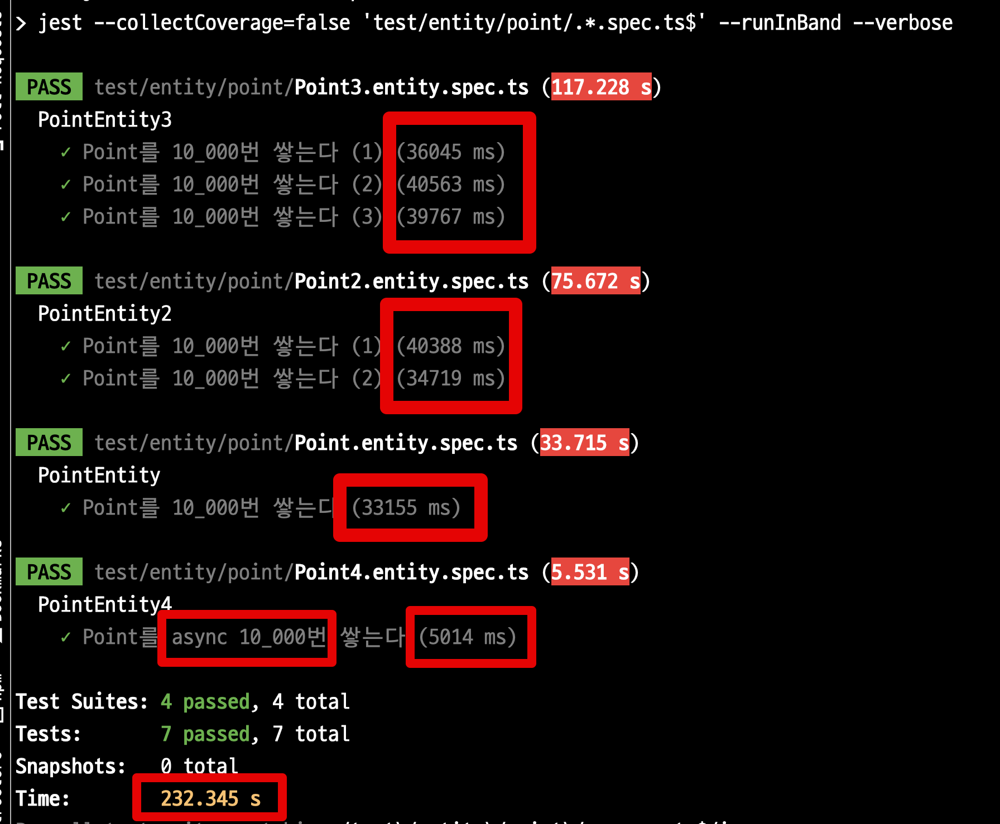

# 데이터베이스 통합 테스트 성능 개선하기 (Docker & PostgreSQL)

보통 통합 테스트는 SQLite, H2와 같은 InMemory 데이터베이스를 사용한다.  
메모리상에만 존재하기 때문에 실제 ORM (SQL) 을 검증이 가능하면서도 **병렬로 테스트를 수행**할 수 있고, **고속의 쿼리 수행**이 가능하기 때문이다.  

대부분의 데이터베이스 쿼리는 InMemory DB 에 대해 실행할 수 있지만 많은 엔터프라이즈 시스템은 실제 프로덕션과 같은 관계형 데이터베이스에 대해서만 테스트할 수 있는 복잡한 기본 쿼리를 사용한다.  
  
그래서 운영 환경에서 사용하는 데이터베이스(MySQL, PostgreSQL 등) 에서 지원하는 여러 기능들을 적극적으로 사용하는 환경에서는 InMemory DB로 검증하는데 한계가 있다.  
  
이를 위해 보통은 로컬 PC에서는 Docker를 통해 데이터베이스 통합 테스트 환경을 구축해서 사용한다.  

물론, 외부에 의존적인 통합 테스트 보다 단위 테스트의 비중이 많은 것이 좋다.  


* 출처: [TestPyramid](https://martinfowler.com/bliki/TestPyramid.html)

다만, 레거시 시스템을 리팩토링해야하거나 기존 시스템이 데이터베이스에 많이 의존하고 있는 경우 프로젝트 전체적인 구조를 개편하기 전까지는 통합 테스트에 많이 의존할 수 밖에 없다.  
  
당장 프로젝트 구조를 개선해서 단위 테스트의 비중을 늘릴 수 있다면 좋겠지만, 그러기 쉽지 않다면, 아래의 내용을 참고해 **데이터베이스를 사용하는 통합테스트의 전체 성능을 개선**하는 것을 시도해보자.

## 문제

Docker PostgreSQL를 사용하는 통합 테스트 환경이 있다고 가정해보자.  
Docker 설정은 다음과 같다.  
  
**docker-compose.yml**

```yaml
services:
  db:
    image: postgres:13-alpine3.17
    ports:
      - '5432:5432'
    container_name: nodejs-test-db
    environment:
      - POSTGRES_DB=test
      - POSTGRES_USER=test
      - POSTGRES_PASSWORD=test
      - POSTGRES_INITDB_ARGS=--encoding=UTF-8
```

그리고 이 테스트 데이터베이스를 사용하는 테스트 코드들은 다음과 같다.

> 모든 코드는 [Github](https://github.com/jojoldu/nodejs-unit-test) 에 존재한다

```ts
// test1
describe('PointEntity', () => {
  let pointRepository: Repository<Point>;

  beforeAll(async () => {
    const module: TestingModule = await Test.createTestingModule({
      imports: [PointEntityModule, getPgTestTypeOrmModule()],
    }).compile();

    pointRepository = module.get(getRepositoryToken(Point));
  });

  afterAll(async () => await getConnection().close());

  beforeEach(async () => await pointRepository.clear());

  it('Point를 1_000번 쌓는다', async () => {
    // given
    const count = 1000;

    // when
    for (let key = 0; key < count; key++) {
      await pointRepository.save(Point.of(key * 1_000));
    }
  });
});

// test2
describe('PointEntity2', () => {
  let pointRepository: Repository<Point>;

  beforeAll(async () => {
    const module: TestingModule = await Test.createTestingModule({
      imports: [PointEntityModule, getPgTestTypeOrmModule()],
    }).compile();

    pointRepository = module.get(getRepositoryToken(Point));
  });

  afterAll(async () => await getConnection().close());

  beforeEach(async () => await pointRepository.clear());

  it('Point를 2_000번 쌓는다', async () => {
    // given
    const count = 2_000;

    // when
    for (let key = 0; key < count; key++) {
      await pointRepository.save(Point.of(key * 1_000));
    }
  });
});

// test3
describe('PointEntity3', () => {
  let pointRepository: Repository<Point>;

  beforeAll(async () => {
    const module: TestingModule = await Test.createTestingModule({
      imports: [PointEntityModule, getPgTestTypeOrmModule()],
    }).compile();

    pointRepository = module.get(getRepositoryToken(Point));
  });

  afterAll(async () => await getConnection().close());

  beforeEach(async () => await pointRepository.clear());

  it('Point를 3_000번 쌓는다', async () => {
    // given
    const count = 3_000;

    // when
    for (let key = 0; key < count; key++) {
      await pointRepository.save(Point.of(key * 1_000));
    }
  });
});
```

- 한번에 **6,000개**를 Insert 하는 것보다는 좀 더 현실감 있게 테스트 파일을 나눠 `connection` 의 `create` 와 `close` 를 여러번 수행되도록 구성 되었다.
- 6,000개를 산정한 이유는 일반적으로 통합 테스트에서 페이징 쿼리, 복잡한 통계 쿼리, 1:N 관계에서의 저장 등 한번의 테스트에 5 ~ 1N 개가 저장되고, 이런 테스트가 수십 ~ 수백개가 있을것이라는 가정을 전제했다.
- `Promise.all` 로 `insert`를 처리하는 것은 **이 글에서는 해결책이 아니다**.
  - 테스트 파일을 수백개 만들지 못해서 임의로 `for loop` 를 돌린 것이다.
  - 실제로는 수백개의 테스트 파일이 도커 PostgreSQL를 사용하는 통합 테스트 환경이기 때문에 모든 테스트는 순차적으로 (`--runInBand`) 되어야 한다.
  - 이번 글에서의 핵심은 **더이상 테스트 코드에서는 성능 개선이 어려운 상황**인 경우이다.

위 테스트를 실제로 수행해보면 **28초**가 수행된다.



* 3000 insert: 13.4초
* 2000 insert: 8.4초
* 1000 insert: 3.3초
* 전체: 28초

이제 이 느리고 거대한 테스트를 개선해보자.

## 해결

## 1. tmpfs

가장 쉽게 효과를 볼 수 있는 방법은 **데이터베이스의 Data 디렉토리를 RAM**으로 옮기는 것이다.  
  
기본적으로 데이터베이스는 ACID를 비롯한 여러 데이터 안정성을 위한 장치가 포함된다.  
그래서 트랜잭션이 완료될 때마다 모든 변경 사항을 디스크에 `flush` 해야 된다.  
테이블 스키마를 생성하는 것 부터 시작해서 데이터 저장, `flush` 등 많은 IO 작업들을 디스크가 아닌 메모리상에서 수행되도록 Docker 설정을 변경할 수 있다.  
이렇게 할 경우 다른 인메모리 데이터베이스 (H2 등)과 같이 테스트 속도를 끌어올릴 수 있다.  
  
설정 방법은 간단하다.  
Docker 설정에서 `tmpfs` 로 PostgreSQL의 data 디렉토리를 설정하면 된다.

```yaml
services:
  db:
    image: postgres:13-alpine3.17
    ports:
      - '5432:5432'
    container_name: nodejs-test-db
    environment:
      - POSTGRES_DB=test
      - POSTGRES_USER=test
      - POSTGRES_PASSWORD=test
      - POSTGRES_INITDB_ARGS=--encoding=UTF-8
    tmpfs:
      - /var/lib/postgresql/data
```

앞서 실행했던 Docker Compose 환경을 깨끗이 초기화하고

```bash
docker rm -f $(docker ps -a -q)
docker volume rm $(docker volume ls -q)
```

다시 Docker Compose를 실행시킨뒤 전체 테스트를 수행해본다.


* 3000 insert: 9.5초 (30% 개선)
* 2000 insert: 6.7초 (21% 개선)
* 1000 insert: 3.3초
* 전체: 22초 (22% 개선)

한 줄의 설정값으로 20~30%의 성능 개선을 얻었다.  

## 2. Non Durability

두번째 개선은 `Durability` 를  `off` 하는 것이다.  
  
Durability 은 서버에 문제가 생겼을때 데이터 저장을 보장하는 기능이다.  
보편적인 데이터베이스에서는 필수 기능이나, **E2E 테스트에서는 중요한 기능이 아니다**.  
  
E2E 테스트가 가능한 운영 (Production) 환경에 최대한 비슷한 형태로 테스트 해야하지만, Duration와 같은 기능들은 실제 E2E 테스트에서는 지켜야할 항목이 아니다.  
(다시 테스트를 수행하면 되기 때문에)  
  
PostgreSQL에서는 내구성 (Durability) 를 다음의 방식으로 `off` 시킬 수 있다.

* https://www.postgresql.org/docs/13/non-durability.html

만약 설치된 DB라면 `/var/lib/postgresql/data/postgresql.conf` 에 다음 옵션을 변경하면 된다.

```bash
fsync = off
synchronous_commit = off
full_page_writes = off
```

하지만 현재 테스트 환경에서는 Docker를 통해 PostgreSQL을 사용하니 `Dockerfile`을 사용한다.  
  
**pg-docker/Dockerfile**  

```bash
FROM postgres:13-alpine3.17

# Update config with non-durable settings (fsync, synchronous_commit, full_page_writes, max_wal_size)
# See: https://www.postgresql.org/docs/13/non-durability.html
RUN sed -ri "s!^#?(fsync|synchronous_commit|full_page_writes)\s*=\s*\S+.*!\1 = off!" /usr/local/share/postgresql/postgresql.conf.sample
```


이렇게 설정된 Dockerfile을 docker-compose에서 사용한다.  
  
**docker-compose.yml**

```bash
services:
  db:
    build:
      context: ./pg-docker
      dockerfile: Dockerfile
    ports:
      - '5432:5432'
    container_name: nodejs-test-db
    environment:
      - POSTGRES_DB=test
      - POSTGRES_USER=test
      - POSTGRES_PASSWORD=test
      - POSTGRES_INITDB_ARGS=--encoding=UTF-8
    tmpfs:
      - /var/lib/postgresql/data

```

설정이 끝났으면 Docker Compose를 초기화 하고 다시 실행시켜본다.

> 이제는 PostgreSQL의 data가 메모리로 관리되기 때문에 굳이 volumn을 지울 필요는 없다.


설정이 잘 적용 되었는지를 꼭 확인해본다.  
실행된 Docker PostgreSQL의 설정값이 정상적으로 바뀌었는지 꼭 확인해본다.


```bash
cat /var/lib/postgresql/data/postgresql.conf | grep -e synchronous_commit -e fsync -e full_page_writes
```

다시 한번 전체 테스트를 수행해본다.

### max_wal_size & checkpoint_timeout

https://www.crunchydata.com/blog/tuning-your-postgres-database-for-high-write-loads

## 3. unlogged table

내구성 (Durability) 과 마찬가지로 테이블의 로그를 관리하는 정보 역시 E2E 테스트 안에서는 성능을 위해 절충할 수 있는 기능이다.  
  

https://www.compose.com/articles/faster-performance-with-unlogged-tables-in-postgresql/

```ts
import { DatabaseTable } from '@mikro-orm/better-sqlite';
import { MikroORM } from '@mikro-orm/core';

export async function generateTestSchema(orm: MikroORM) {
  const schemaGenerator = orm.getSchemaGenerator();
  await schemaGenerator.refreshDatabase();
  // @ts-ignore
  const tables: DatabaseTable[] = schemaGenerator.getTargetSchema().getTables();

  await Promise.all(
    tables.map(async (table) =>
      schemaGenerator.execute(`ALTER TABLE "${table.name}" SET UNLOGGED`),
    ),
  );
}
```

> 물론 이 코드는 MikroORM을 사용했지만, TypeORM에서도 충분히 활용가능하다.
 
```ts

```

## SWC

```bash
yarn add -D @swc-node/jest
```

```ts
"jest": {
  "transform": {
    "^.+\\.(t|j)s$": [
      "@swc-node/jest",
      {
        "swc": {
          "sourceMaps": "inline"
        }
      }
    ]
  },
```

## 마무리

