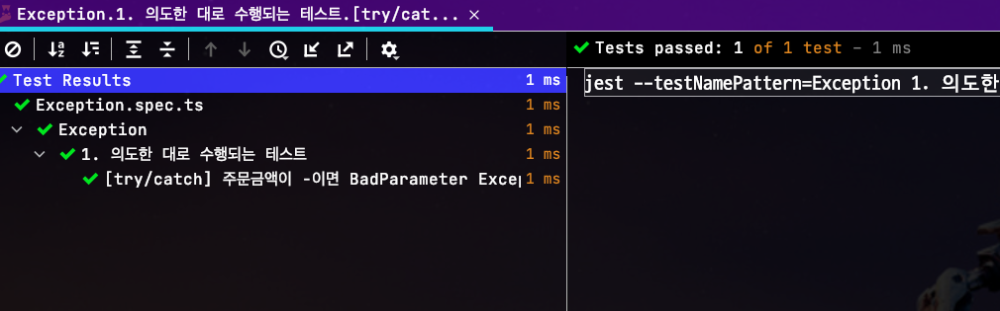
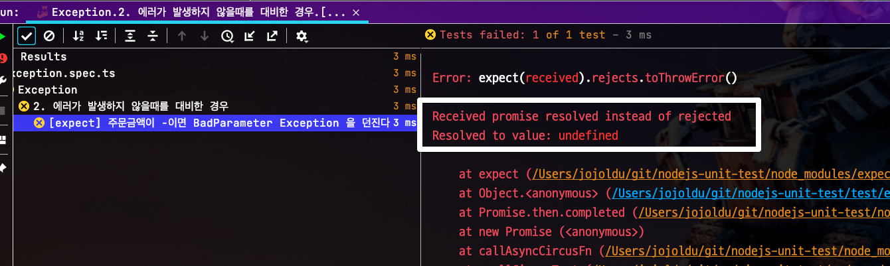
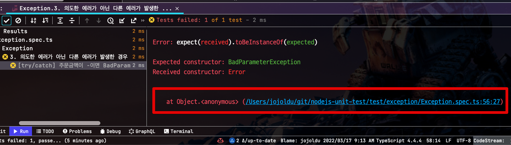
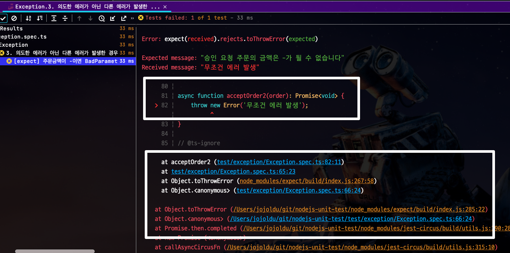

# Jest로 Error 검증시 catch 보다는 expect

Jest를 통한 테스트를 작성하다보면 Exception에 대한 검증을 작성해야할 때가 있다.  
이럴때 보통 2가지 방법 중 하나를 선택한다.

* `try ~ catch`
* `expect.rejects.toThrowError`

실제 코드로는 다음과 같다.

```ts
// try ~ catch
it("[try/catch] 주문금액이 -이면 BadParameter Exception 을 던진다.", async () => {
    try {
        await acceptOrder({amount: -1000});
    } catch (e) {
        expect(e).toBeInstanceOf(BadParameterException);
        expect(e.message).toBe('승인 요청 주문의 금액은 -가 될 수 없습니다');
    }
});

// expect
it("[expect] 주문금액이 -이면 BadParameter Exception 을 던진다.", async () => {
    await expect(async () => {
        await acceptOrder({amount: -1000});
    }).rejects.toThrowError(new BadParameterException('승인 요청 주문의 금액은 -가 될 수 없습니다'));
});
```

이 중에서 개인적으로는 **expect 방식을 선호**하게 됐다.  
이유를 정리해보면 다음과 같다.

## 1. 예외없이 완료 되는 경우

첫번째 코드인 `try/catch` 테스트의 경우 **실제 발생할 예외가 발생하지 않을 경우**를 대비해 여러 코드가 부가적으로 필요하다.  
이를테면 SUT (System under test: 테스트 대상) 가 의도한대로 예외가 발생하지 않고, **정상적으로 수행만 되버려도** 첫번째 테스트는 통과하게 된다.  
  
```ts
async function acceptOrder1(order): Promise<void> {
}

it("[try/catch] 주문금액이 -이면 BadParameter Exception 을 던진다.", async () => {
    try {
        await acceptOrder1({amount: -1000});
    } catch (e) {
        expect(e).toBeInstanceOf(BadParameterException);
        expect(e.message).toBe('승인 요청 주문의 금액은 -가 될 수 없습니다');
    }
});
```



expect가 수행되지 않더라도 테스트 자체는 정상 종료가 가능하기 때문이다.  
거짓된 테스트 통과이다.  
그래서 이를 해결하기 위해 보통 다음과 같은 조치를 취한다.

```ts
it('[try/catch] 주문금액이 -이면 BadParameter Exception 을 던진다.', async () => {
    let errorWeExceptFor = null;
    try {
        await acceptOrder1({amount: -1000});
    } catch (e) {
        expect(e).toBeInstanceOf(BadParameterException);
        expect(e.message).toBe('승인 요청 주문의 금액은 -가 될 수 없습니다');
        errorWeExceptFor = e;
    }

    expect(errorWeExceptFor).not.toBeNull();
});
```

* Exception이 발생했는지, 안했는지 여부를 체크하거나

```ts
it("[try/catch & fail] 주문금액이 -이면 BadParameter Exception 을 던진다.", async() => {
    try {
        await acceptOrder1({amount: -1000});
        throw new Error('it should not reach here');
    } catch (e) {
        expect(e.message).toBe('승인 요청 주문의 금액은 -가 될 수 없습니다');
        expect(e).toBeInstanceOf(BadParameterException);
    }
});
```

* `catch` 로 안빠지게 되면 `throw new Error('it should not reach here')` 를 발생시켜서 꼭 `catch`로 빠지도록 하거나 

등등의 방법들을 쓴다.  
  
물론 `throw new Error` 대신에 `fail()` 을 쓰면 되지 않냐고 할 수 있지만, 현재 Jest에서는 `fail()` 이 정상적으로 작동하지 않는다.  
(애초에 `fail()` 은 Jasmine 것이다.)

* [missing fail() method](https://github.com/facebook/jest/issues/11698)

**try~catch 방법**은 `Exception` 호출 여부를 체크하거나, 강제로 `throw Exception`을 하거나 등의 **후속 조치가 항상 필요하게 된다**.
  
반면에 `expect` 방식은 별도로 조치할 것이 없다.  
의도한대로 **throw가 발생하지 않으면 테스트가 실패**한다.



## 2. 상세한 에러 트레이스

두번째 이유는 상세한 에러 트레이스 때문이다.  
try ~ catch로 잡을 경우 **예상과 다른 에러가 발생시에 추적할 정보가 없다**



이는 이미 `catch` 영역에서 발생한 예외정보를 가져갔기 때문인데,  추적하기 위해서는 **로거를 통해 에러 트레이스를 출력**시켜야만 한다.  
  
반면에 `expect` 방식에서는 예상치 못한 예외가 발생하더라도 **상세하게 예외 트레이스를 모두 출력시켜준다**.



예상한 예외와 다른 예외가 발생했다면, 그게 무엇때문인지 상세하게 알려주기 때문에 원인 파악을 굉장히 쉽게 할 수 있게 된다.

## 마무리

테스트 코드를 검증하는 방식은 **이 테스트가 통과될때만 가정해서는 안된다**.  

* 잘못된 결과로 테스트가 통과한 경우
* 의도와 다른 에러가 발생한 경우

등등 여러 케이스를 고려해서 테스트의 검증문을 선택해야만 한다. 