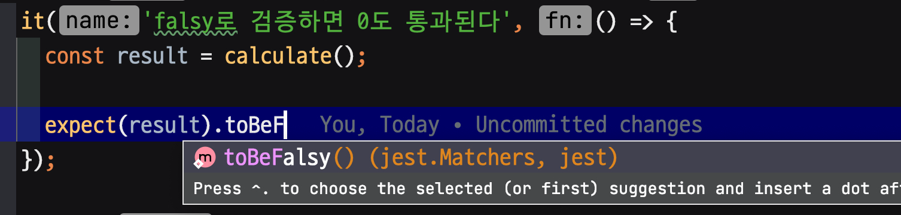
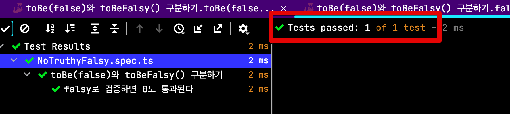
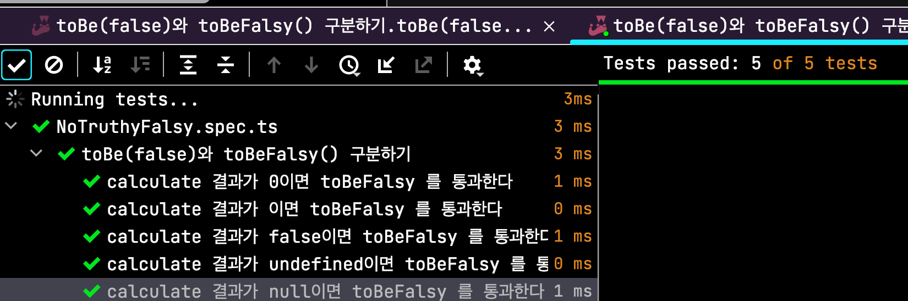
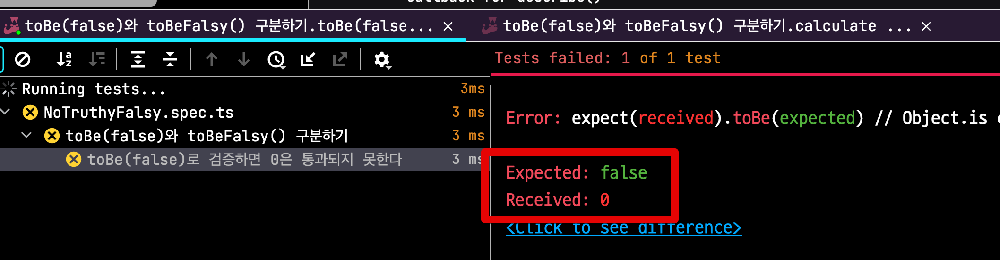

# expect에서 false와 falsy 구분하기

Jest로 테스트 코드를 작성하다보면 습관적으로 IDE의 자동완성으로 `toBeFalsy` 와 `toBeTruthy` 를 사용하곤 했다.  
저 둘이 아닌 `toBe(false)` 와 `toBe(true)` 는 **한 번의 자동완성으로 안되기 때문에** 굳이 사용하진 않았다.  


  
그러다 팀 분의 의견을 받고 더이상 `toBeFalsy()` 는 사용하진 않고 있다.  

> 물론 이에 맞는 쓰임새가 있겠지만, 모든 결과를 강타입으로 처리하는걸 선호하는 입장에서는 `toBeFalsy()` 는 선호하기가 어렵다.

다음과 같은 이유 때문이다.

* `toBeFalsy()` 는 **JS에서 false로 판단되는 모든 값들을 기준**으로 한다

내가 의도한것은 `boolean 타입의 false` 를 원했지만, 수행 결과가 `0, undefined, null, ''` 이면 `toBeFalsy()` 는 통과한다

```ts
it('falsy로 검증하면 0도 통과된다', () => {
  const result = calculate(); // result가 0임에도

  expect(result).toBeFalsy();
});
```



실제로 다음과 같이 테스트 코드를 작성해서 테스트를 해보면 모든 값들이 통과한다

```ts
it.each([
  [0],
  [''],
  [false],
  [undefined],
  [null],
])("calculate 결과가 %s이면 toBeFalsy 를 통과한다", (calculateResult) => {
  const result = calculate(calculateResult);

  expect(result).toBeFalsy();
});
```



그래서 **정확하게 boolean:false를 기대한다면** `toBe(false)` 로 검증해야만 한다.

```ts
it('toBe(false)로 검증하면 0은 통과되지 못한다', () => {
  const result = calculate(0);

  expect(result).toBe(false);
});
```



테스트 코드는 두루뭉실하게 **이것도 되고, 저것도 통과되도록 하는 것이 목표는 아니다**.  
원하는 결과가 명확하다면 그에 맞게 검증문 작성이 필요하다.
