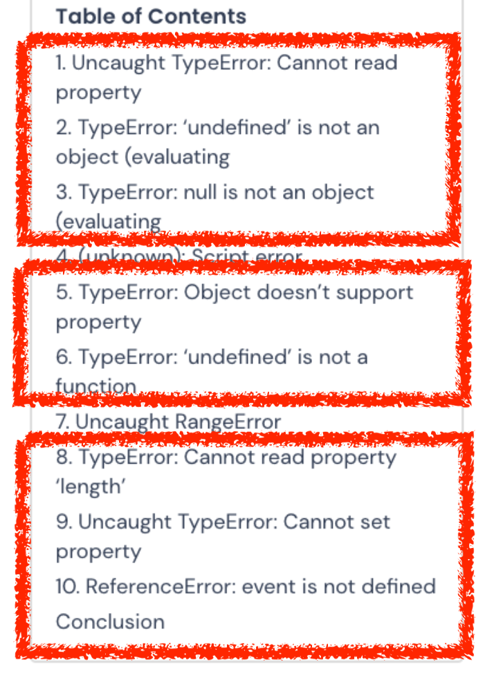
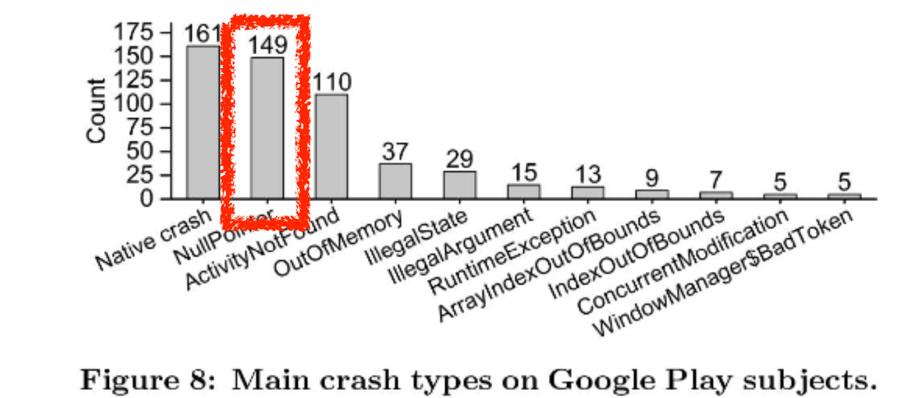
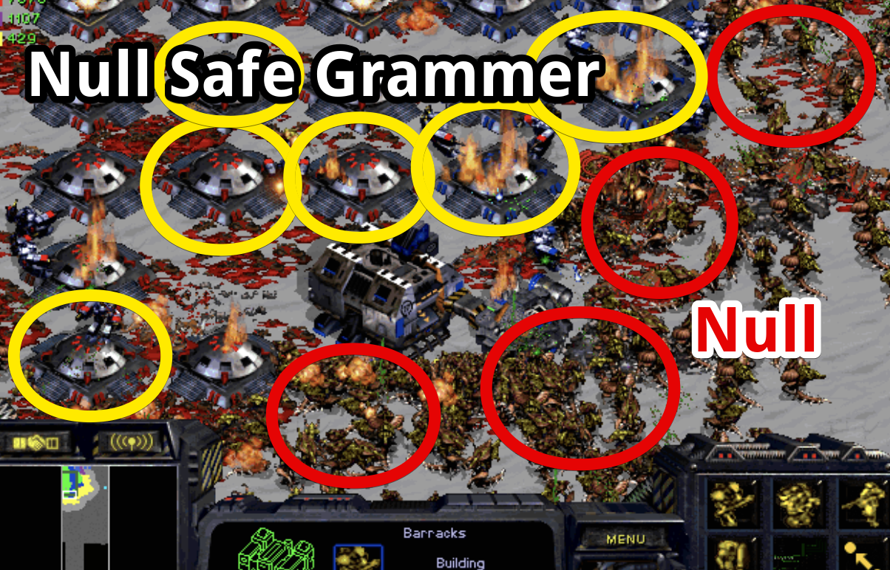
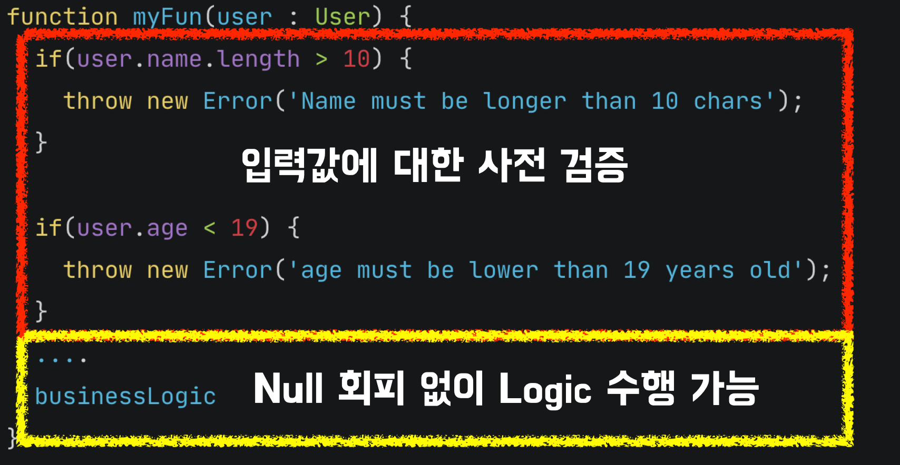
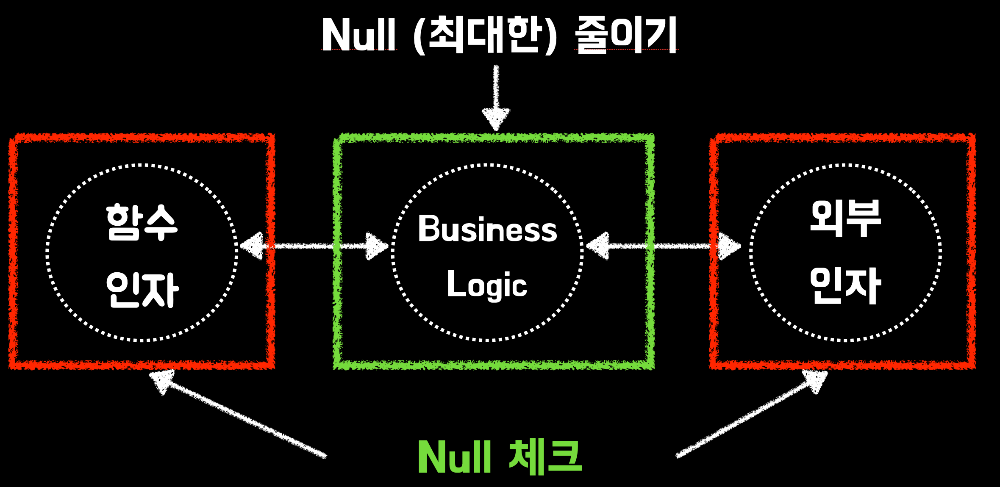
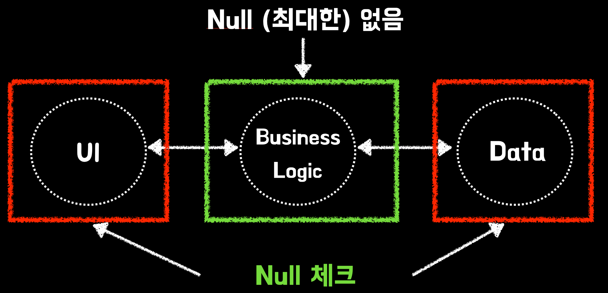
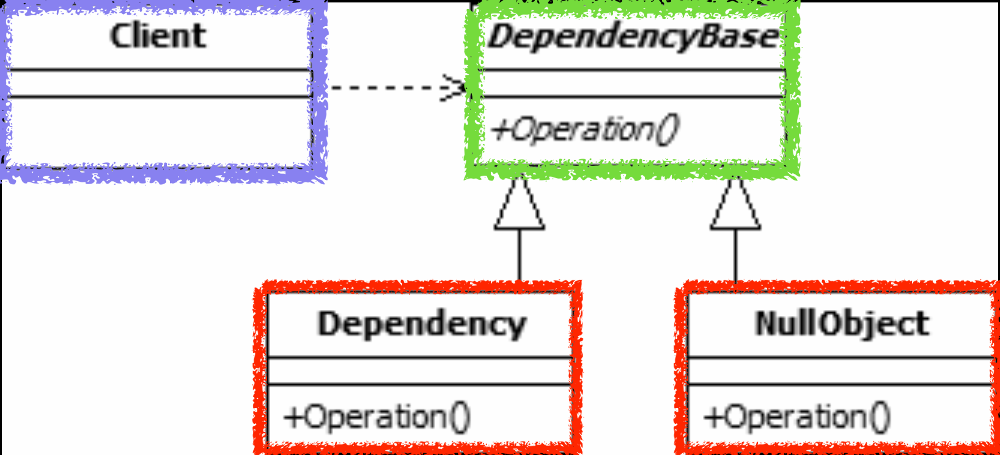
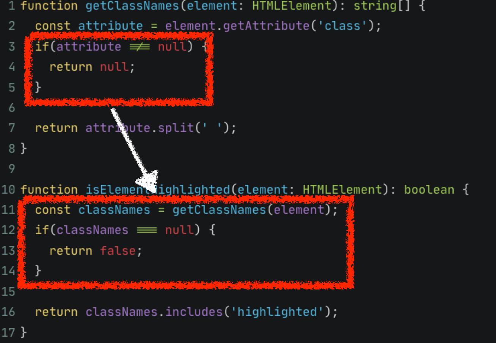
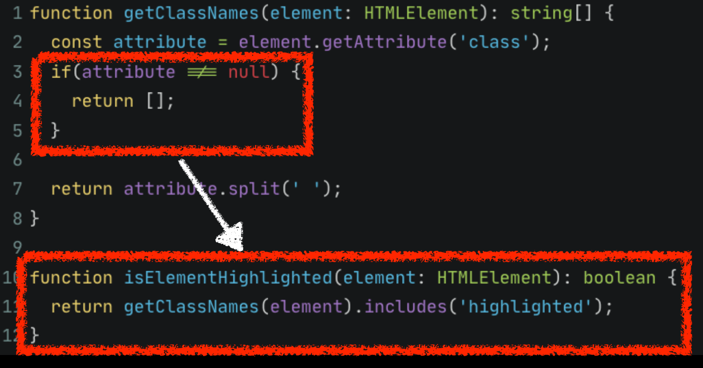

# 3. 좋은 함수 만들기 - Null 을 다루는 방법


> 여기서는 `null` 과 `undefined` 를 구분하지 않고 null 로 통일해서 표현한다. 

정적 분석 서비스 [rollbar](https://rollbar.com/) 에서 **1000개 이상의 JS 프로젝트**에서의 소프트웨어 결함 통계를 공개했다.  



(출처: [top-10-javascript-errors-from-1000-projects](https://rollbar.com/blog/top-10-javascript-errors-from-1000-projects-and-how-to-avoid-them/))


**상위 1~10위까지의 대부분이 null과 undefined 로 인한 문제**였다.  
이 외에 (과거 자료지만) 안드로이드 플레이 스토어의 Top 1,000 Popular Apps 들을 분석한 결과에서도 `NullPointerException` 가 전체 결함 중 2번째였다.  



(출처: [Multi-objective Automated Testingfor Android Applications](http://www0.cs.ucl.ac.uk/staff/K.Mao/archive/p_issta16_sapienz.pdf))

이 만큼 빈값(`Null`, `Undefined`) 을 다루는 것이 애플리케이션을 구현/개선하는데 중요한 역할을 한다.
  
## Null Safe 문법

TypeScriptt나 Kotlin 등 요즘의 모던한 문법을 지원하는 언어들을 사용하다보면 `null` 값들을 안전하게 다루는 여러가지 방법들을 알게 된다.  
다만, 이런 것들은 대부분 지엽적인 경우가 많다.  
이미 Null값이 프로젝트 전방위적으로 퍼져있는 상태에서 **어떻게 Null 에러를 피할 것인가**같은 경우이다.  
예를 들어 대표적인 `null` 을 다루는 방법으로 소개하는 것이 바로 **Optional chaining** (`?.`) 이다.  


```ts
let user = {
  name: 'Alice',
  address: null
};

console.log(user?.address?.street); // 출력: undefined
```

이외에도 **Nullish coalescing** (`??`) 을 활용할 수도 있다.

> TS가 아닌 다른 언어에서는 [엘비스 연산자](https://en.wikipedia.org/wiki/Elvis_operator) (`?:`) 로 불리기도 한다.

```ts
let input = null;
let value = input ?? "default";

console.log(value); // 출력: "default"
```

이런 문법적 기능을 이용하면 인한 `Null Exception` 을 피할 수 있다.
하지만 이런 방법은 **Null 을 다루는 방법이 아니라 Null 을 피하는 방법**이다.  

Null Safe 문법만이 Null을 다루는 방법이 되면 다음과 같이 **모든 영역을 Null Safe 문법으로 도배**해야만 한다.  



(출처: [tobaek.com](https://tobaek.com/58))

**모든 객체의 하위 탐색이 있을때마다 `?.` 을 붙일 것**인가?와 같은 일이 생긴다는 것이다.  
  
즉, Null Safe 문법은 어디까지나 보조적인 도구이지, **애초에 Null을 어디까지 허용할 것인가** 등의 고민이 먼저 필요한 것이다.  

## null을 안전하게 다루는 패턴

이번 시간에 이야기해볼 것은 `null` 을 다루는 방법이다.  
저런 문법적 도움 없는 언어나 생태계에서도 통용되며,  
근본적으로 저런 **Null 관련 기능들의 사용을 최소화할 수 있는 패턴** 혹은 구조를 이야기 해보고 싶다.

### 1. 사전 조건 검증

처음 봤던 이미지를 다시 보자.  
Null 값이 프로그램 전체에 퍼져있으면 그만큼의 Null Safe 코드가 프로그램 전체에 퍼져있어야만한다.


(출처: [tobaek.com](https://tobaek.com/58))

이렇게 Null 객체가 프로그램 전체에 퍼지지 않도록 하려면 어떻게 해야할까?  
  
가장 쉽고 흔한 방법은 **입구에서 막는 것**이다.


(출처: [kkmg2012.tistory.com](https://kkmg2012.tistory.com/1329))

예를 들어 다음과 같이 `user` 객체의 상태에 대해 조건 검증이 필요하다면 그건 가능하면 **가장 진입점에서 검증**을 해야만 한다.

```ts
function myFun(user : User) {
  if(user.name !== null) {
    throw new Error('Name must be Non Null');
  }
  
  if(user.age < 19) {
    throw new Error('age must be lower than 19 years old');
  }
  ....
  businessLogic // 이 로직은 안전해진다.
}
```

이렇게 되면 **주요 로직들은 Null에 대한 걱정 없이 수행할 수 있다**.



다만, 이런 사전 조건 체크해야할 대상이 많다면 (객체의 필드가 많을 경우), 수많은 `if`문으로 주요 로직을 확인하기가 어렵다.  
이를 도와주는 도구들을 사용하는 것이 좋다.  
  
주로 사용하는 언어의 `PreCondition` 라이브러리를 검색해보면 `if` 문을 간소화시켜주는 것들이 많다.

```ts
function myFun(user : User) {
  requires(user.name !== null, 'Name must be Non Null');
  requires(user.age < 19, 'age must be lower than 19 years old');
  ....
  businessLogic
}
```

- [JanMalch/ts-code-contracts](https://github.com/JanMalch/ts-code-contracts)
- [Guava - Preconditions](https://kwonnam.pe.kr/wiki/java/lombok/pitfall?s[]=guava#nonnull_%EC%82%AC%EC%9A%A9_%EA%B8%88%EC%A7%80)

사용자의 입력 혹은 외부 API 조회 등으로 직렬화/역직렬화가 필요한 계층에서는 **데코레이터 (어노테이션) 기반**으로 사전 검증을 하는 것도 좋다.

```ts
export class User {
  @IsNotEmpty()
  name: string;

  @IsInt()
  @Min(20)
  age: number;
}
```

- [typestack/class-validator](https://github.com/typestack/class-validator)

위 조건들은 런타임 여부에 관계 없이 실행되는 코드이지만, 자바와 같은 언어에서는 **런타임에서는 실행되지 않는 조건 검증**이 가능하다.  

```java
assert 식1;
assert 식1 : 식2;

ex)

private void setRefreshInterval(int interval) {
  assert interval > 0 && interval <= 1000/MAX_REFRESH_RATE : 'interval must be positive and less than 1000/MAX_REFRESH_RATE';
  ...
}
```

- 참고: [IDE, CLI에서의 실행 방법](https://dirask.com/posts/Java-how-to-enable-assertions-X13EBp)

위 코드는 Boolean 식1이 거짓이면 `AssertionError` 발생하며 식2의 메세지가 출력된다.

- `-enableassertions` 또는 `-ea` 옵션으로 활성화 가능
  - 운영 환경에서는 이 구문이 무시 된다.
- `Exception` 아님! (주의)

사전체크 대신에 단정문이 필요한 경우는 **개발단계에서 실행 가능한 주석으로서의 효과**를 기대할 수 있다.

사전 조건 검증 (`if`, `PreCondition`, `Decorator` 등) 은 결국 **Null이 침범하지 않는 영역을 확실하게 확보하는 것**을 의미한다.  
  
함수 내부에서 인자로 받은 값에 대한 검증, API나 상태 도구에서 가져온 값등을 시작 단계에서 바로 검증하여, **주요 비즈니스 로직까지 Null이 침범하지 않도록 하는 것**이다.  



이걸 좀 더 확장한다면 함수를 넘어 계층에서도 가장 진입점이 되는 계층에서 Null에 대한 검증을 하는 것이 좋다.



Nest나 Spring MVC 등에서 Request DTO 에서 데코레이터(어노테이션)을 활용하여 입력값을 검증하는 것이 이에 해당한다.
### 2. Null을 (최대한) 반환하지 않는다

**null 의 범위를 메소드/함수 지역으로 제한**한다.

Null도 지역적으로 제한할 경우 큰 문제가 안된다.  
메서드/함수의 인자로 전달되는 경우, **메서드/함수 내부에서만 null을 사용하고 가능한 외부로 전달되지 않도록 한다**.  

- 반환 값이 꼭 있어야 한다면 **null을 반환하지 말고 예외를 던진다**. (`throw Error`)
- **Null 대신 유효한 값이 반환** 되어 이후 실행 되는 로직에서 Null로 인한 피해가 가지 않도록 한다.
  - [Null Object Pattern](https://johngrib.github.io/wiki/pattern/null-object/)


Null 값을 만날 경우 **그게 정상적인 흐름이 아닌 경우 예외를 던지는 것** 은 주로 사용하는 방법이다.  
  
다만, 예외로 인해 Flow가 종료되는 것이 아니라 다음 흐름으로 정상적으로 넘어가길 원하는 경우엔 예외를 던질 수가 없다.  
  
이럴 경우 [Null Object](https://en.wikipedia.org/wiki/Null_object_pattern)를 사용하면 좋다.  
  
Null Object Pattern은 Null 처리를 단순화하는 방법이다.  
Null이 아닌 디폴트 객체를 반환하여 Null인 경우에도 프로그램이 계속 동작하도록 한다.  
보통 ORM 등을 사용하다보면 **조회결과가 없을 때 빈 배열을 반환하는 경우**가 이에 속한다.



예를 들면 다음과 같다.



위 코드와 같이 Null을 반환하는 함수 (`getClassNames`) 에 의존하면, **항상 Null 체크가 필요**하다.  
  
반면, Null 이 아닌 Null Object (`[]`) 을 반환하면 **의존하는 함수들은 Null체크를 하지 않아도 된다**



boolean이 반환될때 역시 **null은 배제하고 false 를 반환하는 것이 좋다**.  
boolean은 엄밀히 말해서 **2가지 타입을 가진 열거형**이다.  
이걸 `null`을 넣어서 3가지 타입으로 늘리는 것은 좋지 않다.  
원래 의도대로 2가지의 타입으로 표현해야하며, Null과 false가 구분이 필요하다면 이건 **3개의 경우를 표현해야하는 열거형**이 필요한 경우이다. 

```ts
// bad
null, false, true

// good
READY, PASS, FAIL
```

문자열은 상황에 따라 다르다.  
다음과 같이 단순히 문자들의 집합으로서만 문자열이 필요하다면 **빈 문자열을 Null Object로** 사용하면 된다.

```ts
export class UserComment {
  private _comment: string | null = null;
  
  get comment(): string {
    return this._comment ?? '';
  }
}
```

- 코멘트는 노출용 문자열이기 때문에 빈 문자열이 Null을 대체해도 사이드 이펙트가 없으며, 호출자에서도 그대로 노출하면 된다.

단, 특정 의미를 지니는 경우엔 Null을 반환하는 것이 낫다.

```ts
export class Payment {
  private _cardNo: string | null = null;
  
  get cardNo(): string | null {
    return this._cardNo;
  }
}
```

위 코드에서는 문자열이 Null 인 것은 **카드 거래가 없음을 나타낸다**.  
이럴 경우 Null은 그 의미를 지니고 있기 때문에 Null Object로 대체하기가 곤란할 수 있다.
  
#### Null Object (React)

객체의 경우에도 충분히 사용할 수 있다.  
예를 들어 다음과 같이 User 객체의 Null 유무에 따라 노출값이 달라질 경우 Null Safe 문법 (Nullish coalescing) 을 통해 쉽게 해결할 순 있다.

```jsx
// bad
const UserInfo = ({ user }) => {
  return (
          <div>
            <p>Name: {user?.name ?? 'Not Available'}</p>
            <p>Email: {user?.email ?? 'Not Available'}</p>
          </div>
  );
};

const ParentComponent = ({ user }) => {
  return <UserInfo user={user} />;
};
```

다만, 다음과 같은 경우엔 이는 좋은 해결책이 아니다.

- User 객체가 Null 인것만 체크하면 되는데, 모든 필드마다 Null Safe 문법이 필요한가?
  - User 객체의 필드가 Null 인지에 대한 고려는 하단에서 개선책을 나눈다.
- User 객체가 사용되는 곳이 UserInfo 외에도 많다면 어떻게 될까?
- User 객체의 필드가 2개가 아니라 10개, 20개라면 어떻게 될까?

결국 한번 퍼진 Null 은 UserInfo 외에도 수많은 함수, 컴포넌트에서 Null Safe 문법을 사용해야만 한다.  
  
이럴 경우 Null Object를 활용하기 좋다.

```jsx
// good
const UserInfo = ({ user }) => {
  return (
    <div>
      <p>Name: {user.name}</p>
      <p>Email: {user.email}</p>
    </div>
  );
};

const getUser = ({ user }) => {
  // user가 null인 경우 대신 사용할 null 객체
  return user ?? {
    name: 'Not Available',
    email: 'Not Available',
  };
}

const ParentComponent = ({ user }) => {
  return <UserInfo user={ getUser(user) } />;
};
```

이렇게 될 경우 User 객체를 사용하는 곳에서는 별도의 Null체크가 필요하지 않게 된다.  

만약 User의 필드들에 대해서도 Null 체크가 필요하다면, **기본값을 가진 객체를 반환하는 함수나 클래스를 활용하면 좋다**. 

```ts
class User {
  name = 'Not Available',
  email = 'Not Available',

  constructor(name: string, email: string) {
      this.name = name;
      this.email = email;
  }
}
```

#### 주의할 점

**Null Object Pattern은 [Fail-fast](https://en.wikipedia.org/wiki/Fail-fast)를 못하게 한다**.  

오류가 있는 상황이라 더이상 Flow를 진행하면 안되는 경우라면 바로 Exception을 발생시키는 것이 옳으며, 괜히 널 객체로 인해 실제 오류가 발생한 지점에서 멀리 떨어진 함수에서 오류가 발생해선 안된다.

### 3. 함수 파라미터, 함수 전달인자에서 null 최대한 피하기

함수나 객체의 인자로 null 을 전달하는 것은 피한다.
**함수 파라미터 (매개변수)는 nullable을 최대한 피한다**.  
  
호출하는 쪽에서 인자로 null을 넣어도 된다고 느끼게 하면 안된다.  
null로 지나치게 유연한 메서드를 만들지 말고 최대한 **명시적인 메서드/함수를 만들어야 한다**.  
  
다만, 이렇게 되면 외부의 API, 사용자의 입력, 데이터베이스의 조회 등으로 null 을 함수 인자로 전달할 수 밖에 없는 상황에서의 방법이 중요하다.  
  
예를 들어 아래 코드에서 `printLength` 은 null에 대한 방어가 되어있다.  
그래서 **이를 호출하는 함수들은 무분별하게 null을 인자로 전달**한다.  

```ts
// bad
function mainFunction() {
  let value: string | null = getNullableValue();
  printLength(value); // null 체크 없이 바로 전달한다.
  ...이후 비즈니스 로직
}

function printLength(input: string | null) {
  if (input !== null) {
    console.log(input.length);
  }
}
```

이 방식은 여러 편의성을 제공한다.  
함수 `printLength` 를 호출하는 누구나 null 을 신경쓰지 않게 되었기 때문이다.  
  
다만, 문제는 **함수 파라미터가 null을 허용할수록 null의 범위가 커진다**는 것이다.  
모든 공통 함수가 null을 허용한다는 것은, **그 함수를 호출하는 함수들은 null을 무분별하게 쓰라고 권장**하는 것과 비슷하다.  

null은 개발자가 주의를 기울여야하며 최대한 지양해야할 값의 유형이지, 무분별하게 사용해도 될 것이 아니다.  
   
좀 더 실제에 가까운 예제를 보자.  
다음은 `문자열 <-> LocalDateTime` 을 치환하는 유틸리티 함수의 모음이다.   

```ts
export class DateTime {
  private static DATE_TIME_FORMATTER = DateTimeFormatter.ofPattern(
    'yyyy-MM-dd HH:mm:ss',
  );

  static toString(dateTime: LocalDateTime | null): string {
    if (!dateTime) {
      return '';
    }

    return dateTime.format(this.DATE_TIME_FORMATTER);
  }
  ....
}
```

이 함수는 null을 허용한다.  
null이 들어오면 안전하게 **빈 문자열을 반환**한다.  
그리고 이제 이 함수를 호출하는 모든 함수들은 **무분별하게 null을 사용하게 된다**.

```ts
function mainFunction() {
  const value: LocalDateTime | null = getNullableTime();
  const dateStr = DateTime.toString(value);
  ...
}
```

위 mainFunction은 `value` 가 null 임에도 함수 곳곳에서 이를 활용하게 된다.  
이 외에도 **값이 null 일 경우 어떤 데이터/액션이 필요한지를 호출자가 결정할 수가 없게 된다**.  
문자열로 치환이 필요한 LocalDateTime 값이 null 일 경우 

- 빈 문자열
- null 
- throw Exception

등등 어떤 결과가 필요할지를 유틸 함수인 `DateTime`이 결정 (빈 문자열 반환) 한다.  
호출을 하는 주체 함수에서 결정할 수 없다.

오히려 다음과 같이 null을 허용하지 않고, 호출하는 쪽의 자유도에 맡기는 것이 더 열린 결말이다.

```ts
export class DateTime {
  static toString(dateTime: LocalDateTime): string {
    return dateTime.format(this.DATE_TIME_FORMATTER);
  }
}

function main() {
  const orderedAt = getOrderedAt();
  const dateStr = orderedAt ? DateTime.to(orderedAt) : ''; // 혹은 원하는 무엇이든
  subFunction(dateStr);
}  
```

그래서 **최대한 함수의 파라미터와 인자에는 null을 허용하지 않도록 구현한다**.  

그리고 **null이 아닌 경우에만 인자로 전달**하는 방법을 고려할때는 가능하면  `1. 사전 조건 검증` 에서 언급한 Early Exit을 사용하는 것을 추천한다.  
  
아래 예제코드를 기반으로 이야기하면,

```ts
function mainFunction() {
  let value: string | null = getNullableValue();
  if(value !== null) {
    nonnullFunction(value); 
  }
  ...이후 비즈니스 로직
}
```

이유는 다음과 같다.

- `nonnullFunction` 에서 null 체크를 하더라도, 그 아래 코드들에서 `value = null` 로 인해 문제가 발생할 수 있다.
  - 이를 위해 `nonnullFunction` 를 호출하는 코드 외에도 아래 로직들에서 null check 혹은 null safe 문법을 사용해야만 한다.

```ts
function mainFunction() {
  let value: string | null = getNullableValue();
  if(value !== null) { 
    nonnullFunction(value); 
  }
  ...이후 비즈니스 로직 // <-- 여기서도 똑같이 null safe 가 필요할 수 있다.
}
```

결국 null 값의 범위를 어디까지 줄일 수 있을 것인가의 문제가 된다.  

```ts
function mainFunction() {
  let value: string | null = getNullableValue();
  
  // Early Exit
  if (value === null) {
    return ;
  }
  
  /** 아래부터는 Null Safe Zone **/
  nullableFunction(value); 
  ... 비즈니스 로직
}
```

가능하면 함수 파라미터 (매개변수) 에서는 null 허용을 최대한 피한다.  
그리고 그렇게 null을 받지 않는 함수들의 모음을 최대한 늘려, null의 범위를 최소한으로 한다.

### 4. 명확한 초기값을 설정한다.

- 초기화 시점과 실행 시점이 겹치지 않아야 한다

```ts
class BadExample {
    instanceVariable: string | null = null;

    constructor() {
        this.instanceVariable = this.getNullableValue(); 
        // 초기화 시점과 실행 시점이 겹침: 생성자에서 초기화하면서 메소드를 실행
        console.log(this.instanceVariable.length); // Null Pointer Exception 발생 가능성
    }

    getNullableValue(): string | null {
        // null이나 non-null 값을 반환
        return null; // 예시를 위해 항상 null 반환
    }
}

class GoodExample {
    instanceVariable: string | null = null;

    constructor(input: string | null) {
        this.instanceVariable = input; 
        // 초기화 시점과 실행 시점이 분리: 객체 생성 시점에 값을 설정하고, 나중에 메소드를 실행
    }

    execute(): void {
        if (this.instanceVariable !== null) {
            console.log(this.instanceVariable.length);
        } else {
            // 적절한 예외 처리
        }
    }
}

let value: string | null = getNullableValue();

let goodExample = new GoodExample(value);
goodExample.execute();
```

- 실행 시점에 null인 필드는 초기화되지 않았다는 의미가 아닌, 값이 없다는 의미여야 한다.
- 실행 시점엔 초기화되지 않은 필드가 없어야 한다

```ts
class Item {
    private name: string;
    private price: number;

    constructor() {
        this.name = '';
        this.price = 0;
    }

    initialize(name: string, price: number) {
        this.name = name;
        this.price = price;
    }

    purchase(quantity: number): number {
        return this.price * quantity;
    }
}
```

```ts
let myItem = new Item(); 
// 초기화 시점: name은 빈 문자열이고, price는 0입니다.
myItem.initialize('Apple', 150); 
// 실행 시점: 여기서 'Apple'로 name을 설정하고, 150으로 price를 설정합니다.

let total = myItem.purchase(3); 
// 실행 시점: 여기서 purchase 메서드를 사용하여 총 금액을 계산합니다.
console.log(total); // 출력: 450
```

- 지연 초기화(lazy initialization) 필드의 경우 팩토리 메서드로 null 처리를 캡슐화 하라
  - null 처리 로직을 팩토리 메서드 내부로 숨기는 것을 의미합니다. 이 원칙을 따르면 null 처리 로직이 전체 코드에 퍼져 있지 않고 한 곳에 모여있게 되므로 가독성과 유지보수성이 향상된다.


## 마무리

Null Safe 문법들은 Null 문제를 회피할 수 있다.  
다만 그로 인해, **개발자들이 점점 더 무분별하게 Null 사용을 부추긴다**.   

null로 지나치게 유연한 메서드를 만들지 말고 **명시적인 메서드/함수를 만들어야 한다**.  

Null 의 범위를 좁히는 방법
 - Pre Condition (사전 조건 체크)
 - Null 반환 금지
     - throw Error
     - return Null Object
 - Null 함수 인자 전달 금지
 - 초기값과 실행값 구분


## 함께 보면 좋은 글

- [자바에서 null을 안전히 다루는 방법 (박성철)](https://www.youtube.com/watch?v=vX3yY_36Sk4)
- [is_left vs left_at vs left_status](https://jojoldu.tistory.com/577)
- [Number와 boolean 은 최대한 Not Null로 선언하기](https://jojoldu.tistory.com/718)
- [좋은 API Response Body 만들기](https://jojoldu.tistory.com/720)

