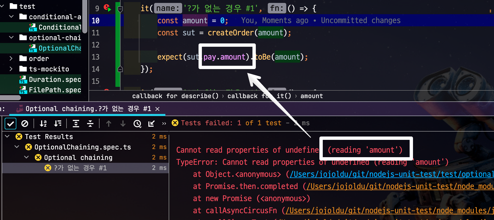

# 테스트코드에서 Optional chaining(?.) 금지

여러 포스팅에서 언급한것처럼 **테스트 코드는 빠르게 실패를 파악할 수 있어야 한다**.  
  
그런면에서 `Optional chaining(?.)` 은 테스트코드에 적합하지 않다.  

MDN의 설명을 가져오면 `Optional chaining(?.)`은 `체이닝 연산자(.)` 와 유사하게 작동하지만, 만약 참조가 **nullish (en-US) (null 또는 undefined)이라면, 에러가 발생하는 것 대신에 표현식의 리턴 값을 undefined로 반환**한다.  
    
따라서 참조가 누락될 가능성이 있는 경우 연결된 속성으로 접근할 때 더 짧고 간단한 표현식이 생성된다.  
어떤 속성이 필요한지에 대한 보증이 확실하지 않는 경우 객체의 내용을 탐색하는 동안 도움이 될 수 있다.  
  
안정적으로 객체 탐색이 가능하기 때문에 프로덕션 코드에서는 적극적으로 사용하는 편이다.  
하지만 테스트 코드에서는 **안정적인 점이 오히려 단점**이 된다.  
    
## 문제

이를 테면 다음과 같이 `sut` 의 하위에 있는 `pay.amount` 를 검증한다고 하자.  
이때 `Optional chaining(?.)` 을 사용한다면 다음과 같다.

```ts
it('?가 있는 경우 #1', () => {
    const amount = 0;
    const sut = createOrder(amount);

    expect(sut?.pay?.amount).toBe(amount);
});

class Order {
    pay;

    constructor(amount?) {
        if(amount) {
            this.pay = {
                amount,
            }
        }
    }
}
```

이 테스트는 다음과 같이 실패한다.


실패 로그를 보고 **왜 실패했는지** 짐작이 가능할까?  

* `sut`가 `undefined`인지
* `pay`가 `undefined`인지
* `amount`가 `undefined`인지

탐색 객체가 깊으면 깊을수록 **실패원인을 찾기가 어렵다**.  
  
반면 다음과 같이 `Optional chaining(?.)` 없이 테스트를 작성한다면

```ts
it('?가 없는 경우 #1', () => {
    const amount = 0;
    const sut = createOrder(amount);

    expect(sut.pay.amount).toBe(amount);
});
```

다음과 같이 `pay` 객체가 없음을 알 수 있다.



* `amount`가 없다면 `Cannot read properties of undefined` 가 아니라 첫번째 예제처럼 `undefined` 값 비교만 발생한다.

만약 최상위 객체인 `sut`가 없는 경우에도 

```ts
it('?가 있는 경우 #2', () => {
    const amount = -100; // sut 비생성 규칙
    const sut = createOrder(amount); // sut가 undefined

    expect(sut?.pay?.amount).toBe(amount);
});

function createOrder(amount?) {
    if(amount < 0) {
        return undefined;
    }

    return new Order(amount);
}
```

Optional chaining(?.)은 **어디가 문제인지 표기하지 못한다**


 
반면 Optional chaining(?.) 이 없는 로직에서는 `sut` 객체가 `undefined` 임을 명시해준다

```ts
it('?가 없는 경우 #2', () => {
    const amount = -100;
    const sut = createOrder(amount);

    expect(sut.pay.amount).toBe(amount);
});
```


## 마무리

테스트 코드는 프로덕션 코드와 달리 **안정적으로 프로그램을 수행하는 것이 목적이 아니다**.  
테스트 코드는 실패할 테스트는 **더 빠르고, 명확한 이유로 실패**나는것이 좋다.  
Optional chaining(?.)처럼 실패할 것을 방지하는 것은 오히려 테스트 코드의 목적을 방해한다.  
실패 원인을 더 명확한 코드를 작성할수록 테스트 관리가 더 용이하다.