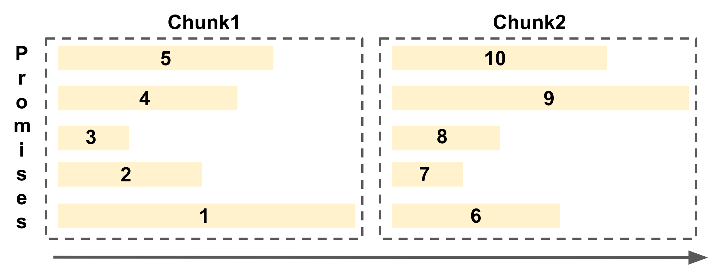
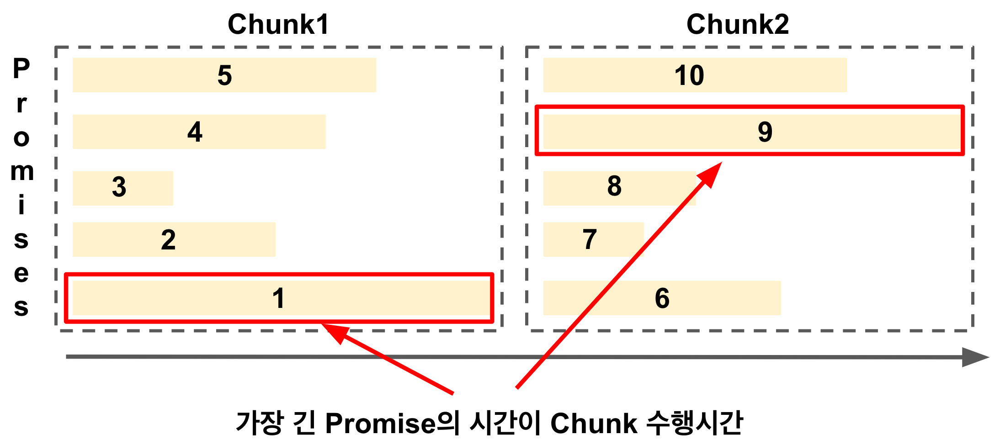
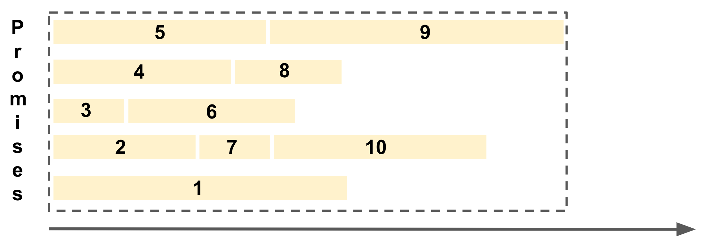
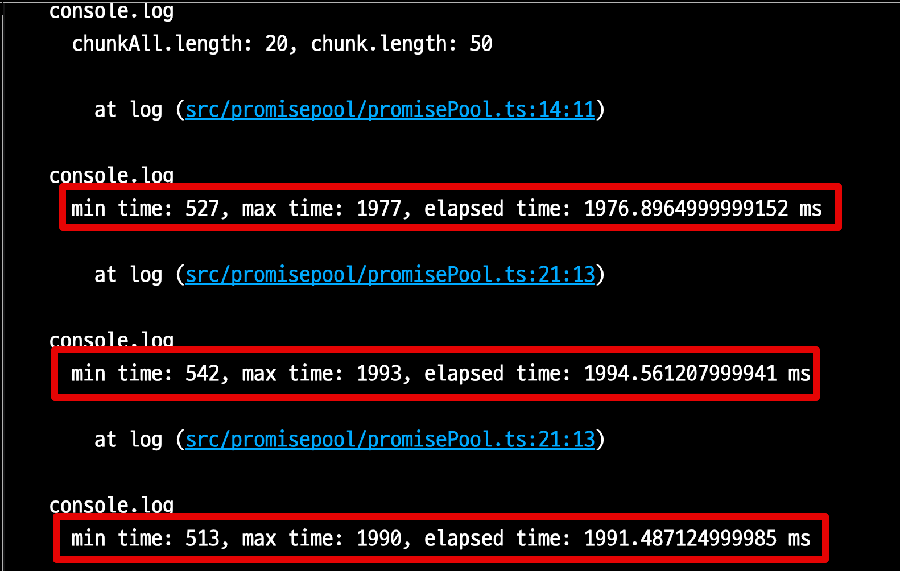
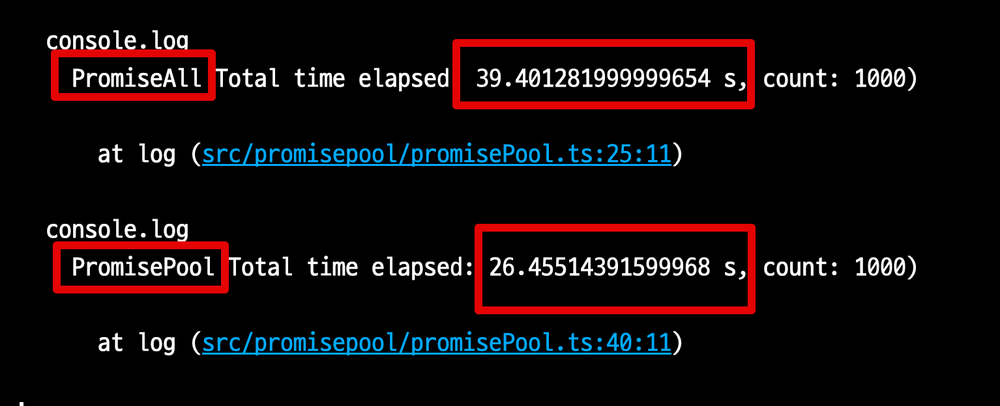

# Promise Pool로 성능 개선하기

Node.js 환경에서는 다수의 비동기 작업을 처리하기에 적합하다.  
예를 들어, 다음과 같은 상황이 있다고 가정해보자.

- ID 별로 조회만 가능한 외부 서비스에서 대량의 건수를 API로 조회해야하는 경우
- `join`, `subquery` 로 조회시 성능과 DB의 부하가 심하여, `id` 별로 쿼리를 나눠서 조회해야하는 경우
- 대량으로 이벤트 메세지를 발행해야하는 경우

등등 다량의 Promise 작업들은 백엔드 애플리케이션 작업에서는 언제든지 발생할 수 있다.  
이럴때 Node.js 환경에서는 `Promise.all` 을 통해 쉽게 해결할 수 있다.  
여기서 `Promise.all` 보다 좀 더 성능을 개선할 수 있는 방법을 보자.
## 개요

수백개 이상의 Promise 작업들은 보통 한번에 `Promise.all`을 수행하지 않는다.  

예를 들어 수백개의 조회 쿼리를 Node.js 환경에서 수행해야한다고 가정해보자.  
이럴 경우 **데이터베이스의 커넥션풀 제한** 등을 고려해서 적당량의 chunk로 분할해서 `Promise.all`을 수행한다.  
  
데이터베이스의 커넥션 풀이 50개인 상황에서, 1,000개의 쿼리 수행이 필요하다면 보통은 50개 이하의 단위 (chunk) 로 Promise 배열을 만들어 이들을 `Promise.all` 로 수행한다.  
(실제 운영 환경에서는 chunk를 50개로도 잡지 않는다.  
다른 서버들도 여러 쿼리들이 수행될 수 있기 때문에 그보다 훨씬 더 낮은 값으로 잡는다.)  
  
예로 든 것처럼 Chunk단위로 나눠진 Prmise 배열들을 `Promise.all`로 수행하는 형태는 다음과 같다.



각 Chunk 단위로 병렬로 Promise들이 수행되어 효율적으로 기능을 수행할 수 있다.  
Chunk + `Promise.all` 의 조합에서는 **Promise 배열 내 가장 긴 Promise가 Chunk의 수행 시간**이 된다.



그러다보니 **가장 긴 Promise가 끝나기 전까지는 다음 Promise들은 작업을 하지 않는 비효율**이 발생할 수 있다.  
  
위 그림의 첫번째 Chunk를 보면 1번 Promise가 가장 긴 작업이라 나머지 2~5 Promise들은 작업이 이미 끝났지만 다음 Promise들인 6~10이 작업을 시작할 수가 없다.  
  
이런 비효율을 개선하기 위해 Promise들을 Pool로 관리하는 방법이 있다.  
  
Promise Pool 방법은 다음과 같이 **지정한 개수 만큼의 레일을 깔아두고 이 자리를 Promise 들이 계속 채워가는 형태**가 된다.



각 레일별로 Promise가 끝나는 대로, 다음 Promise들이 빈 레일에서 작업을 수행한다.  
  
그래서 이 Promise Pool 방법을 실제 예제로 한번 테스트해보자.
## 테스트

많은 Promise Pool 라이브러리가 있다.  

- [@supercharge/promise-pool](https://github.com/supercharge/promise-pool)
- [es6-promise-pool](https://github.com/timdp/es6-promise-pool)

이 중에서는 [@supercharge/promise-pool](https://github.com/supercharge/promise-pool) 가 최근까지도 개발되고 있으며 **API가 명시적이고 직관적이다**.  
  
예제 코드를 작성해보자.

```ts
export async function measure(chunkSize = 50) {
  const times = Array.from({length: 1000}, () => getRandomTime(500, 2000));
  await measurePromiseAll(times, chunkSize);
  await measurePromisePool(times, chunkSize);
}

async function measurePromiseAll(times: number[], chunkSize: number) {
  clear();
  const chunkAll = _.chunk(times, chunkSize);
  console.log(`chunkAll.length: ${chunkAll.length}, chunk.length: ${chunkAll[0].length}`);
  const startTime = performance.now();

  for (const chunk of chunkAll) {
    const chunkStartTime = performance.now();
    await Promise.all(chunk.map(time => insert(time)));
    const chunkEndTime = performance.now();
    console.log(`min time: ${Math.min(...chunk)}, max time: ${Math.max(...chunk)}, elapsed time: ${chunkEndTime - chunkStartTime} ms`);
  }

  const endTime = performance.now();
  const elapsedTime = endTime - startTime;

  console.log(`PromiseAll Total time elapsed: ${elapsedTime/1000} s, count: ${count()})`);
}

async function measurePromisePool(times: number[], chunkSize: number) {
  clear();
  const startTime = performance.now();

  const { results, errors } = await PromisePool
    .for(times)
    .withConcurrency(chunkSize)
    .process(insert);

  const endTime = performance.now();
  const elapsedTime = endTime - startTime;

  console.log(`PromisePool Total time elapsed: ${elapsedTime/1000} s, count: ${count()})`);
}
```

> 전체 예제 코드는 [Github](https://github.com/jojoldu/nodejs-unit-test/blob/master/src/promisepool/promisePool.ts) 에 존재한다.

### 테스트 결과

- 총 1,000개의 Promise (`sleep`) 
- 각 `sleep`은 0.5 ~ 2초 사이의 **랜덤한 소요 시간**을 가진다.
- chunk 단위는 50으로 설정했다.
  - `measurePromiseAll` 에서는 **Chunk단위를 50개**로 Promise 배열을 나누어 총 20개의 배열을 순차적으로 수행한다.
  - `measurePromiseAll` 에서는 **50개의 레일**을 깔아 Promise 1000개를 수행한다.

이를 수행해보면?  
  
Promise.all은 각 Chunk에서의 최소 수행시간이 0.5, 최대 수행시간이 1.9초인 것을 알 수 있다.


  
그래서 **각 Chunk 내에서 가장 긴 작업 시간이 Chunk의 작업 시간**이 된다. 
  
전체를 모두 수행한 2개 작업들의 최종 결과는 다음과 같다.



- `Promise.all`
  - 39.4초
  - 20개의 Chunk 작업 시간이 총 39.4초 (20개 X 19.x초) 가 되었다.  
- `PromisePool`
  - 26.4초

테스트 결과, PromisePool로 인해 `Promise.all` 보다 **33% 더 성능이 개선**되었다.
50개의 레일에서 작업이 끝나는대로 다음 Promise들을 수행하기 때문이다.  
  
## 주의

Chunk 단위마다 긴 작업이 하나씩은 꼭 포함되어있기 때문에 이런 결과가 나온 것이지,  
**Promise마다 작업시간이 거의 유사한 상황에서는 결과가 큰 차이가 없다**.  
  
특히 실제 운영 환경에서 검증한 것이 아닌, 한정된 자원내에서의 성능 테스트이기 때문에 **실제 서비스 적용전에는 충분한 검증이 필요**하다.  
  
만약 본인의 환경에서 `Promise.all` 을 통해 더이상 성능을 개선할 수 없을때 시도해볼만하며, **Promise.all로 충분히 처리 가능한 상황에서는 굳이 선택하지 않아도 된다**.  
  
이른 최적화 보다는 가능한 필요한 시점에 최적화를 하는 것을 추천한다.

## 마무리

Promise.all은 Promise들을 효과적으로 수행해주나, 대량의 Promise들을 수행하기 위해 Chunk 단위로 나눠지는 순간 각 Chunk 마다의 가장 긴 작업들의 누적시간이 총 수행시간이 된다.  
  
대량으로 수행할 Promise들의 작업시간 편차가 큰 상황이라면 PromisePool을 통해 충분히 성능 개선을 시도해볼 수 있다.


