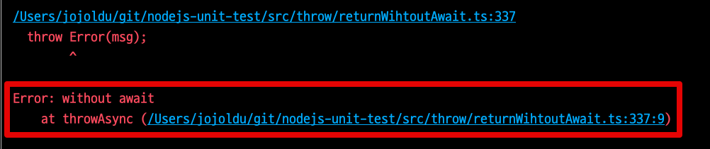
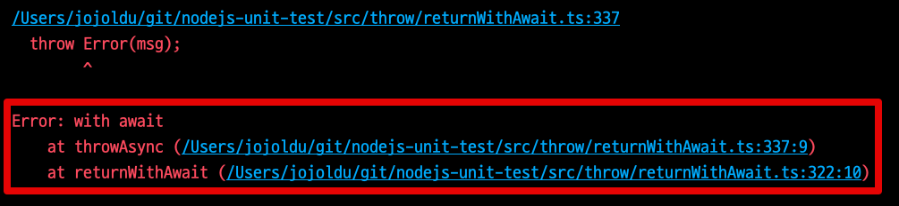

# Return Await 를 권장하자??

팀을 위한 Exception 처리 내용을 정리하다가 재밌는 글을 보게 되었다.

* [Returning Promises](https://github.com/goldbergyoni/nodebestpractices/blob/master/sections/errorhandling/returningpromises.md?s=35)

기존에 우리팀에서 사용하던 방식을 완전히 부정당하게 되서 흥미롭게 읽어볼 수 있었다.  
  
## 문제

Node.js를 비롯한 백엔드에서는 에러가 발생한다면 해당 에러에 대한 상세한 추적 내역은 필수다.  
다만, Node.js에서는 `await` 없이 `Promise` 객체를 그대로 반환할 경우 `await` 없이 반환한 함수는 Trace가 되지 않는다.  
  
몇가지 예를 보자.


### 문제 1. 

예를 들어 다음과 같이 구현을 했다고 가정해보자.

```ts
export async function returnWithoutAwait() {
  return throwAsync('without await'); // await가 없는 return
}

async function throwAsync(msg) {
  await sleep(10);
  throw Error(msg);
}

returnWithoutAwait().catch(console.log);
```

일반적으로 `Promise`를 그대로 반환하는 경우 자주 사용하는 패턴이다.  
이렇게 구현될 경우 실제 로그에는 다음과 같이 출력된다.



내가 호출한 함수는 `returnWithoutAwait` 인데 Error Trace에서는 **에러가 발생한 async 함수만 추적이 되고**, 실제 호출 함수 (`returnWithoutAwait`) 가 전혀 추적이 되지 않는다.  
  
이건 왜 문제일까?  
대부분의 `async` 함수들은 재사용성이 높다.  

* API 호출
* RDBMS 등 외부 저장소 호출
* File 읽기, 쓰기

등등 외부 의존성의 코드들이기 때문이다.  

하지만, 위와 같이 구현될 경우 **어디에서 이 async 함수를 호출했는지 추적이 되지 않는다**.  
여러 곳에서 사용될 여지가 높은 함수인데, 정작 에러가 발생하면 어디서 호출되는지 모르는 상황이 되는 것이다.  
  
반면 `return await` 함수에서 테스트 해보면 결과가 다르다.

```ts
export async function returnWithAwait() {
  return await throwAsync('with await'); // await가 있는 return
}

async function throwAsync(msg) {
  await sleep(10);
  throw Error(msg);
}

returnWithAwait().catch(console.log);
```

이때의 결과는 명확하게 **returnWithAwait가 Trace가 된다**.




### 문제 2.

```ts
async function throwAsync(msg) {
  await sleep(10);
  throw Error(msg);
}

function passSync (msg) {
  return throwAsync(msg)
}

async function returnAndPassWithoutAwait (msg) {
  return await passSync(msg);
}

returnAndPassWithoutAwait().catch(console.log);
```

```ts
async function throwAsync(msg) {
  await sleep(10);
  throw Error(msg);
}

async function passAsync (msg) {
  return await throwAsync(msg)
}

async function returnAndPassWithAwait (msg) {
  return await passAsync(msg);
}

returnAndPassWithAwait().catch(console.log);
```
### 문제 3.

```ts

```

```ts

```
  
왜 이렇게 되는 걸까?
## Zero cost Async Stack traces

이는 함수 foo2가 이전에 대기에서 실행을 일시 중단했다가 나중에 마이크로태스크 대기열(즉, 기본적으로 이벤트 루프에서)에서 재개되었기 때문에 JSVM의 관점에서 볼 때 타당하다. 즉, 현재 그 아래에 있는 스택에는 다른 함수가 없다는 것을 의미한다.

오른쪽에 foo가 제대로 표시되는 비동기 스택 추적을 볼 수 있습니다("Call Stack" 섹션). 이 기능은 비동기 함수뿐만 아니라 약속 또는 setTimeout()과 같은 웹 API를 직접 사용하는 코드에서도 작동합니다.

그리고 인스펙터가 연결되면 Node.js에서 작동합니다. 그러나 이 기능에는 두 가지 문제가 있습니다.

* 그것은 사소한 오버헤드가 아니다.
* 그것은 검사관이 실행해야 한다.

비동기 스택 추적은 중요한 프로덕션 기능이기 때문에 둘 다 쇼스토퍼입니다(넷플릭스 같은 회사는 스택 추적 문제가 해결될 때까지 비동기/대기 금지).

프로덕션에서 비동기 스택 추적이 없으면 실행 중에 기록된 오류를 파악하기가 매우 어렵습니다.

인스펙터 기능을 기반으로 Error.stack을 강화할 수도 있지만, 무료(영원히)는 아니므로 상당한 오버헤드가 여전히 발생할 것입니다.

여기에 설명된 솔루션은 promise chains이 실행을 계속하기에 충분한 정보를 포함하고 있다는 사실을 활용합니다.

'대기'의 경우 중단점과 재개점이 일치하므로 우리는 어디에서 계속할지 알 수 있을 뿐만 아니라 우연의 일치로 인해 우리가 어디에서 왔는지도 알 수 있다.

따라서 promise chains, 특히 계속 대기에서 발견된 정보를 활용하여 모든 비동기 함수를 포함하는 스택 추적을 재구성할 수 있습니다.


## 추가

v8 구현의 동기화 함수 스택 추적과 비동기 함수 스택 추적 뒤에 있는 메커니즘은 상당히 다릅니다. 동기화 스택 추적은 Node.js가 실행되는 운영 체제에서 제공하는 스택 을 기반으로 합니다(대부분의 프로그래밍 언어에서와 마찬가지로). 비동기 함수가 실행 중일 때 운영 체제 스택 은 함수가 첫 번째 함수에 도달하는 즉시 해당 함수를 꺼냅니다 await. 따라서 비동기 스택 추적은 운영 체제 스택 과 거부된 약속 해결 체인 이 혼합된 것입니다 . 비용이 들지 않는 비동기 스택 추적 구현은 약속이 ¹ 가 될 때만 약속 해결 체인 을 확장합니다 . 기능 만 가능하기 때문에awaited asyncawait, 함수가 호출된 후 비동기 작업이 수행된 경우 비동기 스택 추적에서 동기화 함수가 항상 누락됩니다.

절충안
Every await는 이벤트 루프에서 새로운 마이크로태스크를 생성하므로 await코드에 더 많은 s를 추가하면 약간의 성능 저하가 발생합니다. 그럼에도 불구하고 네트워크나 데이터베이스에 의해 발생하는 성능 저하가 엄청나게 크기 때문에 await요청 또는 명령당 매우 핫한 코드가 아닌 한 웹 서버 또는 CLI 개발 중에 추가 패널티를 고려해야 하는 것은 아닙니다. 따라서 awaits에서 return awaits를 제거하는 것은 눈에 띄는 성능 향상을 찾기 위한 마지막 위치 중 하나여야 하며 절대 사전에 수행해서는 안 됩니다.

왜 반환 대기가 과거에 안티 패턴으로 간주 되었습니까?
블록 외부에서 사용해서는 안 되는 이유와 이를 허용하지 않는 ESLint 규칙 에 대해 설명 하는 훌륭한 기사 가 많이 있습니다. 그 이유는 async/await가 Node.js 0.10에서 트랜스파일러와 함께 사용 가능해지고(Node.js 7.6에서 기본 지원을 얻었기 때문에) "제로 비용 비동기 스택 추적"이 Node.js 10에 도입되고 플래그가 지정되지 않을 때까지입니다. Node.js 12에서는 블록 외부의 모든 코드 와 절대적으로 동일합니다 . 일부 다른 ES 엔진에서도 여전히 동일할 수 있습니다. 이것이 약속을 반환하기 전에 해결하는 것이 일반적으로 EcmaScript가 아닌 Node.js에 대한 모범 사례인 이유입니다.return awaittryreturn awaitreturntry

메모:
비동기 스택 추적이 까다로운 구현을 갖는 또 다른 이유는 스택 추적이 이벤트 루프 ¹ 의 동일한 틱에서 항상 동기적으로 빌드되어야 한다는 제한입니다.
await코드 가 없으면 throwAsync이벤트 루프의 동일한 단계에서 실행됩니다. 함수 결과를 명시적으로 기다리지 않아도 OS 스택 이 비어 있지 않고 스택 추적이 가득 차는 퇴화한 경우 입니다. 일반적으로 약속 사용에는 일부 비동기 작업이 포함되므로 스택 추적의 일부가 손실됩니다.
비용이 들지 않는 비동기 스택 추적은 복잡한 약속 사용(예: 다른 장소에서 여러 번 대기한 단일 약속)에 대해 여전히 작동하지 않습니다.

* [v8의 제로 비용 비동기 스택 추적에 대한 블로그 게시물](https://v8.dev/blog/fast-async)
* [여기에 언급된 구현 세부 정보가 포함된 제로 비용 비동기 스택 추적에 대한 문서](https://docs.google.com/document/d/13Sy_kBIJGP0XT34V1CV3nkWya4TwYx9L3Yv45LdGB6Q/edit)
