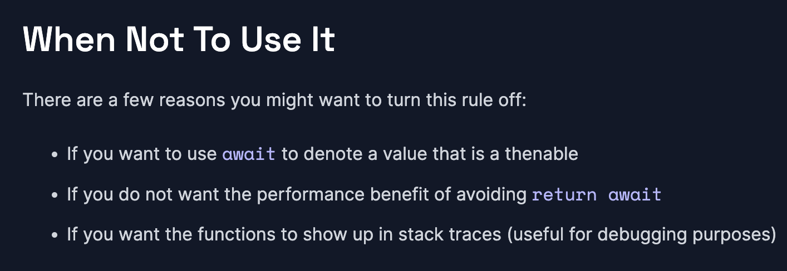
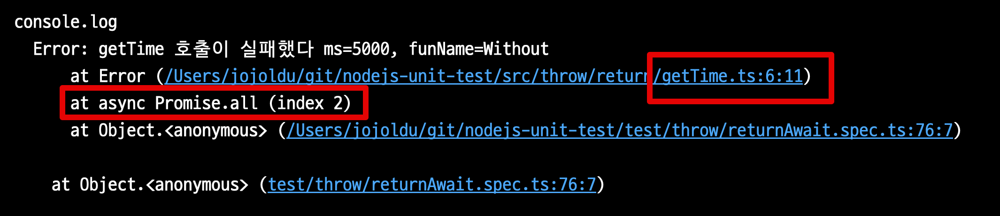
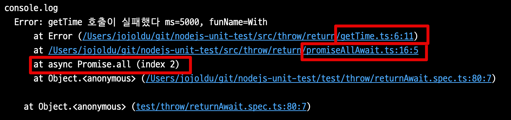
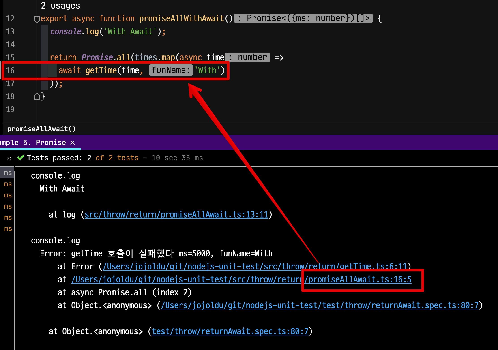
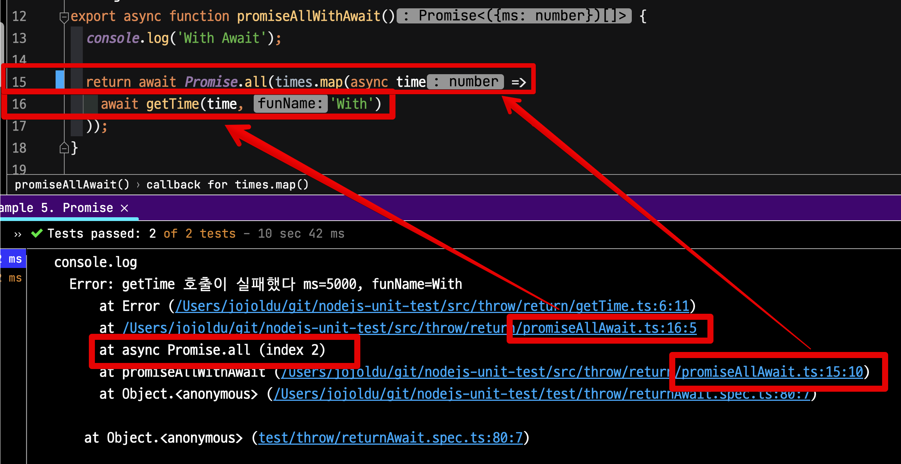
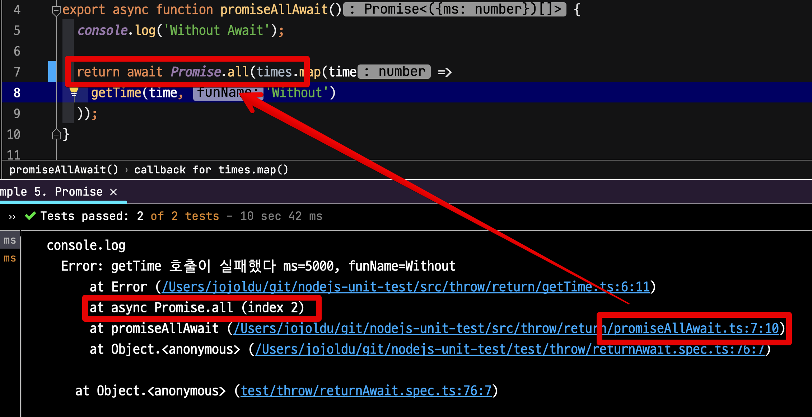

# no-return-await 는 항상 정답일까

보편적으로 JS/TS 에서는 `async` 함수를 사용할때 `return` 만 필요한 경우에는 굳이 `await`를 명시하지 않았다.  
실제로 ESLint 룰 상에서도 이에 대한 규칙을 갖고 있다.

- [no-return-await](https://eslint.org/docs/latest/rules/no-return-await)

하지만 해당 규칙에서도 **이 규칙을 적용하면 안되는 예**를 소개하는데, 다음과 같다.



* `await` thenable 인 값을 나타내기 위해 사용하려는 경우
*  `return await` 회피의 성능상의 이점을 원하지 않는 경우
* **함수를 스택 추적에 표시**하려는 경우 (**디버깅에 유용함**)

마지막의 "함수를 스택 추적에 표시" 가 이번 포스팅의 주제이다.  

Node.js를 비롯한 백엔드에서는 에러가 발생한다면 해당 에러에 대한 상세한 Trace가 거의 대부분 필요하다.  
Node.js에서는 `await` 없이 `Promise` 객체를 그대로 반환할 경우 `await` 없이 반환한 **함수는 Trace가 되지 않는다**.  
  
몇가지 예를 보자.

## 1. Async Function 

예를 들어 다음과 같이 구현을 했다고 가정해보자.

```ts
// (2)
export async function returnWithoutAwait() {
  return throwAsync('without await'); // await가 없는 return
}

// (3)
async function throwAsync(msg) {
  await sleep(10);
  throw Error(msg);
}

// test.ts
it('returnWithoutAwait', async () => {
  // (1)
  await returnWithoutAwait().catch(console.log);
});
```

* 호출순서는 (1) -> (2) -> (3) 이다.


일반적으로 `Promise`를 그대로 반환하는 경우 자주 사용하는 패턴이다.  
이렇게 구현될 경우 실제 로그에는 다음과 같이 출력된다.


내가 호출한 함수는 `returnWithoutAwait` 인데 Error Trace에서는 **에러가 발생한 async 함수만 추적이 되고**, **실제 호출 함수** (`returnWithoutAwait`) **가 전혀 추적이 되지 않는다**.  
  
이건 왜 문제일까?  
대부분의 `async` 함수들은 외부와의 의존성을 가지고 있으며, 재사용성이 높다.  

* API 호출
* RDBMS 등 외부 저장소 호출
* File 읽기, 쓰기

하지만, 위와 같이 구현될 경우 **어디에서 이 async 함수를 호출했는지 정확한 추적이 어렵다**.  
여러 곳에서 사용될 여지가 높은 함수인데, 정작 에러가 발생하면 어디서 호출되는지 모르는 상황이 되는 것이다.  
  
반면 `return await` 함수에서 테스트 해보면 결과가 다르다.

```ts
export async function returnWithAwait() {
  return await throwAsync('with await'); // await가 있는 return
}

async function throwAsync(msg) {
  await sleep(10);
  throw Error(msg);
}

// test.ts
it('returnWithAwait', async () => {
  // (1)
  await returnWithAwait().catch(console.log);
});
```

이때의 결과는 명확하게 **호출 함수인** `returnWithAwait` **가 Trace가 된다**.


## 2. Promise.all

이번엔 `Promise.all` 에서 알아보자.  
다음과 같이 Promise를 반환하는 `getTime` 을 `map` 과 `Promise.all` 을 통해 실행한다고 가정해보자.
(흔히들 볼 수 있는 코드이다.)  

```ts
// getTime.ts
export async function getTime(ms: number, funName = '') {
  await sleep(ms);
  if (!ms || ms >= 5_000) {
    throw Error(`getTime 호출이 실패했다 ms=${ms}, funName=${funName}`);
  }
  return {ms: ms}
}
////////////////////////////////////////////////////////

// promiseAllAwait.ts
const times = [1_000, 2_000, 5_000];

export async function promiseAllAwait() {
  console.log('Without Await');

  return Promise.all(times.map(time =>
    getTime(time, 'Without')
  ));
}

// test.ts
it('without await', async () => {
  await promiseAllAwait().catch(console.log);
});
```

- 배열의 요소인 `time` 을 인자로 하여 그대로 `getTime` 객체를 반환한다

이를 실행해보면, 다음과 같이 **Promise.all과 getTime의 호출만 Trace 된다**.  



중요한 것은 실제 호출 함수인 `promiseAllAwait` **에서 실행한** `getTime` **호출부에 대한 Trace가 전혀 남지 않는다**.  
  
반대로 이번엔 `getTime` 앞에 `await` 를 추가해본다.

```ts
const times = [1_000, 2_000, 5_000];

export async function promiseAllWithAwait() {
  console.log('With Await');

  return Promise.all(times.map(async time =>
    await getTime(time, 'With') // getTime 앞에 await를 추가한다.
  ));
}

// test.ts
it('with await', async () => {
  await promiseAllWithAwait().catch(console.log);
});
```

그리고 실행을 해보면, 다음과 같이 호출부인 `promiseAllAwait.ts:16:5` 가 명확하게 Trace 된다.



해당 로그를 클릭해보면 다음과 같이 정확하게 에러 함수를 호출한 위치를 가리킨다.



여기서 `Promise.all`에 `await`가 붙지 않아, **조금 더 상세하게 추적하지 못하고 있다**.  
이를 위해 `Promise.all` 에도 `return await` 를 붙여서 실행해보면 다음과 같이 **Promise.all 까지 Trace 대상**이 된다.



물론, `getTime`에 `await` 를 붙이지 않더라도, `Promise.all` 에라도 `await` 를 붙이는 경우도 최소한 `Promise.all` 까지는 Trace된다.



즉, 단일함수와 `Promise.all` 어디에서든 `return await` 가 없다면 **비동기 스택에서는 Trace 대상이 되지 않는다**.  

## 마무리

주요한 애플리케이션 로직을 담고 있는 경우 가능하면 `return await` 를 유지하는 것을 고민해볼 필요가 있다.  
(가능하면 무조건 선언하는 편이다.)  

함수가 `Promise` 를 반환하지만 `await` 하지 않는다면 누락된 Trace가 발생할 수 있다.  
이럴 경우 **함수 오류를 추적하는 것을 어렵게 만든다**.  
  
물론 `return await` 는 Event Loop에서 새로운 microtask를 생성하므로 `await` **코드가 많아질수록 약간의 성능 저하가 발생할 수 있고**, 충분히 그에 대해 우려할 수 있다.  
  
하지만 Node.js와 같이 백엔드 애플리케이션 환경에서는 대부분 **네트워크 지연, Slow Query로 인한 성능 저하가 더 빈번하고 더 큰 비중을 차지한다**.  
  
await를 제거해서 성능 개선을 얻고자 하는 것은 **가장 최후의 수단**이어야 한다.  
절대 **0.00X 초 개선을 위해 에러 추적을 어렵게 만들어서는 안된다**.  
실제 서비스 환경에서 비동기 이벤트는 **오류를 파악하기 정말 어렵다**.  
이럴때 Trace도 제대로 남지 않는다면 문제 해결이 정말 어려워진다.  

사소한 성능으로 서비스 전체의 문제 해결력을 낮추는 것이 더 좋은지는 고민해볼 필요가 있다.

> 참고로 위 실험은 **크롬 브라우저에서 실행해도 동일하게 적용된다**