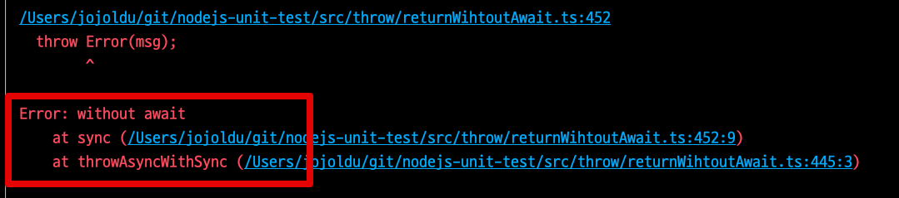
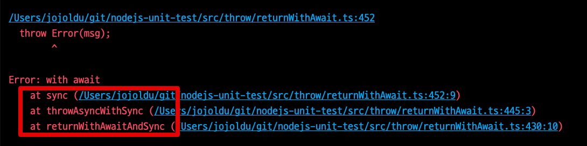

# no-return-await 는 항상 정답일까

보편적으로 JS/TS 에서는 `async` 함수를 사용할때 `return` 만 필요한 경우에는 굳이 `await`를 명시하지 않았다.  
실제로 ESLint 룰 상에서도 이에 대한 규칙을 갖고 있다.

- [no-return-await](https://eslint.org/docs/latest/rules/no-return-await)

하지만 해당 규칙에서도 **이 규칙을 적용하면 안되는 예**를 소개하는데, 다음과 같다.


* `await` thenable 인 값을 나타내기 위해 사용하려는 경우
*  `return await` 회피의 성능상의 이점을 원하지 않는 경우
* **함수를 스택 추적에 표시**하려는 경우 (**디버깅에 유용함**)

마지막의 "함수를 스택 추적에 표시" 가 이번 포스팅의 주제이다.  

Node.js를 비롯한 백엔드에서는 에러가 발생한다면 해당 에러에 대한 상세한 Trace가 거의 대부분 필요하다.  
Node.js에서는 `await` 없이 `Promise` 객체를 그대로 반환할 경우 `await` 없이 반환한 **함수는 Trace가 되지 않는다**.  
  
몇가지 예를 보자.

### 문제 1 

예를 들어 다음과 같이 구현을 했다고 가정해보자.

```ts
// (2)
export async function returnWithoutAwait() {
  return throwAsync('without await'); // await가 없는 return
}

// (3)
async function throwAsync(msg) {
  await sleep(10);
  throw Error(msg);
}

// (1)
returnWithoutAwait().catch(console.log);
```

일반적으로 `Promise`를 그대로 반환하는 경우 자주 사용하는 패턴이다.  
이렇게 구현될 경우 실제 로그에는 다음과 같이 출력된다.


내가 호출한 함수는 `returnWithoutAwait` 인데 Error Trace에서는 **에러가 발생한 async 함수만 추적이 되고**, 실제 호출 함수 (`returnWithoutAwait`) 가 전혀 추적이 되지 않는다.  
  
이건 왜 문제일까?  
대부분의 `async` 함수들은 재사용성이 높다.  

* API 호출
* RDBMS 등 외부 저장소 호출
* File 읽기, 쓰기

등등 외부 의존성의 코드들이기 때문이다.  

하지만, 위와 같이 구현될 경우 **어디에서 이 async 함수를 호출했는지 추적이 되지 않는다**.  
여러 곳에서 사용될 여지가 높은 함수인데, 정작 에러가 발생하면 어디서 호출되는지 모르는 상황이 되는 것이다.  
  
반면 `return await` 함수에서 테스트 해보면 결과가 다르다.

```ts
export async function returnWithAwait() {
  return await throwAsync('with await'); // await가 있는 return
}

async function throwAsync(msg) {
  await sleep(10);
  throw Error(msg);
}

returnWithAwait().catch(console.log);
```

이때의 결과는 명확하게 **returnWithAwait가 Trace가 된다**.


### 문제 2

만약 여러 중첩 Promise 호출 사이에 중간 지점에서만 `await`가 누락되면 어떻게 될까?

```ts
async function returnAndPassWithoutAwait (msg) {
  return await passSync(msg);
}

function passSync (msg) {
  return throwAsync(msg); // 여기서만 await를 제거 
}

async function throwAsync(msg) {
  await sleep(10);
  throw Error(msg);
}


returnAndPassWithoutAwait().catch(console.log);
```

문제 1과 마찬가지로 



```ts
async function returnAndPassWithAwait (msg) {
  return await passAsync(msg);
}

async function passAsync (msg) {
  return await throwAsync(msg)
}

async function throwAsync(msg) {
  await sleep(10);
  throw Error(msg);
}

returnAndPassWithAwait().catch(console.log);
```




## 마무리

주요한 애플리케이션 로직을 담고 있는 경우 가능하면 `return await` 를 유지하는 것이 좋다.  
함수가 `Promise` 를 반환하지만 `await` 하지 않는다면 누락된 Trace가 발생할 수 있다.  
이럴 경우 함수 오류 흐름에 대해 파악하는 것을 어렵게 만든다.  
  
물론 `return await` 는 Event Loop에서 새로운 microtask를 생성하므로 `await` 코드가 많아질수록 약간의 성능 저하가 발생할 수 있고, 충분히 그에 대해 우려할 수 있다.  
  
하지만 Node.js와 같이 백엔드 애플리케이션 환경에서는 대부분 **네트워크나 데이터베이스로 인한 성능 저하가 더 빈번하고 더 큰 비중을 차지한다**.  
  
await를 제거해서 성능 개선을 얻고자 하는 것은 **가장 최후의 수단**이어야 한다.  
절대 0.00x초 개선을 위해 에러 추적을 어렵게 만들어서는 안된다.  
실제 서비스 환경에서 비동기 액션은 **오류를 파악하기 정말 어렵다**.  
이럴때 Trace도 제대로 남지 않는다면 문제 해결이 정말 어려워진다.  

사소한 성능으로 서비스 전체의 문제 해결력을 낮추는 것이 더 좋은지는 고민해볼 필요가 있다.

