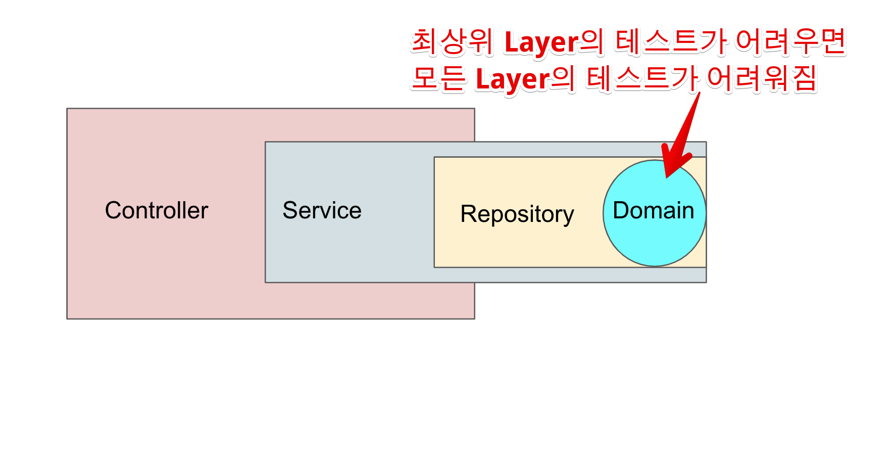

# 2. 테스트하기 좋은 코드 - 테스트하기 좋은 코드로 개선

[1편](https://jojoldu.tistory.com/674) 을 통해 테스트하기 어려운 코드에 대해 이야기를 나눴다.  
이번 편에서는 테스트하기 어려운 코드를 어떻게 테스트 하기 좋은 형태로 개선하는지 이야기해보려고 한다.

## 2-1. 리팩토링

먼저 앞에서 보았던 `discount()` 코드를 다시 보자.   

```ts
export default class Order {
    ...
    discount() {
        const now = LocalDateTime.now();
        if (now.dayOfWeek() == DayOfWeek.SUNDAY) {
            this._amount = this._amount * 0.9
        }
    }
}
```

여기서 `discount()`는 **도메인의 로직** (`Order`) 으로 되어있다.  
이렇게 작성되면 이 함수의 테스트가 어려운 것도 문제지만, **계층 전반의 테스트가 어려워진다**는 더 큰 문제가 있다.  
  
예를 들어 위 코드를 Spring, Nest.js 등의 MVC 프레임워크로 API로 만들어낸다고 가정해보면 다음과 같다.  
  
**Service.ts**

```ts
export class OrderService {
    constructor(
        private readonly orderRepository: OrderRepository,
        ...
        ) {
    }
    async discount(orderId: number) {
        const order:Order = await this.orderRepository.findById(orderId);
        order.discount();
        await this.orderRepository.save(order);
    }
    ...
}
```

**Controller.ts**

```ts
@Controller('/order')
export class OrderController {
    constructor(private readonly orderService: OrderService) {}

    @Post('/discount')
    discount(orderId: number): void {
        return this.orderService.discount(orderId);
    }
}

```




```ts
export default class Order {
    ...
    async cancelOrder(cancelTime): void {
        const cancelOrder = new Order();
        cancelOrder._amount = this._amount * -1;
        cancelOrder._status = OrderStatus.CANCEL;
        cancelOrder._orderDateTime = cancelTime;
        cancelOrder._description = this._description;
        cancelOrder._parentId = this._id;
        
        await getConnection()
          .getRepository(Order)
          .save(cancelOrder);
    }
}
```

이 테스트는 왜 테스트 작성이 너무나 어려운것일까?

* 실행할때마다 변경되는 현재 시간 쿼리 함수 (`NOW()`) 를 쿼리 내부에서 쓰고 있다
* 
* 현재 테스트로 사용중인 데이터베이스에 

```ts
public async acceptOrder(amount: number, description: string) {
  if(amount < 0) {
    throw new Error(`주문시 -금액은 될 수 없습니다. amount=${amount}`);
  }

  if(!description) {
    throw new Error(`주문명은 필수입니다.`);
  }

  const order = Order.create(amount, LocalDateTime.now(), description);

  await this.repository.acceptOrder(order);
}
```

여기서 테스트를 어렵게 만드는 부분은 2군데이다.

* `Order.create(amount, LocalDateTime.now(), description)`
* `await this.repository.acceptOrder(order)`

이 둘이 테스트

테스트 하기 어려운 코드들은 최대한 한 곳에서 관리하고,  
이 코드들이 전파되지 않도록 해야한다.


## 테스트 하기 좋은 코드로 리팩토링

흔히 말하는 Controller-Service-Repository 패턴이라면 Repository 가 

실제로는 Controller -> Service -> Domain <- Repository 가 된다.
즉, 

### BE

DB에서 값을 가져오는 코드

### FE

Cookie 나 로컬 스토리지를 통해 값을 가져오는 코드

## 

다음과 같이 시그널을 캐치할 수 있다.

> private 메소드가 많다면 클래스로 분리하는 것을 고려해보자

