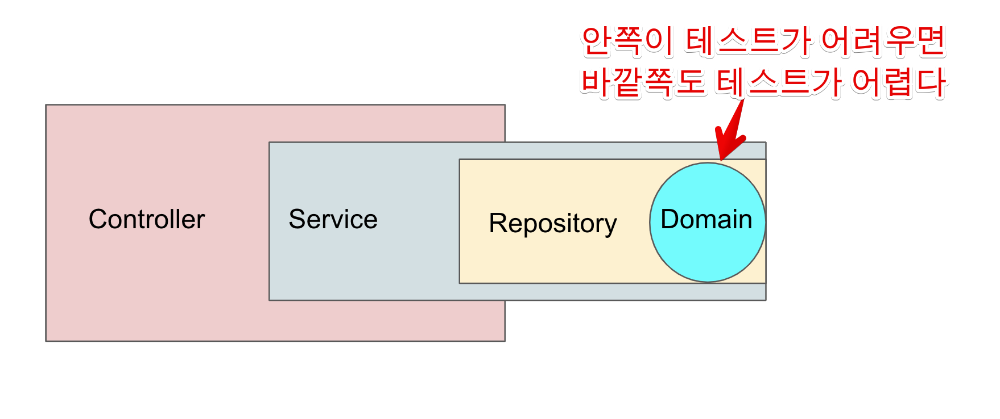

# 2. 테스트하기 좋은 코드 - 제어할 수 없는 코드 개선

[1편](https://jojoldu.tistory.com/674) 을 통해 테스트하기 어려운 코드에 대해 이야기를 나눴다.  
이번 편에서는 테스트하기 어려운 코드 중 첫번째인 "제어할 수 없는 코드를 개선하는 법"을 이야기해보자.  

## 2-1. 문제 상황

먼저 앞에서 보았던 `discount()` 코드를 다시 보자.   

```ts
export default class Order {
    ...
    discount() {
        const now = LocalDateTime.now();
        if (now.dayOfWeek() == DayOfWeek.SUNDAY) {
            this._amount = this._amount * 0.9
        }
    }
}
```

이 `discount()` 는 **실행할때마다 항상 결과가 다르다**.  
그렇기 때문에 실행할때마다 항상 결과가 똑같은 형태의 메소드로 전환이 필요하다.  
  
특히, `discount()`는 도메인(`Order`) 의 로직으로 되어있다.  
**테스트하기 어려운 코드가 도메인 로직**으로 되어있음을 의미한다.  
  
도메인 로직이 테스트하기 어려운 것은 다른 계층에서 테스트가 어려운것 보다 훨씬 더 문제가 있다.  
해당 로직의 테스트만 어려운게 아니라, **계층 전반의 테스트가 어려워진다**는 것이다.  
  
예를 들어 위 코드를 Spring, Nest.js 등의 MVC 프레임워크에서 사용한다고 가정해보자.  
  
그럼 다음과 같은 코드가 된다.  
  
**Service.ts**

```ts
export class OrderService {
    constructor(
        private readonly orderRepository: OrderRepository,
        ...
    ) {}
  
    async discount(orderId: number) {
        const order:Order = await this.orderRepository.findById(orderId);
        order.discount();
        await this.orderRepository.save(order);
    }
    ...
}
```

**Controller.ts**

```ts
@Controller('/order')
export class OrderController {
    constructor(private readonly orderService: OrderService) {}

    @Post('/discount')
    discount(orderId: number): void {
        return this.orderService.discount(orderId);
    }
}

```

위 계층들의 단위 테스트를 작성한다고 가정해보자.  

* Service 의 `discount` 는 **날짜를 제어할 수 있을까?**
* Controller 의 `discount` 는 **일요일에 할인이 되는지 검증할 수 있을까?**
  
Order 의 테스트와 마찬가지로 **제어할 수 없는** `now()` 로 인해 Repository, Service, Controller 등의 **도메인 로직에 의존하는 모든 계층의 테스트가 어렵다**.  
    
즉, **테스트의 어려움은 전파**가 된다는 것이다.  
  


> 일반적인 계층형 아키텍처에서는 Controller -> Service -> Repository로 호출이 이어진다.

테스트하기 어려운 코드가 있다면 **해당 코드에 의존하는 모든 코드들이 다 테스트하기 어렵다**.  
  
그렇기 때문에 **테스트하기 어려운 코드와 테스트하기 쉬운 코드를 분리**해야만 한다.  
둘을 분리해서, 테스트 하기 어려운 코드에 오염되는 영역을 최소화하는 것이 중요하다.  
  
## 2-2. 해결 방법

그렇다면 테스트하기 어려운 코드와 테스트 하기 쉬운 코드는 어떻게 분리할 수 있을까?  
  
가장 쉬운 방법은 **생성자, 함수(메소드)의 인자로 테스트하기 어려운 코드의 결과를 받는 것**이다.  
  
이번 같은 경우 `Order.discountWith()` 에서 **제어할 수 없는 값을 외부에서 주입**받도록 한다.

```ts
export default class Order {
    ...
    // 현재시간(now)를 밖에서 주입받도록 한다.
    discountWith(now: LocalDateTimw) { 
        if (now.dayOfWeek() == DayOfWeek.SUNDAY) {
            this._amount = this._amount * 0.9
        }
    }
}
```

이렇게 할 경우 다음과 같이 **제어할 수 없는 시간이라는 값**을 내가 원하는 값으로 지정해서 테스트를 작성할 수 있게 된다.

```ts
it('일요일에는 주문 금액이 10% 할인된다', () => {
  const sut = Order.of(10_000, OrderStatus.APPROVAL);
  const now = LocalDateTime.of(2022,8,14,10,15,0); // 2022-08-14 10:15:00 시로 고정
  sut.discountWith(now);

  expect(sut.amount).toBe(9_000);
});
```

물론 이렇게 할 경우 함수의 인자가 너무 많아지는 것은 아닌지 부담스럽게 느낄 수 있다.  
  
그럴때는 몇가지 해결책이 있는데,

* 같은 Context 라고 생각되는 함수 인자들은 [Dto 패턴](https://martinfowler.com/eaaCatalog/dataTransferObject.html) 으로 묶어서 전달하거나
* 의존성 주입을 통해 제어할 수 없는 값을 다루는 객체들은 생성자 주입을 받아서 사용하거나
  * 이건 2-3-2에서 자세히 소개한다.
* (언어에 따라 다르지만) **함수 인자의 기본값**을 사용하는 방법이 있다. 

TS의 경우 다음과 같이 **함수 인자의 기본값**을 선언할 수 있다.

```ts
export default class Order {
    ...
    // 인자 호출이 없을 경우 LocalDateTime.now()를 사용
    discountWith(now = LocalDateTime.now()) { 
        if (now.dayOfWeek() == DayOfWeek.SUNDAY) {
            this._amount = this._amount * 0.9
        }
    }
}
```

Kotlin 역시 TS와 마찬가지로 함수 인자의 기본값을 선언할 수 있다.

```java
class Order {
    ...
	fun discountWith(now: LocalDateTime = LocalDateTime.now()) {
		...
	}
}
```


이렇게 할 경우 기존의 도메인 코드를 호출하는 쪽은 굳이 함수 인자를 사용할 필요가 없다.  

```ts
export class OrderService {
    constructor(
        private readonly orderRepository: OrderRepository,
        ...
    ) {}
  
    async discountWith(orderId: number) {
        const order:Order = await this.orderRepository.findById(orderId);
        order.discountWith(); // now() 값을 인자로 사용할 필요가 없다.
        await this.orderRepository.save(order);
    }
    ...
}
```

그리고 테스트 코드에서는 함수 인자로 내가 원하는 값을 사용하면 된다.

```ts
it('일요일에는 주문 금액이 10% 할인된다', () => {
  const sut = Order.of(10_000, OrderStatus.APPROVAL);
  const now = LocalDateTime.of(2022,8,14,10,15,0); // 2022-08-14 10:15:00 시로 고정
  sut.discountWith(now);

  expect(sut.amount).toBe(9_000);
});
```

제어할 수 없는 값인 `now()`를 함수 인자로 빼도록 변경하는 순간  `Order.discountWith()` 함수는 **항상 일괄된 결과**를 뱉어내고, **테스트 역시 항상 일관된 결과**를 출력할 수 있다.  

## 2-3. 제어할 수 없는 코드의 위치

그럼 **함수 인자의 기본값을 지원하지 않는 언어**에서는 테스트하기 어려운 코드 (`now()`) 을 어디까지 미루면 좋을까?  
즉, 도메인 로직에서 `now()`를 메소드 인자로 받도록 변경했다면

* 이를 호출하는 Service, Repository 에서 해당 메소드의 인자로 `now()`를 넣어 주면 되는것인가?
  * 그렇다면 Service, Repository의 테스트가 여전히 `now()`로 인해서 테스트가 어렵지 않은가?

위와 같은 고민으로 인해 일반적으로 구조를 해치지 않는 범위 내에선 **의존하는 코드가 가장 적은 영역까지** 밀어내는 것이 좋다.  
  
의존하는 코드가 가장 적은 영역으로 밀어내는 방법으로 크게 2가지가 있다.

### 2-3-1. 가장 바깥쪽으로 밀어내기

가장 쉬운 방법은 **Controller** (프론트엔드라면 Event Handler) 까지 밀어내는 것이다.  
  
예를 들어 다음과 같다.  
  
**Service.ts**

```ts
export class OrderService {
    constructor(
        private readonly orderRepository: OrderRepository,
        ...
    ) {}
  
   // now()를 Service의 호출자가 전달해주도록 한다.
   // Order와 마찬가지로 Service의 테스트가 쉽도록 하기 위함이다.
    async discountWith(orderId: number, now = LocalDateTime.now()) {
        const order:Order = await this.orderRepository.findById(orderId);
        order.discountWith(now);
        await this.orderRepository.save(order);
    }
    ...
}
```

* Service에서는 도메인 로직 (`order.discountWith`) 에 `now()` 값을 전달한다
* Service 역시 **가장 바깥쪽 계층이 아니기 때문에** 제어할 수 없는 값인 `now()`는 바깥에서 전달 받도록 한다.
    * Service의 테스트 코드 작성이 수월해야하기 때문이다.

일반적인 백엔드 구조에서 가장 바깥쪽이라 할 수 있는 Controller에서 제어할 수 없는 값을 시작한다.  
  
**Controller.ts**

```ts
@Controller('/order')
export class OrderController {
    constructor(private readonly orderService: OrderService) {}

    @Post('/discount')
    async discount(orderId: number): Promise<void> {
      ...
      // now() 의 시작점
      await this.orderService.discountWith(orderId, LocalDateTime.now()); 
      ...
    }
}
```

이렇게 할 경우 **Controller를 제외한 나머지 계층은 테스트 하기 어려운 코드와 분리**된다.  
  
이 방식은 비단, 백엔드 코드에서만 적용되는 것은 아니다.  
작성한 코드의 가장 바깥쪽이란 다음과 같다.

* AWS Lambda 등의 서버리스 환경에서의 `handler` 
* 백엔드 API에서의 Controller
* 웹프론트 혹은 앱 등의 클라이언트에서의 이벤트 핸들러

즉, **프로그램의 진입점이 되는 영역**에 최대한 테스트하기 어려운 코드를 모아두고, 그 다음 계층부터 테스트 하기 좋은 코드로만 이루어지도록 한다.  
  
최대한 **제어할 수 없는 코드를 바깥으로 밀어내, 해당 코드에 의존하는 범위를 좁히는 것**이다.  

### 2-3-2. 의존성 주입

다만, 위 방식에도 몇가지 문제가 있다. 

* 진입 계층인 Controller의 테스트가 여전히 어렵다.
* Service, Repository, Component 등 여러 영역의 **모든 함수가 제어할 수 없는 값을 항상 함수/메소드 인자로** 받아야만 한다.

그래서 이런 문제를 의존성 주입 패턴으로 풀때가 많다.  
  
제어할 수 없는 값을 반환하는 인터페이스를 두고, 이를 테스트와 메인코드에서 활용하는 것이다.


실제 코드는 다음과 같다.

```ts
export interface Time {
  now(): LocalDateTime;
}
```

해당 인터페이스의 구현체를 만들어, 이를 기존 코드에서 활용하도록 한다.

```ts
export class JodaTime implements Time {
  now(): LocalDateTime {
    return LocalDateTime.now();
  }
}
```

그리고 테스트에서 사용할 테스트 더블 구현체를 만들어, 테스트 코드에서 사용한다.

```ts
export class StubTime implements Time {
  private readonly currentTime: LocalDateTime;

  constructor(currentTime: LocalDateTime) {
    this.currentTime = currentTime;
  }

  static of (year:number, month:number, day:number, hour:number, minute:number, second:number) {
    return LocalDateTime.of(year, month, day, hour, minute, second);
  }

  now(): LocalDateTime {
    return this.currentTime;
  }
}
```

* `StubTime` 의 경우 **생성자로 받은 시간**을 그대로 전달하도록 구현되어있다.
* 즉, 내가 의도한대로 시간값을 제어해서 테스트에서 활용할 수 있다.

이렇게 구성할 경우 다음과 같이 제어할 수 없는 값을 처리하는 객체를 **생성자 주입**으로 받아서 처리할 수 있다. 

```ts
@Controller('/order')
export class OrderController {
    constructor(private readonly orderService: OrderService,
                // 메인 코드에서는 JodaTime을, 테스트 에서는 StubTime을 받도록
                private readonly time: Time) {}

    @Post('/discount')
    async discount(orderId: number): Promise<void> {
        // this.time 객체로 제어할 수 없는 값을 담당하게 한다.
        await this.orderService.discountWith(orderId, this.time.now());
    }
}
```

위 코드는 이제 테스트 코드에서 내가 의도한대로 시간을 조절할 수 있다.

```ts
const stubTime = new StubTime(LocalDateTime.of(2022, 8, 14, 10, 15, 0));
new OrderController (orderService, stubTime);
```

굳이 Controller에서 값을 넘겨받지 않고, **Service 혹은 Repository에서 즉시 제어할 수 없는 값**을 처리할 수 있다.

```ts
export class OrderService {
    constructor(
        private readonly orderRepository: OrderRepository,
        private readonly time: Time, // Time 객체를 생성자 주입 받아서
        ) {
    }

    // 메소드에서 활용한다.
    async discountWith(orderId: number) {
        const order: Order = await this.orderRepository.findById(orderId);
        order.discountWith(this.time.now()); // this.time으로 현재 시간을 사용한다 
        await this.orderRepository.save(order);
    }
}
```

구현 코드가 위와 같이 되어 있을 경우 테스트 코드에서는 **동일한 인터페이스에 맞춘 테스트 더블 객체로 교체**해서 사용할 수 있다.  

```ts
describe('OrderService', () => {
    const repository = new OrderRepository();

    it('일요일에는 주문 금액이 10% 할인된다', async () => {
        const savedOrder = await repository.save(Order.of(10_000, OrderStatus.APPROVAL));
        const sunday = LocalDateTime.of(2022, 8, 14, 10, 15, 0);
        const discountTime = new StubTime(sunday); // 의도한 날짜
        const sut = new OrderService(repository, discountTime);

        // when
        await sut.discountWith(savedOrder.id);

        // then
        const result = await repository.findById(savedOrder.id);
        expect(result.amount).toBe(9_000);
    });
});
```


## 2-4. 마무리

이번 내용을 정리하면 다음과 같다.

* 제어할 수 없는 값에 의존하는 코드들을 최대한 줄이는 것을 목표로 하여
* 제어할 수 없는 값을 함수의 인자로 받도록 해서 함수 자체는 순수 함수로서 구현되도록 한다.
* 제어할 수 없는 값의 위치는 최대한 진입점에 위치시켜 테스트하기 어려운 코드들의 숫자를 최대한 줄이되, 가능하다면 함수의 기본값 혹은 의존성 주입 등을 통해서 해결한다.

[1편에 나온 코드](https://jojoldu.tistory.com/674) 를 다시 한번 생각해보면 얼마나 부수효과가 많았는지, 매번 다른 결과가 나오는 함수인지를 알 수 있다.  
  
테스트 하기 좋은 코드가 될수록 우리의 코드는 부수효과가 없고, 항상 같은 결과가 반환되는 순수 함수가 될 수 있다.  
테스트 코드 하기 좋은 코드로의 리팩토링은 결국 메인 코드의 품질을 높일 수 있다.  

