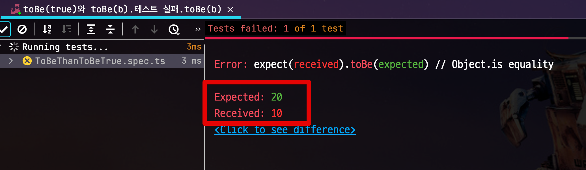

# expect안에서 검증하지 않기

간혹 코드를 보면 **expect 안에서 검증을 하는 코드**를 보곤 한다.  


```ts
expect(a==b).toBe(true) 보다는 expect(a).toBe(b)
```





비슷한 예로 Java로 한다면

```java
//bad

assertTrue(a == 1)
```

보다는 아래와 같은 코드가 되어야 한다.

```java
//good

assertThat(a).is(1)
```


