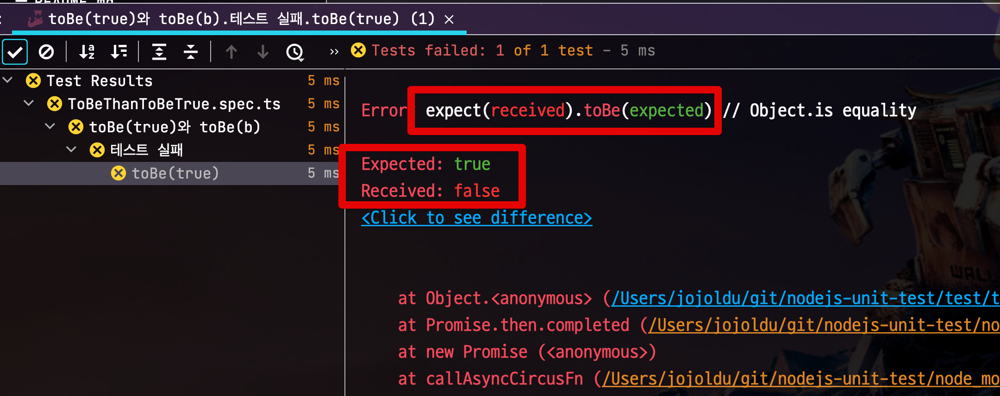

# toBe(true) 보다는 toBe(b)

```ts
expect(a==b).toBe(true) 보다는 expect(a).toBe(b)
```




비슷한 예로 Java로 한다면

```java
//bad

assertTrue(a == 1)
```

보다는 아래와 같은 코드가 되어야 한다.

```java
//good

assertThat(a).is(1)
```


