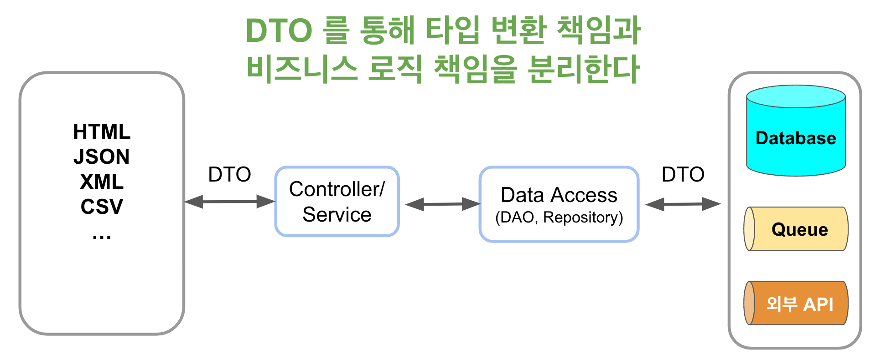

# 데이터 변환 계층 (Data Transfer Layer)

Express와 JS/TS만을 가지고 프로젝트를 진행하다보면 데이터 변환 계층의 기준이 정해져있지 않은 경우를 많이 본다.  
사람마다 다르기도 하고, 혹은 같은 사람이 작성한 코드에도 천차만별이다.  
  
이에 대해서는 팀에서 확실하게 컨벤션을 잡지 않으면 서로 데이터 변환 계층을 다르게 두어 프로젝트 전체가 일관성이 떨어지고 코드 가독성과 리팩토링 내성도 떨어지게 된다.  

그렇다면 데이터 변환 계층의 기준을 어떻게 세우면 좋을까?  

## 문제

예를 들어 다음과 같은 상황이 있다고 해보자.

* 프로젝트에서는 js-joda (혹은 Dayjs 등) 날짜 타입을 쓰고 있는 상황에서
  * Database SQL에서 사용하기 위해서는 `Date` 로 치환해야하는 경우
  * API 로 외부에 데이터를 전송 (혹은 요청) 하기 위해 `String` 으로 치환해야하는 경우
* 프로젝트에서는 `BigInt`를 쓰고 있는 상황에서
  * 외부에 제공하는 지표 데이터로는 `String` 으로 전달해야하는 경우


> TypeORM, MikrORM 등 ORM 혹은 SpringFramework, NestJS 등 의 프레임워크 등을 사용하지 않으면 Type Transform 이 매끄럽지 않아서 이런 경우를 더 쉽게 만날 수 있다.

이때 가장 흔하게 쓰는 방법은 **원하는 타입을 Data Access 계층의 파라미터로** 전달하는 것이다.

```ts
export class LectureRepository extends BaseRepository<Lecture> {
    ...
    async getLectureByDate (createdAt: Date): Promise<Lecture> {
        const lectures = await this.queryTemplate.queryWith(
            'SELECT * FROM lecture l WHERE l.created_at >= $1',
            [createdAt]
        );

        return transform(lectures[0], Lecture);
    }
}
```

이렇게 되면 Data Access 계층 입장에서는 좋은 방법이다.  
LectureRepository 는 Date 타입만을 처리하면 된다.  
  
하지만 이를 호출하는 쪽에서는 어떨까?

```ts
export class LectureService {

    async getLecture (createdAt: LocalDateTime): Promise<Lecture> {
        ...
        const date = convert(createdAt).toDate(); // LocalDateTime -> Date 로 변환
        const lecture = await this.lectureRepository.getLectureByDate(date);
        ....
    }
}
```

Service 계층에서 Date로 변환하는 역할을 해야한다.  
문제는 **LectureService 외에도 lectureRepository를 호출하는 곳이 있다면 해당 영역 모두에서 Date로 변환**을 해야만 한다.  
  
이건 테스트 코드를 작성할때도 마찬가지다.

```ts
it('getLectureByDate', async () => {
    ...

    const createdAt = LocalDateTime.of(2022,11,26, 12,0,5);
    const createdDate = convert(createdAt).toDate(); 
    const result = await lectureRepository.getLectureByDate(createdDate);

    expect(...);
});
```

* `const createdAt = LocalDateTime.of(2022,11,26, 12,0,5);`
  * 원하는 날짜를 편하게 생성하기 위해 `LocalDateTime` 사용
  * 보통 팀의 표준 날짜 라이브러리가 이를 위해 사용되며, dayjs 등도 동일하게 적용 
* `const createdDate = convert(createdAt).toDate();`
  * 테스트 대상인 `getLectureByDate` 가 `Date`를 받기 때문에 다시 형변환 진행

Repository 에서 데이터 변환을 담당하지 않기 때문에 Repository는 깔끔한 형태를 유지할 수 있다.  
하지만 Repository를 편하게 하기 위해 **매번 Repository를 호출 하는 곳에서 데이터 변환을 해야만 한다**.  

프로젝트 전체가 `LocalDateTime`을 공식적인 날짜 타입으로 사용하더라도, 매번 데이터 변환 코드를 작성해야 한다.  
  
만약 Repository를 호출하는 영역이 한정되어있더라도, 현재의 방식은 확장에 어려움이 있다.  
  
* RDBMS에서 메세지큐, API 등으로 EndPoint가 변경이 필요해서 **날짜 데이터를 문자열로 변경** 해야하는 경우

> 물론 Global Handler 혹은 Resolver (Pipe) 등으로 해당 액션이 수행되기전에 Date -> String 을 자동으로 하게 할 수도 있다.

이럴경우 **Data Access 계층을 호출하는 모든 영역이 변경의 대상**이 된다.  

또한 다음과 같이 **의도치 않게 추가 기능이 필요할 경우 변경양이 많다**.  
  
예를 들어 아래와 같이 1) 로직과 2) 로직 사이에 추가로 **날짜 연산**이 필요하면 어떻게 될까?

```ts
export class LectureService {

    async getLecture (createdAt: LocalDateTime): Promise<Lecture> {
        ...
        const date = convert(createdAt).toDate(); // 1)
        // 이 사이에 createdAt 를 통한 추가 연산이 필요하다면?
        const lecture = await this.lectureRepository.getLectureByDate(date); // 2)
        ....
    }
}
```

이럴 경우 **1) 로직을 전체적으로 손을 봐야한다**.  
(변수명 변경, `date` 변환 위치 수정 등)

```ts
export class LectureService {

    async getLecture (createdAt: LocalDateTime): Promise<Lecture> {
        ...
        const lastEndedAt = createdAt.plusDays(END_DAY); // date 변환용 신규 파라미터
        const date = convert(eventEndedAt).toDate();  // createdAt이 아니라 endedAt 을 쓰도록 변경해야한다.
        const lecture = await this.lectureRepository.getLectureByDate(date); 
        ....
    }
}
```

> 물론 이 코드는 약식이기 때문에 `const date = convert(createdAt.plusDays(END_DAY)).toDate();` 로 변경해도 된다.  
> 다만, **해당 값이 의도하는 바가 무엇인지** 명확하게 하기 위해 변수명을 선언하고 할당해야하는 경우도 많다.

결국 특정 계층을 위한 타입 변환의 책임이 어디에 있느냐로 인해 **프로젝트 전체에 타입 변환 책임이 전파되는 문제**가 발생한다.
## 해결

데이터의 타입 변환의 책임이 프로젝트 전체에 전파 되는 것을 막아야만 한다.
### Data Access (해당) 계층에서 변환하기

가장 쉬운 방법은 해당 계층에서 변환하도록 하는 것이다.

```ts
async getLectureByLocalDate (createdAt: LocalDateTime): Promise<LectureItem> {
    const createdDate = convert(createdAt).toDate();
    const lectures = await this.queryTemplate.queryWith(
        'SELECT * FROM lecture l WHERE l.created_at >= $1',
        [createdDate]
    );

    return transform(lectures[0], LecturesItem);
}
```

이럴 경우 **프로젝트 전체에서는 데이터 변환 책임이 없어진다**.

```ts
export class LectureService {

    async getLecture (createdAt: LocalDateTime): Promise<Lecture> {
        ...
        const lecture = await this.lectureRepository.getLectureByDate(createdAt);
        ....
    }
}
```

테스트 코드에서도 임의로 지정한 날짜를 그대로 사용하면 된다.

```ts
it('getLectureByDate', async () => {
    ...

    const createdAt = LocalDateTime.of(2022,11,26, 12,0,5);
    const result = await lectureRepository.getLectureByDate(createdAt);

    expect(...);
});
```

이 방법이 당장의 문제를 해결할 수 있지만, 좀 더  
### Data Transfer Object (DTO)

[Data Transfer Object](https://martinfowler.com/eaaCatalog/dataTransferObject.html) 에 대해 **호출횟수 최적화** 관점에서 이야기를 많이들 한다.  
하지만 또 다른 장점으로 **직렬화 로직을 캡슐화** 하는 장점이 있다.  
이를 이용해 이번 문제도 해결할 수 있다.

```ts
export class LectureSearchDto {
  private _createdAt: LocalDateTime;

  constructor(createdAt: LocalDateTime) {
    this._createdAt = createdAt;
  }

  get createdAt(): Date {
    return convert(this._createdAt).toDate();
  }
}
```

* 객체가 내부적으로 다루는 값은 프로젝트 표준인 `LocalDateTime` 으로 한다.
* 이를 호출해서 사용하는 경우 해당 계층의 목적에 맞게 **데이터가 변환된** 형태 (`get createdAt(): Date`) 로 제공한다. 

이럴 경우 다음과 같이 Data Access는 **DTO로 캡슐화된 날짜 데이터**를 사용하면 된다.

```ts
async getLectureByDto (param: LectureSearchDto): Promise<LectureItem> {
    const createdAt = param.createdAt;
    const lectures = await this.nodePgTemplate.queryWith(
        'SELECT * FROM lecture l WHERE l.created_at >= $1',
        [createdAt]
    );

    return transform(lectures[0], LecturesItem);
}
```

이를 호출하는 Service, Test 계층 등에서도 DTO에 대해서만 고려하면 된다.  
**타입 변환에 대한 책임은 모두 DTO 가 책임진다**.  
  
이는 다음과 같이 **View 계층**에서도 쉽게 적용할 수 있다.  
API의 응답으로 **문자열로된 날짜값**을 전달해야하는 경우에도 DTO가 책임지면 **비즈니스 로직을 훼손시키지 않는다**.

```ts
export class LectureResponse {
    private readonly _createdAt:LocalDateTime;
    ...

    get createdAt(): string {
      return toString(this._createdAt);
    }
}
```

## 마무리

프로젝트를 진행하다보면 외부의 의존성 (Data Access, View, 외부의 API 등) 으로 인해 데이터 변환이 필수적으로 필요하다.  
이를 비즈니스 계층에서 책임지면 프로젝트 전체가 변화와 확장에 대응하기가 어렵다.  



가능하면 DTO 를 사용하여 데이터 변환 계층에 대해서 책임을 비즈니스 로직과 분리하는 것이 좋다.