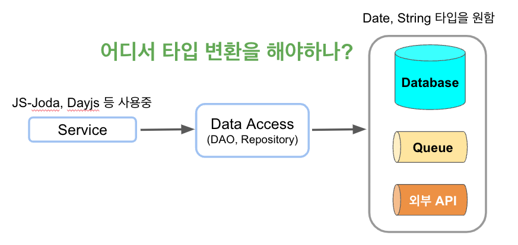

# 데이터 변환 계층

Express와 JS/TS만을 가지고 프로젝트를 진행하다보면 데이터 변환 계층의 기준이 정해져있지 않은 경우를 많이 본다.  
사람마다 다르기도 하고, 혹은 같은 사람이 작성한 코드에도 천차만별이다.  
  
이에 대해서는 팀에서 확실하게 컨벤션을 잡지 않으면 서로 데이터 변환 계층을 다르게 두어 프로젝트 전체가 일관성이 떨어지고 코드 가독성과 리팩토링 내성도 떨어지게 된다.  

그렇다면 데이터 변환 계층의 기준을 어떻게 세우면 좋을까?  

## 문제

예를 들어 다음과 같은 상황이 있다고 해보자.

* 프로젝트에서는 js-joda (혹은 Dayjs 등) 날짜 타입을 쓰고 있는 상황에서
  * Database SQL에서 사용하기 위해서는 `Date` 로 치환해야하는 경우
  * API 로 외부에 데이터를 전송 (혹은 요청) 하기 위해 `String` 으로 치환해야하는 경우
* 프로젝트에서는 `BigInt`를 쓰고 있는 상황에서
  * 외부에 제공하는 지표 데이터로는 `String` 으로 전달해야하는 경우



> TypeORM, MikrORM 등 ORM 혹은 SpringFramework, NestJS 등 의 프레임워크 등을 사용하지 않으면 Type Transform 이 매끄럽지 않아서 이런 경우를 더 쉽게 만날 수 있다.

이때 가장 흔하게 쓰는 방법은 Data Access 계층의 파라미터로 원하는 타입을 전달하는 것이다.

```ts
export class LectureRepository extends BaseRepository<Lecture> {

    async getLectureByDate (createdAt: Date): Promise<Lecture> {
        const lectures = await this.queryTemplate.queryWith(
            'SELECT * FROM lecture l WHERE l.created_at >= $1',
            [createdAt]
        );

        return transform(lectures[0], Lecture);
    }
}
```

이렇게 되면 Data Access 계층 입장에서는 좋은 방법이다.  
하지만 이를 호출하는 쪽에서는 어떨까?

```ts
export class LectureService {

    async getLecture (createdAt: LocalDateTime): Promise<Lecture> {
        const date = convert(createdAt).toDate();
        const lecture = await this.lectureRepository.getLectureByDate(date);
        ....
    }
}
```

당연하지만, 테스트 코드를 작성할때도 마찬가지다.


## 해결

### 비즈니스 계층 지키기

```ts
async getLectureByLocalDate (createdAt: LocalDateTime): Promise<LectureItem> {
    const createdDate = convert(createdAt).toDate();
    const lectures = await this.queryTemplate.queryWith(
        'SELECT * FROM lecture l WHERE l.created_at >= $1',
        [createdDate]
    );

    return transform(lectures[0], LecturesItem);
}
```

### Data Transfer Object (DTO)

```ts
export class LectureSearchDto {
  private _createdAt: LocalDateTime;

  constructor(createdAt: LocalDateTime) {
    this._createdAt = createdAt;
  }

  get createdAt(): Date {
    return convert(this._createdAt).toDate();
  }
}
```

```ts
async getLectureByDto (param: LectureSearchDto): Promise<LectureItem> {
    const lectures = await this.nodePgTemplate.queryWith(
        'SELECT * FROM lecture l WHERE l.created_at >= $1',
        [param.createdAt]
    );

    return transform(lectures[0], LecturesItem);
}
```