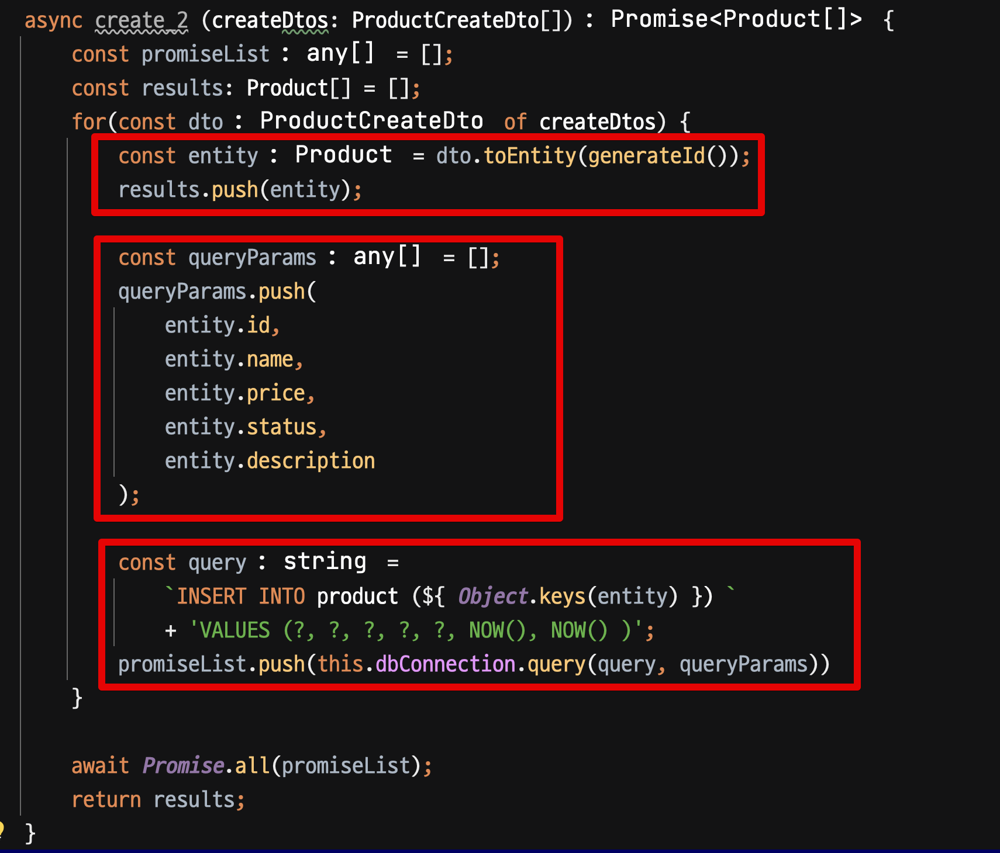
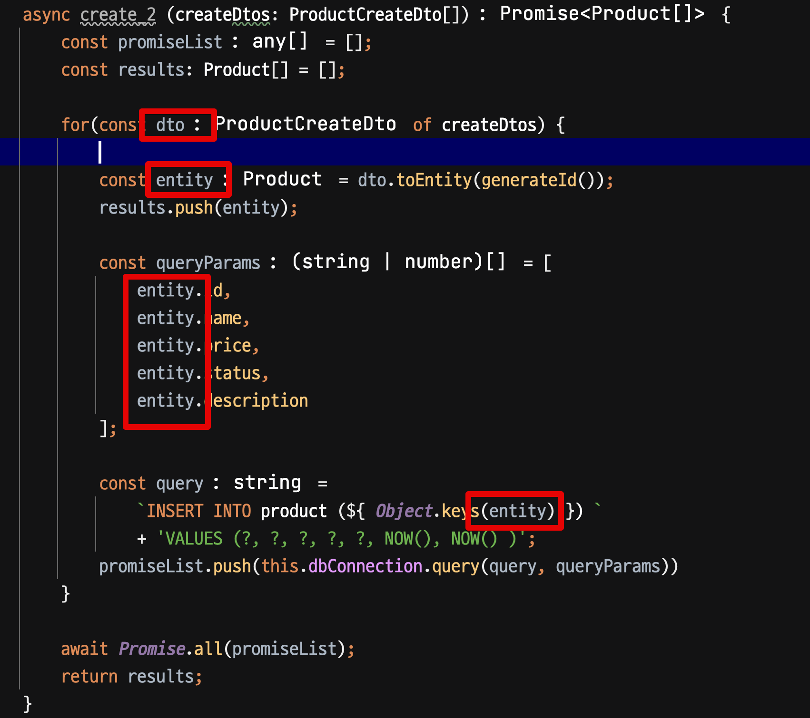
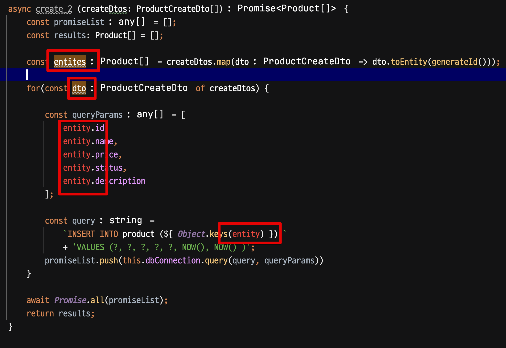
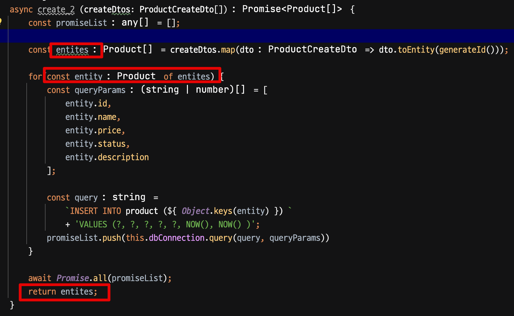
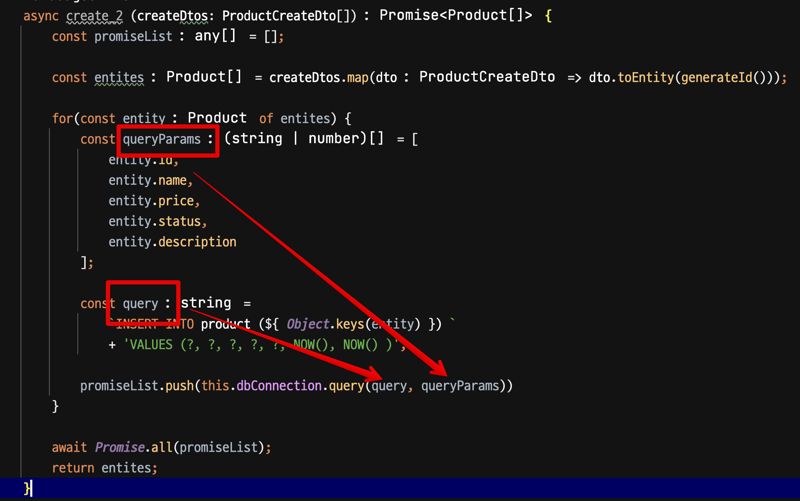
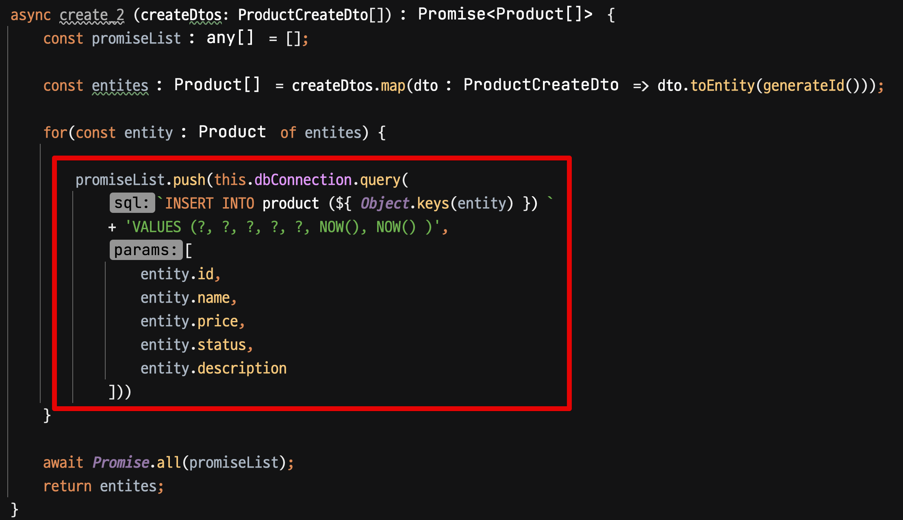
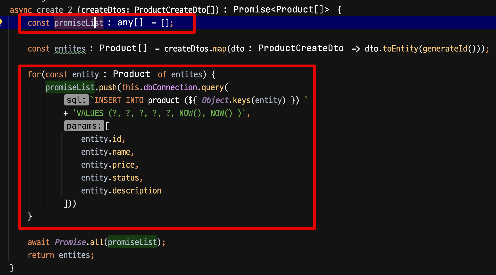
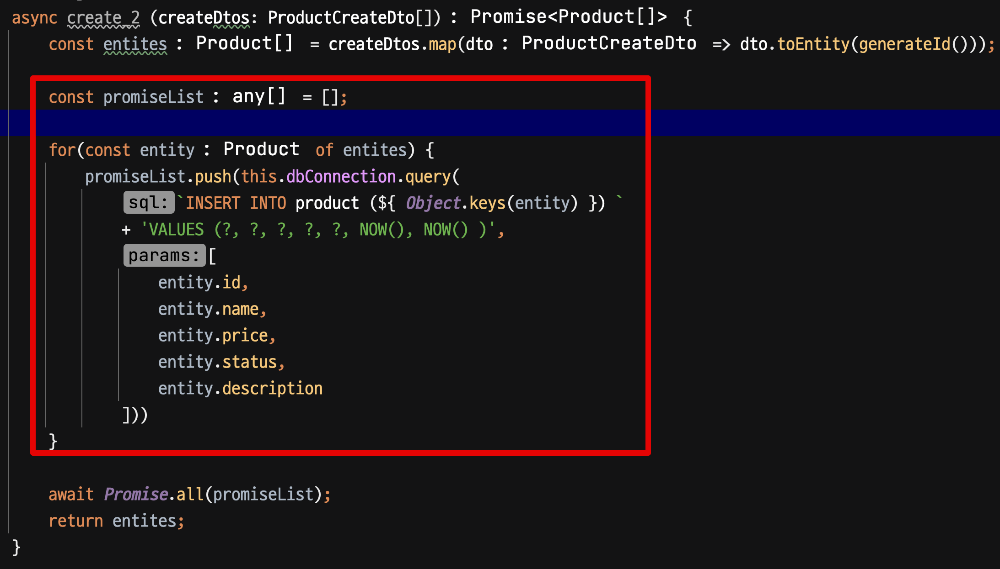
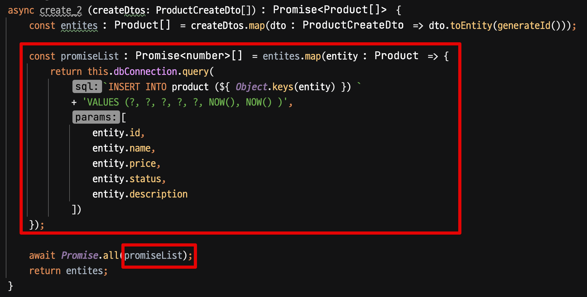
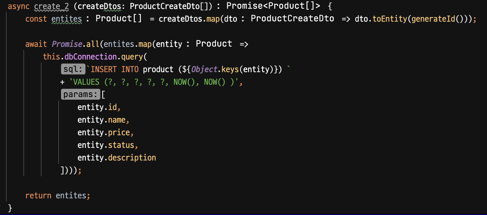

# 리팩토링 - 코드 배치와 변수 줄이기

비즈니스 로직 위주로만 생각하고 바로 코드를 작성하다보면 코드가 길어지고, 가독성이 떨어지는 경우가 많다.  
특히 가독성이 떨어지면 코드를 리팩토링할때도 이상한 방향으로 할 때가 있다.  
이럴때 가독성을 높이기 위해 코드 배치와 변수를 줄이는 방법을 알아보자.

## 예제

ORM 없이 직접 SQL을 작성하는 환경에서 다음과 같이 코드를 작성했다고 가정하자.

```ts
export class ProductRepository {
    async create (createDtos: ProductCreateDto[]) {
        const promiseList = [];
        const results: Product[] = [];
        
        // 반복문을 수행하면서 DTO를 Entity로 변환하고 SQL Promise를 쌓아둔다.
        for(const dto of createDtos) {
            const entity = dto.toEntity(generateId());
            const queryParams = [];

            const query =
            `INSERT INTO product (${ Object.keys(entity) }) `
            + 'VALUES (?, ?, ?, ?, ?, NOW(), NOW() )';

            queryParams.push(
                entity.id,
                entity.name,
                entity.price,
                entity.status,
                entity.description
            );
            
            // Promise.all로 일괄처리를 위해 SQL 실행 Promise를 모아둔다. 
            // (물론 트랜잭션 등 단일 커넥션을 사용해야하니 이렇게 사용하면 안된다.) 
            promiseList.push(this.dbConnection.query(query, queryParams));
            results.push(entity);
        }
        
        // 모아둔 Promise SQL들을 실행
        await Promise.all(promiseList);
        
        // 반복문을 돌면서 쌓아둔 결과를 반환
        return results;
    }
}
```

생각나는대로 코드를 작성하다보면 위와 같이 코드가 길어지고, 가독성이 떨어지는 경우가 많다.  
어디서부터 리팩토링을 시작해야할지, 차근차근 시작해보자.

## 리팩토링

가장 먼저 해야할 것은 **연관된 코드들끼리 근처에 두는 것**이다.



- `entity` 와 관련된 코드들을 모아두고
- `queryParams` 와 관련된 코드들을 모아두고
- `promiseList` 와 관련된 코드들을 모아둔다.

연관된 코드끼리 근처에 두니 **dto를 entity로 변환하는 코드 외에는 dto가 필요없다**는 것을 알 수 있다.  
그럼 이 반복문은 굳이 Dto를 통해 할 필요가 없고 Entity의 배열을 통해 수행할 수도 있다.



그래서 dto를 통한 반복문에서 entity를 통한 반복문으로 변경하는 것이 좋다.
그리고 이를 위해서는 **entity의 배열을 만들어야한다.**
  
반복문이 있음에도 `map` 을 통해 collection 작업을 한번 더 하는 것이 불편하지만, 한번 해보자.

```ts
async create (createDtos: ProductCreateDto[]) {
    const entites = createDtos.map(dto => dto.toEntity(generateId()));
    
    for(...) {
        ...
    } 
    
    ..
}
```

그럼 다음과 같이 dto가 필요하지 않고, entity만 있으면 반복문이 수행가능 함을 알 수 있다.



이를 entity의 배열로 교체하고, 반복문 내의 코드들도 변경한다.



그럼 다음과 같은 효과가 생긴다.

- 불필요하던 `results` 변수가 삭제된다.
- dto와 entity라는 2개의 값 변수가 하나로 통일 된다.

이제 `queryParams` 와 `query` 를 처리해보자.  
물론 `queryParams` 와 `query` 라는 변수는 "의미가 있는 변수인데 굳이 줄여야하나?" 라는 생각도 든다.  
그렇지만 일단은 한번 코드를 줄일 수 있는 만큼 줄여보자.



그럼 다음과 같이 반복문 안에는 `promiseList.push()` 만 남게된다.



그럼 결국 다음과 같이 `promiseList` 배열 변수와 반복문, entity 배열만 남게되었다.



그 전과 마찬가지로 다시 연관된 코드를 한 곳으로 모아둔다.



반복문과 이를 저장할 배열만 있다면 이 `map` 을 통해 줄일 수 있으니, 다음과 같이 변경해보자.



남은 변수인 `promiseList` 도 삭제해보자.  
그럼 다음과 같이 `entities` 와 `Promise.all()` 만 남게된다.



그래서 최종적으로 다음과 같은 코드가 된다.

```ts
export class ProductRepository {
    ...
    
    async create (createDtos: ProductCreateDto[]) {
        const entites = createDtos.map(dto => dto.toEntity(generateId()));

        await Promise.all(entites.map(entity =>
            this.dbConnection.query(
                `INSERT INTO product (${Object.keys(entity)}) `
                + 'VALUES (?, ?, ?, ?, ?, NOW(), NOW() )',
                [
                    entity.id,
                    entity.name,
                    entity.price,
                    entity.status,
                    entity.description
                ])));

        return entites;
    }
}
```

물론 좀 더 리팩토링한다면 좀 더 함수를 분리할 수도 있다.

```ts
export class ProductRepository {
    ...
    
    async create (createDtos: ProductCreateDto[]) {
        const entites = createDtos.map(dto => dto.toEntity(generateId()));

        await Promise.all(entites.map(entity =>
            this.dbConnection.query(getInsertQuery(entity), getParams(entity))));

        return entites;
    }
}
```

- `getInsertQuery` : entity를 통해 insert 쿼리를 생성한다.
- `getParams` : entity를 통해 쿼리 파라미터를 생성한다.

너무 극단적인 코드 줄임이 오히려 가독성을 방해해서 중간 변수등을 활용하고 싶다면 다음과 같이 할 수도 있다.

```ts
export class ProductRepository {
    ...
    
    async create (createDtos: ProductCreateDto[]) {
        const entites = createDtos.map(dto => dto.toEntity(generateId()));

        await Promise.all(entites.map(entity => {
            const query = `INSERT INTO product (${Object.keys(entity)}) `
                + 'VALUES (?, ?, ?, ?, ?, NOW(), NOW() )';
            const params = [
                entity.id,
                entity.name,
                entity.price,
                entity.status,
                entity.description
            ];
            return this.dbConnection.query(
                query,
                params);
        }));

        return entites;
    }
}
```

## 마무리

하나의 레거시 코드를 리팩토링 하는 과정을 진행했다.  
어마어마한 원칙을 따랐다기 보다는 크게 2가지를 우선 고려해서 진행했다.

- 연관된 코드끼리 근처에 두기
- 변수 줄이기

이렇게 줄이고 난 뒤, 가독성을 위해 다시 변수를 추가하거나 함수를 분리하는 등의 작업을 진행했다.  
이렇게 하면 가독성을 높이면서도 코드를 줄일 수 있다.
  
코드를 리팩토링할 때 어디서부터 시작해야할지 감이 잡히지 않는다면, 위 2가지를 우선 고려해보자.

> 물론 기존 함수의 테스트 코드가 있을때 리팩토링을 진행해야한다.  
> 리팩토링은 정확히 이전과 동일하게 작동한다는 확신하에 시작해야만 한다.
