# SonarCloud를 통한 Node.js & Jest 프로젝트 정적 분석하기

일반적으로 프로젝트의 코드 퀄리티를 올리기 위해서는 단위 테스트를 비롯해 여러가지 장치를 도입한다.  
이때 가장 가성비가 좋은 작업이 바로 **정적 코드 분석**을 도입하는 것이다.  
  
정적 코드 분석은 코드내에서 발견할 수 있는 **코드 스멜, 잠재적인 결함, 컨벤션 체크, 보안 취약점** 등을 코드 레벨에서 분석해서 레포팅 해준다.  
  


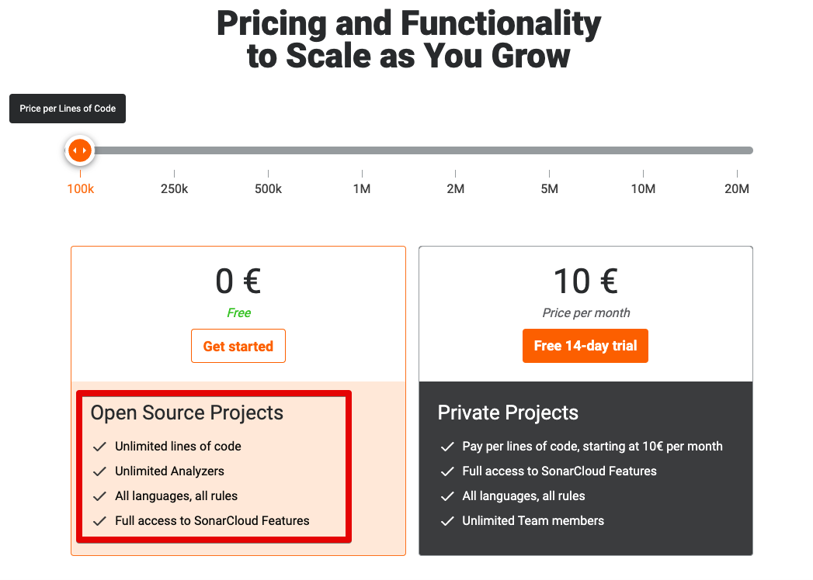

> **회사에서 사용한다면 SonarQube를 추천한다**.  
> 아직까지 SonarQube 만큼의 기능이 SonarCloud에서 지원하지 못하고 있다.
> [SonarCloud or SonarQube? - Guidance on Choosing One for Your Team](https://blog.sonarsource.com/sq-sc_guidance)

## Sonar Cloud 연동

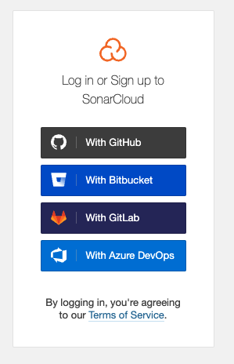

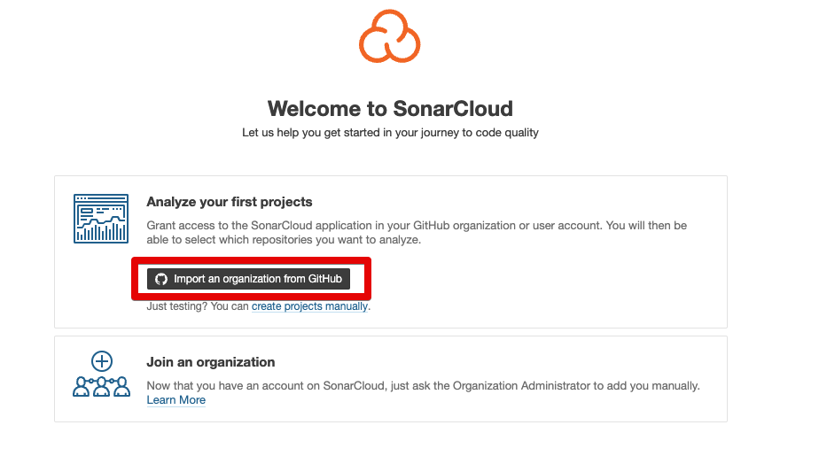


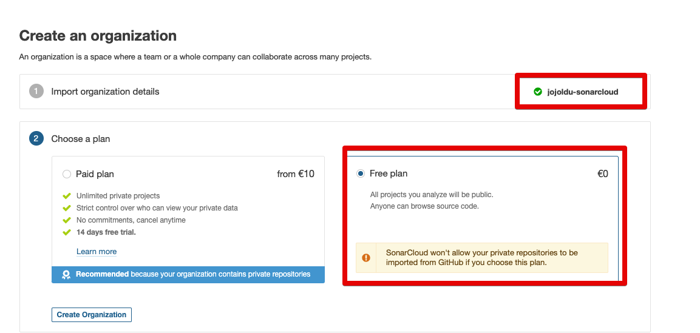

작성된 organization 이름이 

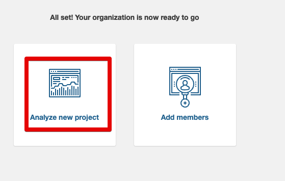

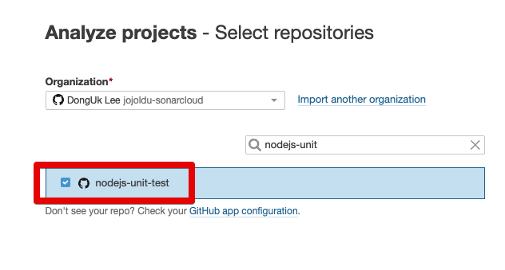

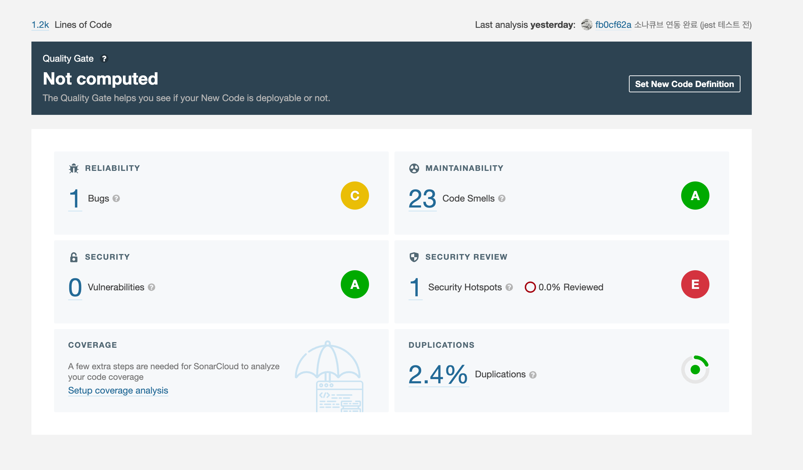

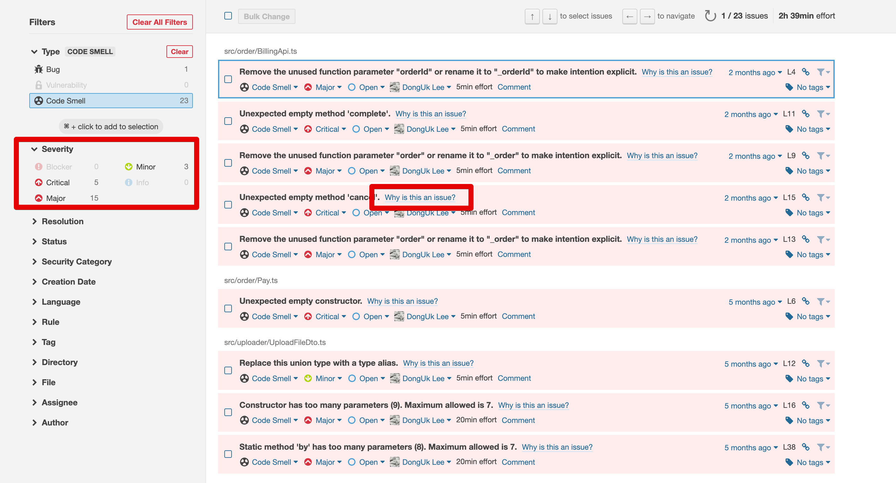

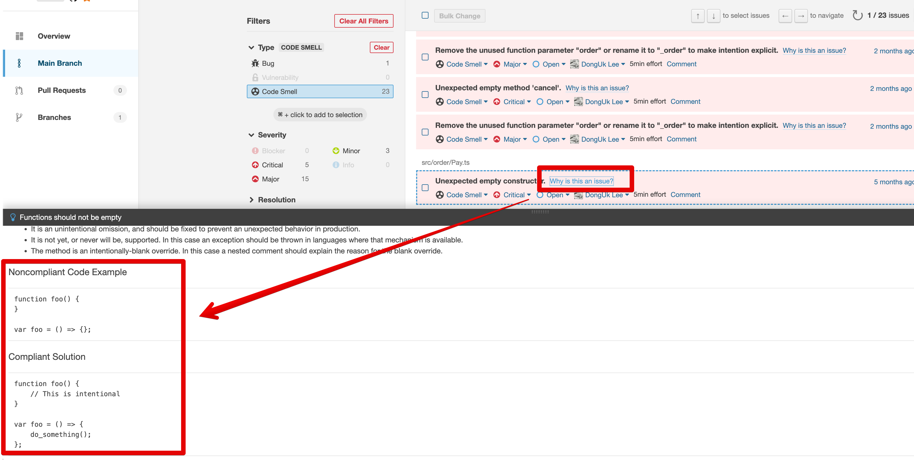

## Github Action 연동

`.github/workflows/build.yml`

```yml
name: Build
on:
  push:
    branches:
      - master
  pull_request:
    types: [opened, synchronize, reopened]

jobs:
  sonarcloud:
    name: SonarCloud
    runs-on: ubuntu-latest
    steps:
      - uses: actions/checkout@v2
        with:
          fetch-depth: 0
      - name: Install dependencies
        run: yarn
      - name: Test and coverage
        run: yarn jest --coverage
      - name: SonarCloud Scan
        uses: SonarSource/sonarcloud-github-action@master
        env:
          GITHUB_TOKEN: ${{ secrets.GITHUB_TOKEN }}
          SONAR_TOKEN: ${{ secrets.SONAR_TOKEN }}
```

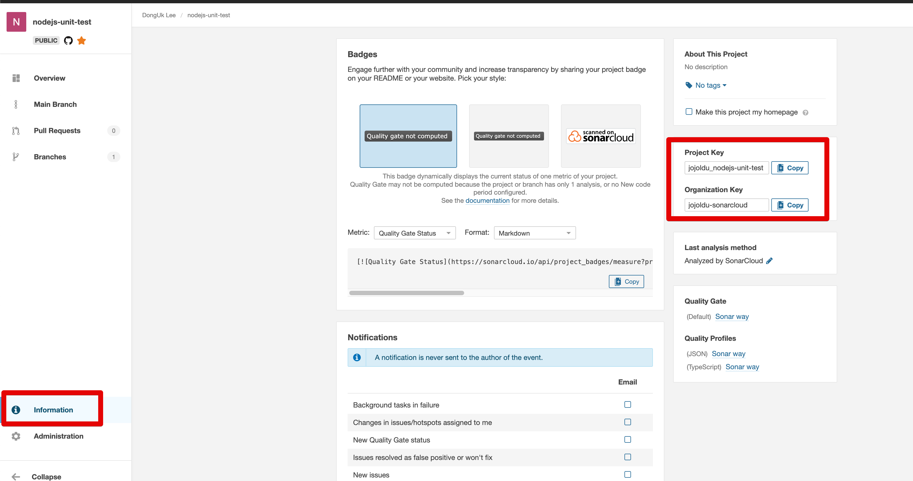

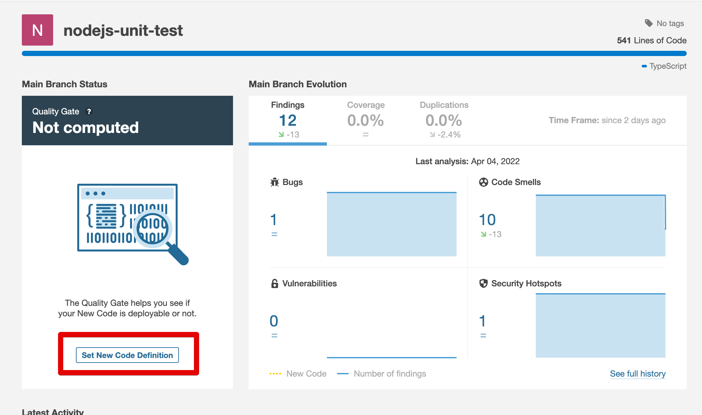

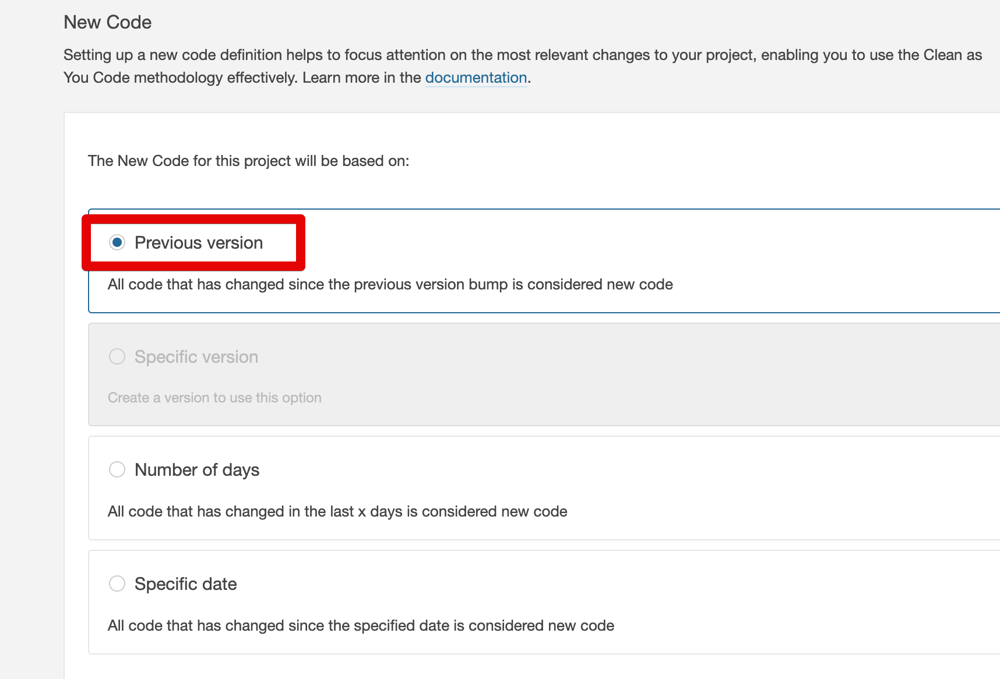

## 테스트 커버리지 추가하기

```ts
  "jest": {
    "collectCoverage": true,
    "collectCoverageFrom": [
      "**/*.(t|j)s"
    ],
    "coverageDirectory": "./coverage",
  }
```

## WebStorm (IntelliJ) 연동

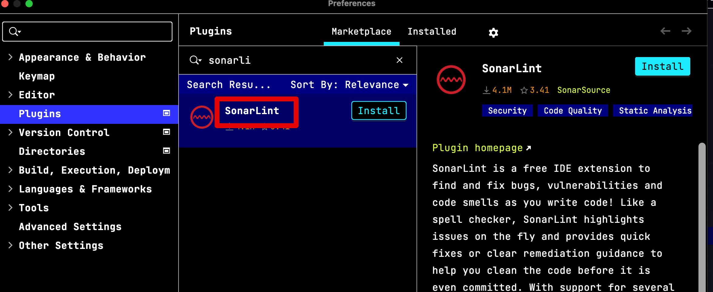

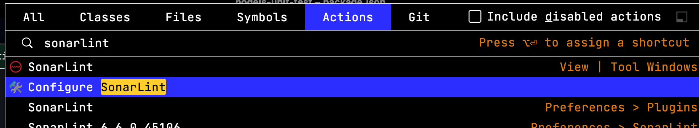