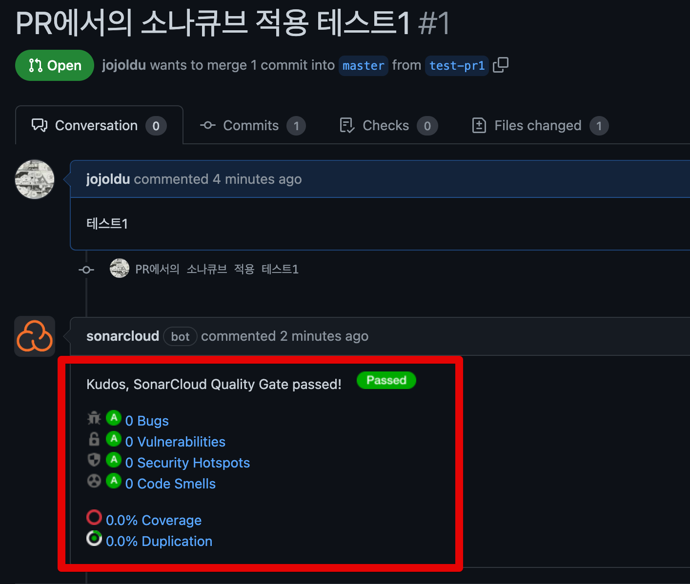

# SonarCloud를 통한 Node.js & Jest 프로젝트 정적 분석하기

일반적으로 프로젝트의 코드 퀄리티를 올리기 위해서는 단위 테스트를 비롯해 여러가지 장치를 도입한다.  
이때 가장 가성비가 좋은 작업이 **정적 코드 분석**을 도입하는 것이다.  
  
정적 코드 분석은 코드내에서 발견할 수 있는 **코드 스멜, 잠재적인 결함, 컨벤션 체크, 보안 취약점** 등을 코드 레벨에서 분석해서 레포팅 해준다.  
  
이런 정적 코드 분석 도구에는 여러가지가 있지만, 가장 많은 사용자들이 사용하는 도구는 SonarQube(소나큐브) 이다.  
  
기존에는 설치형외에는 지원하지 않았지만,  
최근에는 SaaS 형태로 SonarCloud 가 출시되었다.  


**Github에 공개된 저장소에 한해서**는 소나 클라우드의 전체 기능을 무료로 사용할 수 있다.  
그래서 개인 프로젝트는 SonarCloud로 편하게 연동하고, 무료로 **정적 코드 분석**을 받아 볼 수 있다.

> **회사에서 사용한다면 SonarQube를 추천한다**.  
> 아직까지 SonarQube 만큼의 기능이 SonarCloud에서 지원하지 못하고 있다.
> [SonarCloud or SonarQube? - Guidance on Choosing One for Your Team](https://blog.sonarsource.com/sq-sc_guidance)

그래서 이번 시간에는 이 SonarCloud와 Node.js (with. TypeScript) 프로젝트를 연동해서 정적 분석을 진행해보겠다.

> 모든 코드는 [Github](https://github.com/jojoldu/nodejs-unit-test) 에 있다.
## 1. SonarCloud 연동

먼저 [SonarCloud 사이트](https://sonarcloud.io/) 로 이동해 회원가입을 진행한다.


공개된 저장소와 연동해야하기 때문에 본인의 코드 저장소 위치에 맞게 로그인을 시도한다.  
여기서는 Github 저장소를 연동할 예정이라, Github으로 로그인을 시도했다.  
  
회원가입이 완료되면 이후 Github 의 저장소들을 SonarCloud 그룹 (Organization) 으로 import 시킨다.


아래와 같이 Organization 의 이름과 Plan 을 선택한다.


* Free plan을 선택하면 **private 저장소는 연동하지 못한다**.
  
### 1-1. 저장소 분석

Organization 생성이 끝났다면, 실제로 하나의 저장소를 분석해본다. 


좀 전에 생성한 Organization 을 선택하고,  **해당 Organization 에 포함시킬 저장소를 선택**한다.


이것만 하면 **자동으로 분석** (`Automatic Analysis`) 이 실행된다.  
그럼 아래와 같이 선택된 저장소의 코드에 대해 **코드스멜, 잠재적 버그 유발코드, 보안 위험 코드, 중복 코드** 등을 확인할 수 있다. 


* 테스트 커버리지 (`COVERAGE`) 가 출력되지 않는데, 이는 자동 분석(`Automatic Analysis`) 을 통해서 저장소를 분석했기 때문이다.
* SonarCloud의 자동 분석(`Automatic Analysis`)으로는 테스트 코드를 수행할 수가 없다.
* 이를 위해 자동 분석(`Automatic Analysis`) 을 멈추고, 수동으로 해야만 하는데, 이는 바로 다음에 진행한다.

Code Smells를 클릭해서 들어가보면 다음과 같이 **심각도와 함께 어느 라인의 어떤 코드가 어떤 문제가 있는지** 상세하게 확인할 수 있다.


* `Why is this an issue` 를 클릭해보면 **왜 이게 이슈이고, 어떻게 개선하면 좋을지**도 확인할 수 있다.


## 2. 테스트 커버리지 측정

바로 위에서 언급한것처럼 SonarCloud에서 테스트 커버리지 측정을 위해서는 자동 분석을 사용하면 안된다.  

> 아직까지 자동 분석에서의 [테스트 커버리지 측정이 지원되지 않는다](https://docs.sonarcloud.io/enriching/test-coverage/javascript-typescript-test-coverage/#use-ci-based-not-automatic-analysis).

그래서 자동 분석을 대신해서 CI 기반의 분석을 사용해야만 한다.  
주체가 필요한데, public 저장소에서 가장 쉽게 사용할 수 있는 **Github Action**을 사용해서 SonarCloud 분석을 진행할 예정이다.  

### 2-1. 인증키 등록 및 자동분석 Off

Github Action이 SonarCloud 접근을 하기 위해서는 기본적으로 SonarCloud Token 발급이 필요하다.  
이를 위해서 SonarCloud에서 Token 발급을 진행한다.  
  
MyAccount -> Security 로 이동하면 Token 발급 페이지가 보인다.


여기서 적절한 이름으로 Token을 발급 받고


Github 저장소의 `secret`에 등록한다.


* `SONAR_TOKEN` 으로 지정된 이름이 이후 Github Action yml에서 사용될 예정이다.

마지막으로 `Adminstration -> Analysis Method` 에서 **SonarCloud Automatic Analysis**를 **Off** 한다


이렇게하면 Github 페이지에서 해야할 작업들은 완료되었다.
### 2-2. 프로젝트 설정

설정된 정보를 기반으로 Github Action workflow yml 파일을 생성한다.  
  
**.github/workflows/build.yml**

```yml
name: Build
on:
  push:
    branches:
      - master
  pull_request:
    types: [opened, synchronize, reopened]

jobs:
  sonarcloud:
    name: SonarCloud
    runs-on: ubuntu-latest
    steps:
      - uses: actions/checkout@v2
        with:
          fetch-depth: 0
      - name: Install dependencies
        run: yarn
      - name: Test and coverage
        run: yarn jest --coverage
      - name: SonarCloud Scan
        uses: SonarSource/sonarcloud-github-action@master
        env:
          GITHUB_TOKEN: ${{ secrets.GITHUB_TOKEN }}
          SONAR_TOKEN: ${{ secrets.SONAR_TOKEN }}
```

* `master` 브랜치의 Push 혹은 Pull Request 발생시에 Github Action이 수행된다
* `secrets.GITHUB_TOKEN` 은 이미 Github Action에 내장된 Secret 값이라 우리가 별도로 등록할 필요는 없다.
* `secrets.SONAR_TOKEN` 은 바로 위에서 저장한 SonarCloud Token 이다.

Github Action workflow yml 설정을 마치고나서, SonarCloud 에 대한 **분석 파라미터 설정** 파일을 생성한다.  
  
**sonar-project.properties**

```properties
sonar.projectKey=jojoldu_nodejs-unit-test
sonar.organization=jojoldu-sonarcloud

sonar.sources=src
# sonar.exclusions=src/**/__tests__/**

sonar.tests=test
# sonar.test.inclusions=src/**/__tests__/**

sonar.javascript.lcov.reportPaths=./coverage/lcov.info
```

* 보통 JS/TS 프로젝트에서는 테스트 코드가 `src` 하위에 `__tests__` 에 둔다.
  * 나 같은 경우 **메인 코드와 테스트코드가 섞여 있는 구조를 선호하지 않는다**. 
  * 현 프로젝트 구조가 `src` 와 `test`로 확실히 구분되어 있기 때문에 굳이 `sonar.exclusions` 와 `sonar.test.inclusions` 를 할 필요가 없어 주석 처리했다.
* `sonar.javascript.lcov.reportPaths`: `jest --coverage` 를 통해 생성되는 레포트가 있는 위치이다.
  * 아래 `jest` 설정에서 위치를 지정할 예정이다.
* `sonar.projectKey` 와 `sonar.organization` 는 아래 페이지에서 확인 가능하다.
  * `Information -> Project Key, Organization Key`


SonarCloud 분석 파라메터 설정이 끝났다면, 남은 것은 `jest 커버리지 설정`이다.  
SonarCloud가 직접 분석하는게 아니라, 테스트 프레임워크의 커버리지 결과물을 활용하는 것이기 때문에 **꼭 해당 커버리지 레포트가 지정된 곳에 생성되어야만**한다.  
  
아래와 같이 `jest` 설정을 진행한다.

```ts
  "jest": {
    "collectCoverage": true,
    "collectCoverageFrom": [
      "**/*.(t|j)s"
    ],
    "coverageDirectory": "./coverage",
  }
```

* `sonar-project.properties` 에 지정된 `sonar.javascript.lcov.reportPaths` 의 디렉토리 주소를 등록한다.
  * 커버리지 파일명이 `lcov.info` 이기 때문에 그 앞 `path` 까지만 등록한다.  

위의 설정이 모두 끝났다면, 저장소 Push를 통해 실제로 Github Action이 잘 작동되는지 확인해본다.
## 3. 최종 결과 확인

Github Action의 Push 후 다음과 같이 전체 Process가 정상 수행된다.


Github Action이 모두 수행되고 나면 SonarCloud **My Projects** 페이지를 보면 다음과 같이 **커버리지 까지 측정된 결과**를 확인할 수 있다.


다만, 해당 프로젝트를 가보면 Quality Gate가 아직 **Not Computed**로 되어있다.  

> Quality Gate는 **이전 코드에 비해 얼마나 개선되었는지**를 측정하는 지표이다.

이는 **현재 분석 결과의 비교 대상을 지정하지 않았기 때문**이다.  
  
**Set New Code Definition** 을 선택하고


원하는 비교 기준을 선택한다.  
(여기서는 **바로 직전에 분석된 코드와 비교를 한다**)


그리고 다시 확인해보면 **Passed**가 된 것을 볼 수 있다.


아래 지표에서도 **그 전 기준에 비해 얼마나 달라졌는지** 분석이 가능하다.


Push 외에 Pull Request를 보낼때에는 **PR 코드 분석 결과**를 볼 수 있다.



> 참고로 Pull Request 에서의 정적 분석 기능은 SonarCloud와 달리 **SonarQube에서는 무료 버전에서는 사용할 수 없다**.  
> [Developer Plan](https://www.sonarqube.org/developer-edition/#branch_pr_analysis) 부터 사용할 수 있다.


## 4. 마무리

정적 분석 도구 도입은 **팀 전체의 기술 부채를 줄이는 가장 가성비가 높은 작업**이다.  
컨벤션 교정 수준이 아니라, 잠재적 문제가 될만한 코드, 안티패턴의 코드들을 다 시스템이 찾아주고 수정안을 제안하기 때문에 **코드리뷰의 공수 역시 획기적으로 줄어든다**.  
  
소나큐브는 표준 컨벤션 외에 우리팀만의 Ruleset을 만들어서 사용할 수도 있다.  
그러다보니, 현재 우리팀 사정에 맞는 자동화된 코드 분석을 자동으로 수행할 수 있다.  
  
이로 얻게되는 점은 **집중해야할 코드 리뷰와 아닌 부분을 분리할 수 있게 된다는 것**이다.  
  
정적 분석 도구가 해주는 것은 결국 사람이 해주는 코드리뷰보다 더 정교할 순 없다.  
다만, **매 신규입사자가 올때마다, 매 신규 프로젝트가 시작될때마다** 하는 수많은 자잘한 코드리뷰 내용들이 모두 사람이 해줄 필요가 없어진다는 것은 큰 장점이다.  
  
테스트코드 도입, 타입 도입, 코드리뷰 도입 등 여러 코드 퀄리티를 높이기 위한 작업 중 가장 쉽게 적용하되 효과가 큰 정적 분석 도구 도입을 적극 추천한다.

> 물론 회사에서 할때는 좀 더 다양한 기능이 지원되는 [SonarQube](https://www.sonarqube.org/) 쓰시길!


