# SonarLint와 SonarCloud 연동하기 (WebStorm Plugin)

[지난 시간](https://jojoldu.tistory.com/662)에 프로젝트와 SonarCloud 연동을 했다.  
이번 시간에는 프로젝트와 연결된 SonarCloud를 개발환경인 WebStorm의 SonarLint 플러그인과 연동해서 **IDE로 개발 중에도 SonarCloud 검증이 되도록** 설정해보겠습니다.  

## 1. 설정
  
먼저 [SonarLint 플러그인](https://plugins.jetbrains.com/plugin/7973-sonarlint)을 설치합니다.  

설치된 SonarLint 플러그인의 설정을 열어봅니다.  
아래와 같이 Action 검색 (`CMD + Shift + A`) 을 통해 검색합니다.

다음과 같이 커넥션 연결 화면이 나온다면 `Configure the connection` 을 선택합니다.

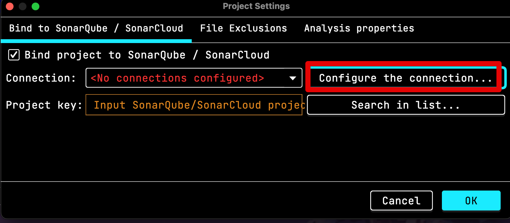

SonarQube / SonarCloud connections의 `+` 버튼을 클리해서 새로운 커넥션을 추가합니다.

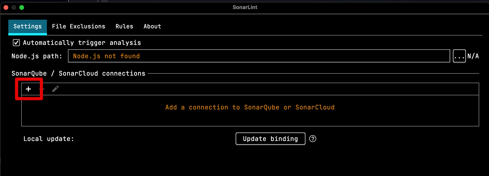

여기서는 SonarCloud를 쓰고 있으니 SonarCloud를 선택합니다.

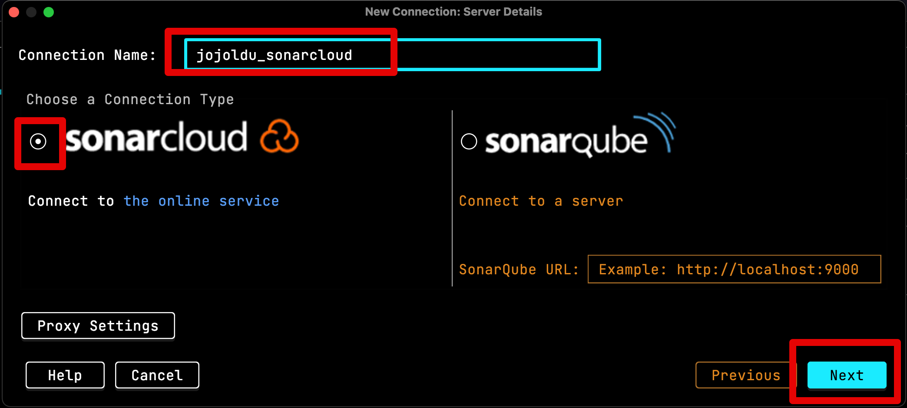

Next로 넘어가면 Token 입력창이 등장합니다.  
해당 Token 발급을 위해 다시 SonarCloud 로 넘어갑니다.  
SonarCloud의 (우측상단) Profile -> My Account로 차례로 이동합니다.

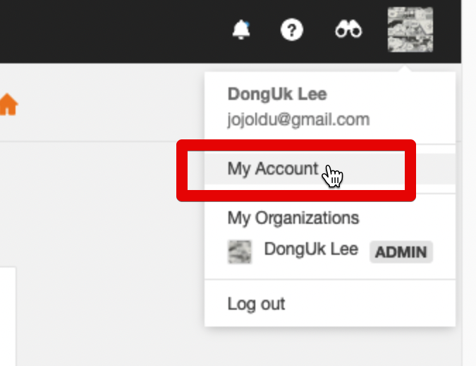

Security 탭을 보면 Token을 생성할 수 있습니다.  
해당 페이지에서 Token을 생성한 뒤,

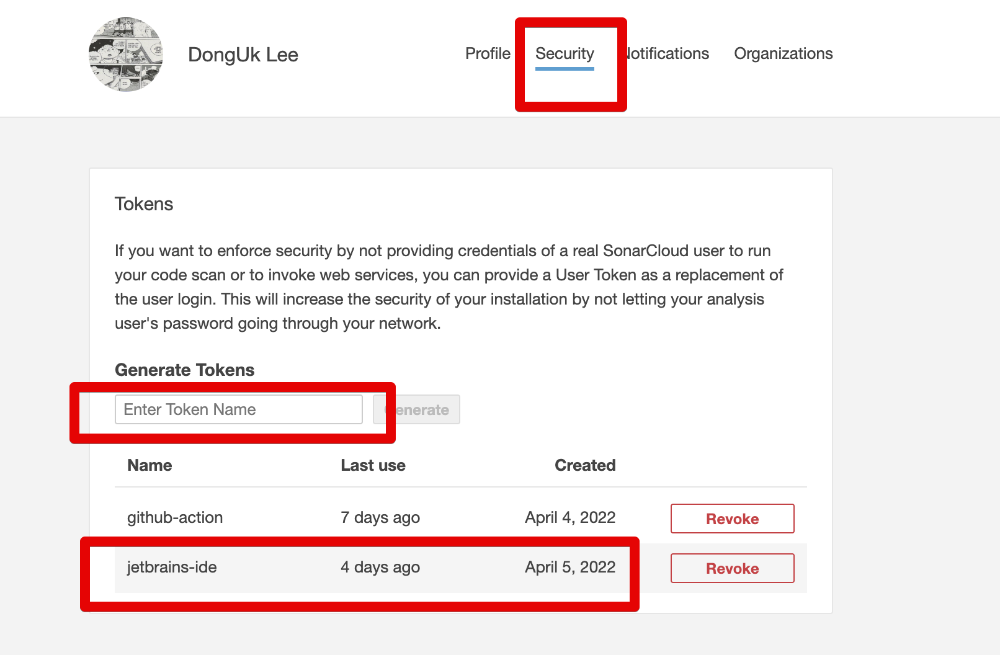

IDE Connection 입력창에서 Token을 등록합니다.

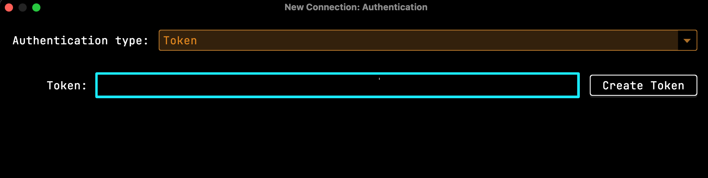

그럼 다음과 같이 SonarCloud의 Organization 항목이 나오는데 이를 선택합니다.

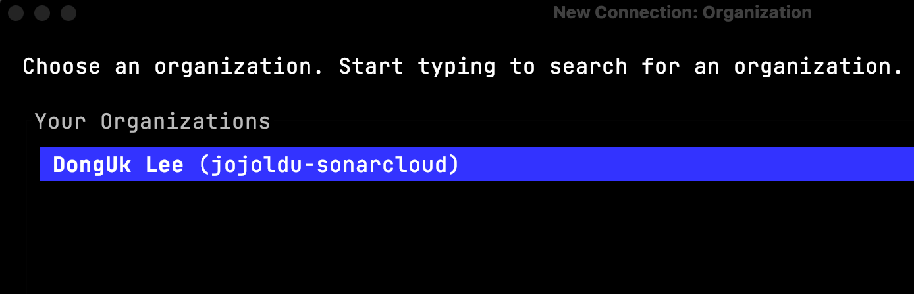

그럼 Connection은 완료되었고, 남은 것은 Project key 입니다.  
Project key는 `Information` -> `Project Key, Organization Key` 에서 확인할 수 있습니다.

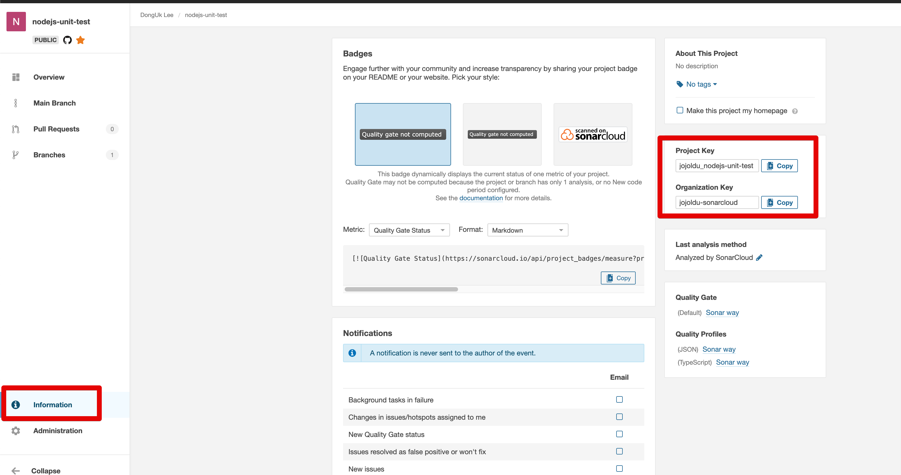

그럼 다음과 같이 설정이 마무리됩니다.

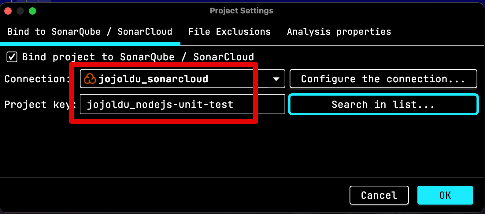

## 2. 마무리

이렇게 설정이 끝나면 이제 SonarCloud(혹은 SoncarQube) 가 잡아주는 여러 규칙들을 IDE에서도 만날 수 있습니다.

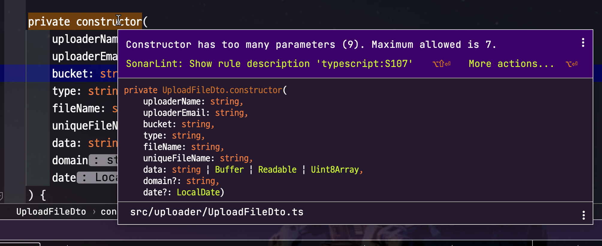

위 Sonar 규칙은 SonarCloud(혹은 SoncarQube)와 동일한 것을 확인할 수 있습니다.

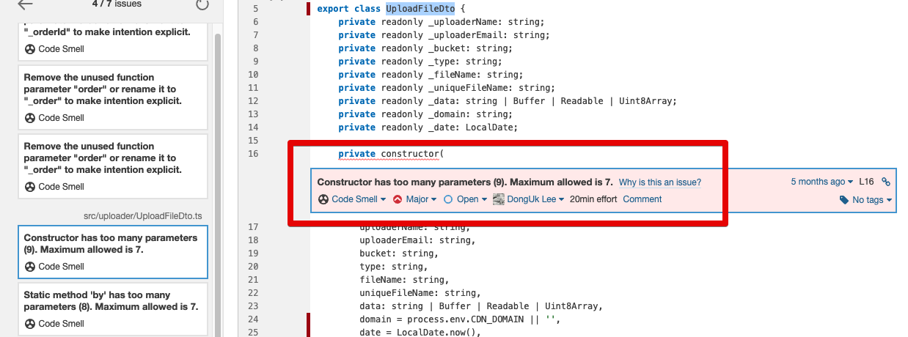

  

